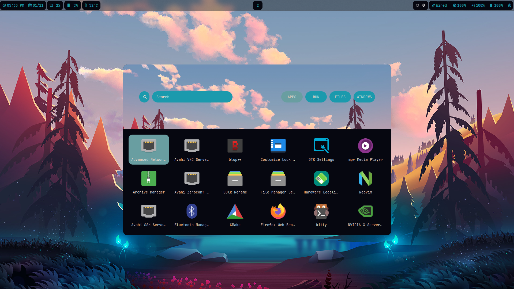
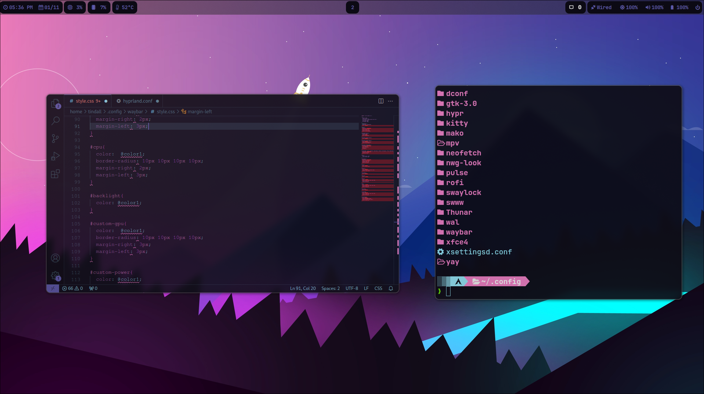
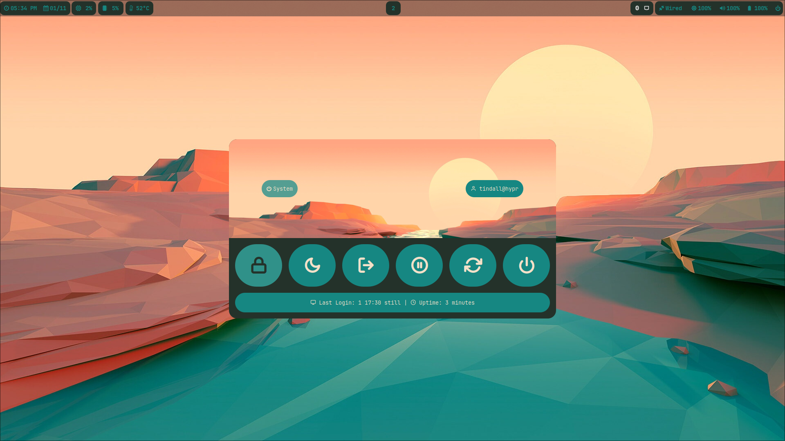
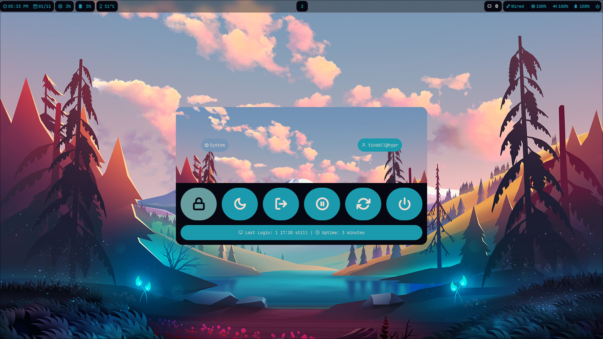
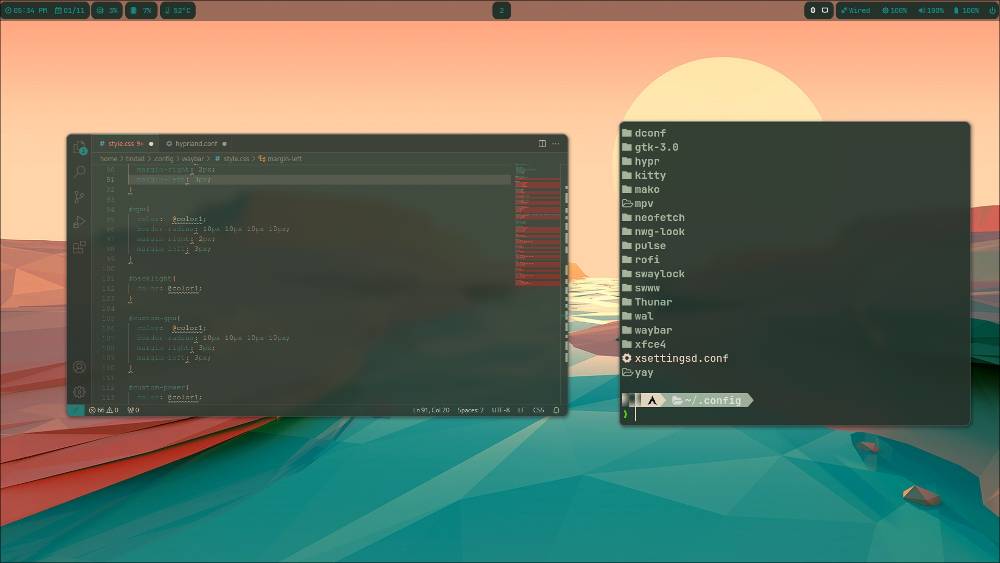
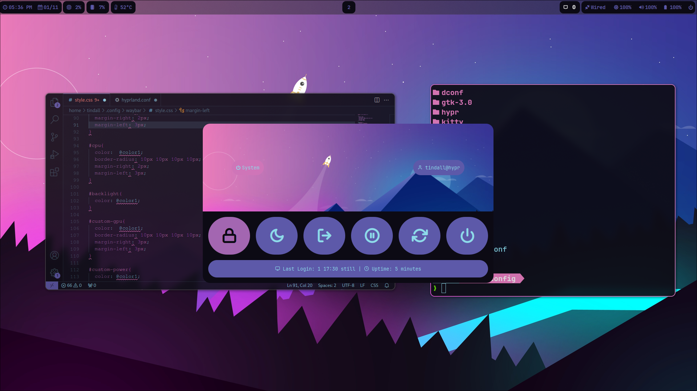
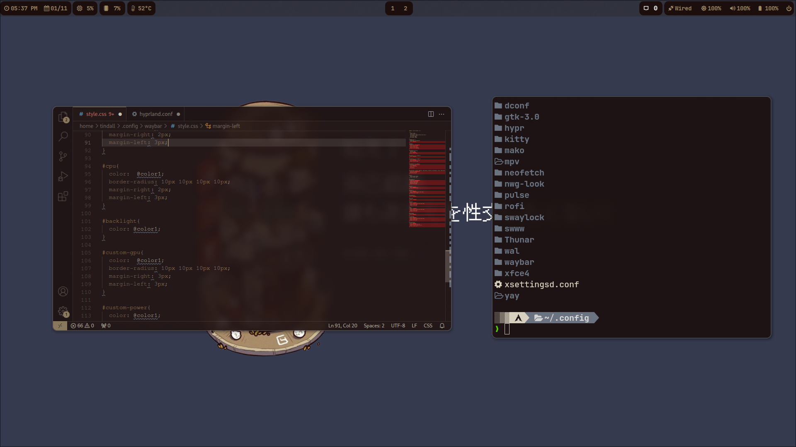

<p align="center">
  
</p>

<p align="center">
  
  
  
  
</p>

<p align="center">
  <em>A Hyprland setup built for three identities at once — developer environment, gaming rig, and AI-assisted workflow — without losing the minimalist bones it started from.</em>
</p>

<p align="center">
  <a href="#install">Install</a> ·
  <a href="#profiles--layers">Profiles</a> ·
  <a href="#architecture">Architecture</a> ·
  <a href="#theming">Theming</a> ·
  <a href="#keybindings">Keybindings</a> ·
  <a href="#roadmap">Roadmap</a> ·
  <a href="#faq">FAQ</a>
</p>

<br>

## Stack

| Layer | Choice |
|---|---|
| Window Manager | [Hyprland](https://github.com/hyprwm/Hyprland) |
| Panel | [Waybar](https://github.com/Alexays/Waybar) |
| Terminal | [Kitty](https://github.com/kovidgoyal/kitty) |
| Launcher | [Rofi](https://github.com/davatorium/rofi) with [custom launcher themes](https://github.com/adi1090x/rofi) |
| Notifications | [Mako](https://github.com/emersion/mako) |
| File Manager | [Thunar](https://github.com/xfce-mirror/thunar) |
| Wallpaper Engine | [awww](https://codeberg.org/LGFae/awww) |
| Shell | [ZSH](https://sourceforge.net/projects/zsh/) or [Starship](https://github.com/starship/starship) |
| Lock Screen | [Swaylock (effects fork)](https://github.com/jirutka/swaylock-effects) |
| Audio Visualizer | [Cava](https://github.com/karlstav/cava) |

<br>

## Why Noctis

Most rices are a snapshot — a config someone tuned once and stopped touching, distributed as a pile of dotfiles you copy over your own and hope for the best. Noctis is built to keep moving. Underneath the visuals is a small, deliberate piece of infrastructure:

- **Declarative, not hardcoded.** Package sets live as data (`profiles/*.toml`), not as bash arrays buried in an install script. Changing what ships means editing a TOML file, not surgery on `install.sh`.
- **Composable, not monolithic.** A base profile (`minimal` or `full`) plus any combination of layers (`gaming`, `dev`, `ai`) resolve into one merged package list at install time. Add a layer without touching the base; add a base without touching the layers.
- **Safe to run twice.** Every install is snapshotted to a timestamped backup before anything changes, and the resolved choice is written to `noctis.toml` so a re-run can detect and reuse it instead of asking the same questions again.
- **Honest about what it will do.** `--dry-run` prints the entire install plan — every package, every layer, every detected system fact — and touches nothing. No surprises, no `sudo` running until you've actually agreed to something.
- **Reversible.** `./uninstall.sh` restores your most recent backup on request. Trying Noctis was never supposed to mean burning your current setup down first.

None of this is unique in isolation, but it's what turns a rice from something you install once into something you can actually keep living in.

<br>

## Install

```
git clone https://github.com/T-Crypt/Noctis-Hypr && cd Noctis-Hypr
chmod +x install.sh
./install.sh
```

Running with no flags launches a short wizard — profile, optional layers, theme, bar position — and writes your choices to `noctis.toml`, which becomes the source of truth for every re-run after that.

Prefer to skip the prompts entirely:

```
./install.sh --profile full --with gaming,dev --dry-run
```

| Flag | Effect |
|---|---|
| `--profile <minimal\|full>` | Selects the base package set. Skips the profile prompt. |
| `--with <layer,layer,...>` | Comma-separated layers to merge in: `gaming`, `dev`, `ai`. Skips the layer prompts. |
| `--theme <name>` | Pre-selects a theme. Skips the theme prompt. |
| `--bar-position <top\|left>` | Sets Waybar's initial position. Skips the bar-position prompt. |
| `--dry-run` | Prints the full resolved install plan and exits — nothing is installed, backed up, or written. |
| `--no-backup` | Skips the pre-install config snapshot. Off by default; use with intent. |
| `--keep-backups <N>` | How many timestamped backups to retain before pruning. Defaults to 5. |
| `-h`, `--help` | Full flag reference. |

`--dry-run` is checked before anything else runs — no `sudo` prompt, no package installs, no filesystem writes happen ahead of it. Re-running `install.sh` later detects your last saved config in `noctis.toml` and offers to reuse it without repeating the wizard.

Something went sideways? `./uninstall.sh` restores your most recent backup — no manual archaeology through `~/.config-backup/`. Pass `--purge-packages` if you also want it to remove everything your profile installed (behind its own separate confirmation).

Custom apps live in `profiles/custom_apps.lst` (still readable at the repo root as a symlink, for anyone on an older clone) and are folded into the resolved package list automatically — no separate prompt needed.

<br>

## Profiles & Layers

A **profile** is the base package set. A **layer** is an optional add-on merged on top. Pick one profile, any number of layers.

| Profile | What you get |
|---|---|
| `minimal` | Hyprland, Waybar, Kitty, Mako, awww, Rofi — the bare tiling desktop, nothing else. |
| `full` | Everything in `minimal`, plus the complete Noctis experience: theming (Pywal, Pywalfox, Dracula GTK/icons), shell tooling (ZSH, Powerlevel10k, Starship), media (mpv, Cava, Swappy), file management (Thunar plus archive/GVFS plugins), Bluetooth, SDDM, and more. |

| Layer | Adds |
|---|---|
| `gaming` | GameMode, MangoHud (both with 32-bit variants), Steam. |
| `dev` | Neovim, tmux, fzf, ripgrep, fd, lazygit. |
| `ai` | Ollama, as a local AI backend — package-layer only for now; workflow integration is a later roadmap phase. |

Layers are additive and dedupe against the base and each other, so `--with gaming,dev,ai` on top of `full` merges cleanly with no duplicate installs. Combine whatever fits: a `minimal` install with just `dev` is a lean coding box; `full` with `gaming` and `dev` is closer to a daily driver that also game-modes on demand.

<br>

## Architecture

Noctis's repo mirrors what actually gets installed, plus the machinery that decides what that is:

```
Noctis-Hypr/
├── install.sh / uninstall.sh   Thin orchestrators — wizard or flags in, resolved plan out
├── noctis.toml                 Generated on first install: the resolved source of truth
├── lib/
│   ├── install/                 Wizard prompts, AUR helper detection, backups, config linking
│   └── toml/                    Profile + layer merge logic
├── profiles/
│   ├── base/                    minimal.toml, full.toml
│   └── layers/                  gaming.toml, dev.toml, ai.toml
├── themes/                      Swappable theme presets (THEME_SPEC.md documents the contract)
└── .configs/                    Mirrors ~/.config — the configs that actually land on disk
```

`install.sh` never hardcodes a package list — it resolves one at runtime by merging `profiles/base/<profile>.toml` with each selected `profiles/layers/<layer>.toml`, deduplicating as it goes. Everything downstream (backups, AUR helper choice, config copying) reads from that single resolved plan.

<br>

<details>
<summary><h3 id="theming">Theming</h3></summary>

<br>

Wallpaper-driven color generation, applied consistently across the stack:

- Rofi
- Kitty
- Waybar
- Mako
- Swaylock
- Cava
- Firefox — requires the [Pywalfox extension](https://addons.mozilla.org/en-US/firefox/addon/pywalfox/)
- VS Code
- GTK — in progress

Thunar has a right-click **Set as Theme** action for building a theme straight from an image in `$HOME/Pictures` (avoid special characters at the front of the path). An SDDM sync script keeps your login screen's wallpaper matched to whatever's currently active.

</details>

<br>

## In Motion

<a id="screenshots"></a>

<p align="center">
  
  
</p>

<details>
<summary><h3>More Screenshots</h3></summary>

<br>

<p align="center">
  
  
</p>
<p align="center">
  
  
</p>
<p align="center">
  
</p>

</details>

<br>

<details open>
<summary><h3 id="keybindings">Keybindings</h3></summary>

<br>

| Keys | Action |
| :-- | :-- |
| <kbd>Super</kbd> + <kbd>Q</kbd> | Quit the focused window |
| <kbd>Super</kbd> + <kbd>W</kbd> | Change wallpaper / theme |
| <kbd>Super</kbd> + <kbd>T</kbd> | Launch Kitty |
| <kbd>Super</kbd> + <kbd>E</kbd> | Launch Thunar |
| <kbd>Super</kbd> + <kbd>C</kbd> | Launch VS Code |
| <kbd>Super</kbd> + <kbd>F</kbd> | Launch Firefox |
| <kbd>Super</kbd> + <kbd>Shift</kbd> + <kbd>F</kbd> | Toggle fullscreen |
| <kbd>Super</kbd> + <kbd>Shift</kbd> + <kbd>W</kbd> | Wallpaper picker (Rofi) |
| <kbd>Super</kbd> + <kbd>,</kbd> | Clipboard history (Rofi) |
| <kbd>Super</kbd> + <kbd>.</kbd> | Emoji picker (Rofi) |
| <kbd>Super</kbd> + <kbd>A</kbd> | Application launcher (Rofi) |
| <kbd>Super</kbd> + <kbd>L</kbd> | Lock screen |
| <kbd>Super</kbd> + <kbd>B</kbd> | Toggle Waybar |
| <kbd>Super</kbd> + <kbd>V</kbd> | Toggle floating |
| <kbd>Super</kbd> + <kbd>J</kbd> | Toggle split direction |
| <kbd>Super</kbd> + <kbd>S</kbd> | Screenshot tool |
| <kbd>Super</kbd> + <kbd>Backspace</kbd> | Power menu (Rofi) |
| <kbd>Super</kbd> + Scroll | Cycle workspaces |
| <kbd>Super</kbd> + <kbd>0</kbd>–<kbd>9</kbd> | Switch to workspace |
| <kbd>Super</kbd> + <kbd>Shift</kbd> + <kbd>0</kbd>–<kbd>9</kbd> | Move window to workspace |

</details>

<br>

## Roadmap

Noctis is being built in phases, on top of the manifest-driven installer already shipped:

- **Identity** — a modern wallpaper-driven color engine (replacing the archived Pywal), multiple palette algorithms, and a live bar-position toggle.
- **Gaming profile** — a real performance-mode toggle, MangoHud Waybar integration, Proton/Steam polish.
- **Dev environment** — deeper terminal and editor tooling, AI CLI workflow integration on top of the `ai` layer.
- **Settings CLI** — a `noctis` command unifying theme, wallpaper, and bar-position switching from one place.
- **Maintenance tooling** — versioning, `noctis doctor`, migrations, and CI.

Longer-term, once the roadmap phases land, the plan is a full wiki — install walkthroughs, theme authoring docs, and a troubleshooting reference — rather than trying to cram everything into this README forever.

<br>

## FAQ

<details>
<summary><strong>Does this work outside Arch?</strong></summary>
<br>
Not currently by design. Noctis assumes Arch/AUR and leans on that assumption throughout the installer — no distro branching is planned.
</details>

<details>
<summary><strong>Can I run this on top of an existing Hyprland setup?</strong></summary>
<br>
Yes. The installer snapshots your existing configs before touching anything (unless you pass <code>--no-backup</code>), and <code>./uninstall.sh</code> restores the most recent snapshot if you want to back out.
</details>

<details>
<summary><strong>What if I only want a subset of what <code>full</code> installs?</strong></summary>
<br>
Start from <code>minimal</code> and add only the layers you want, or edit <code>profiles/custom_apps.lst</code> before installing. Profiles and layers are just TOML — nothing stops you from forking one to fit exactly what you need.
</details>

<details>
<summary><strong>Firefox isn't picking up my theme.</strong></summary>
<br>
Install the <a href="https://addons.mozilla.org/en-US/firefox/addon/pywalfox/">Pywalfox</a> extension — Firefox theming depends on it and won't apply without it.
</details>

<br>

## Credit

Inspired by and built with gratitude toward [Tittu](https://github.com/prasanthrangan)'s minimalist Hyprland dotfiles — Noctis started as a fork of that philosophy and has been growing its own identity ever since.

<p align="center">
  <sub>after dark, always.</sub>
</p>
