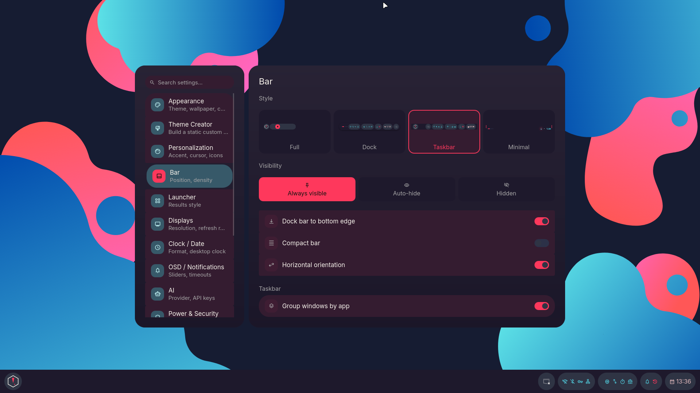
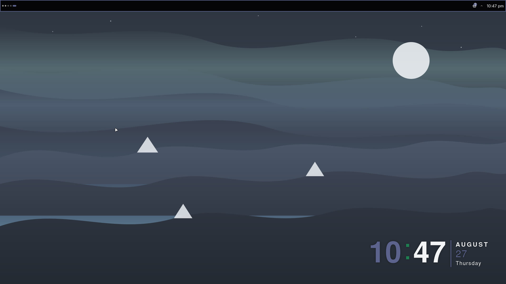
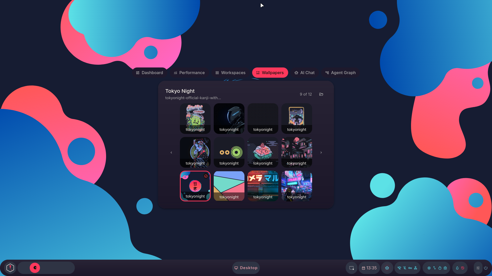
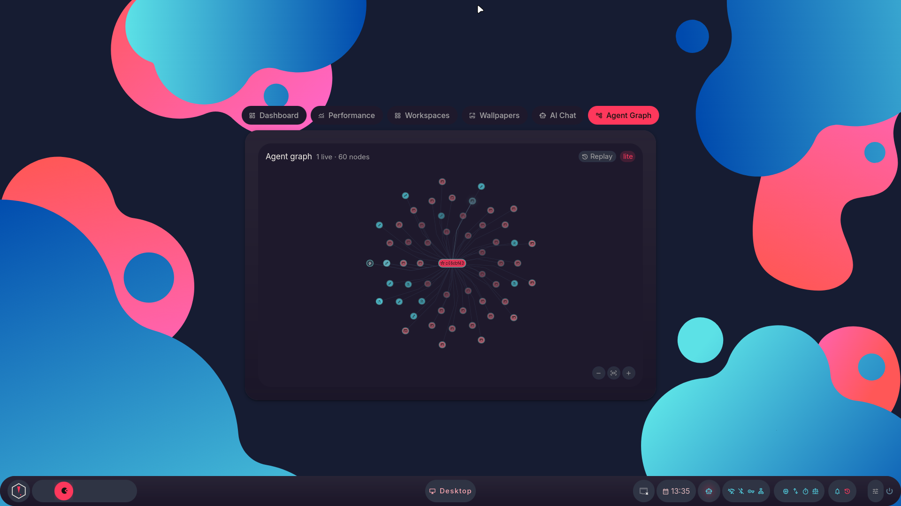
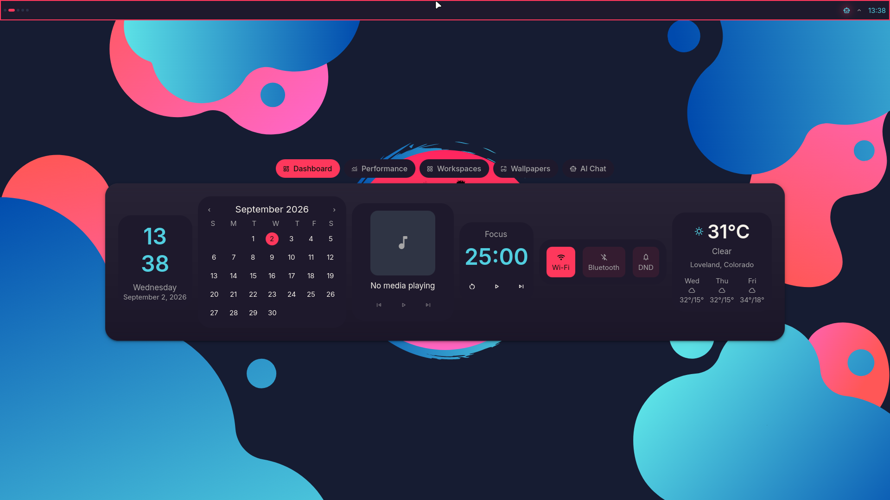
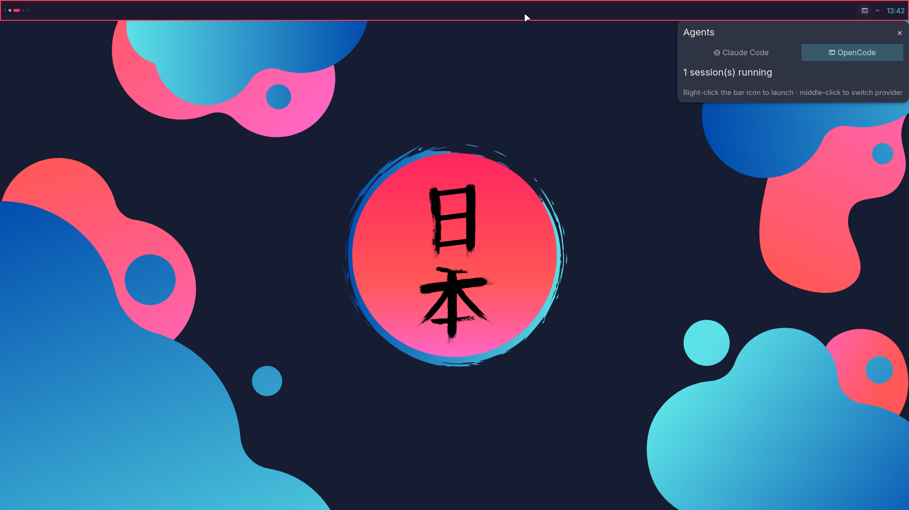
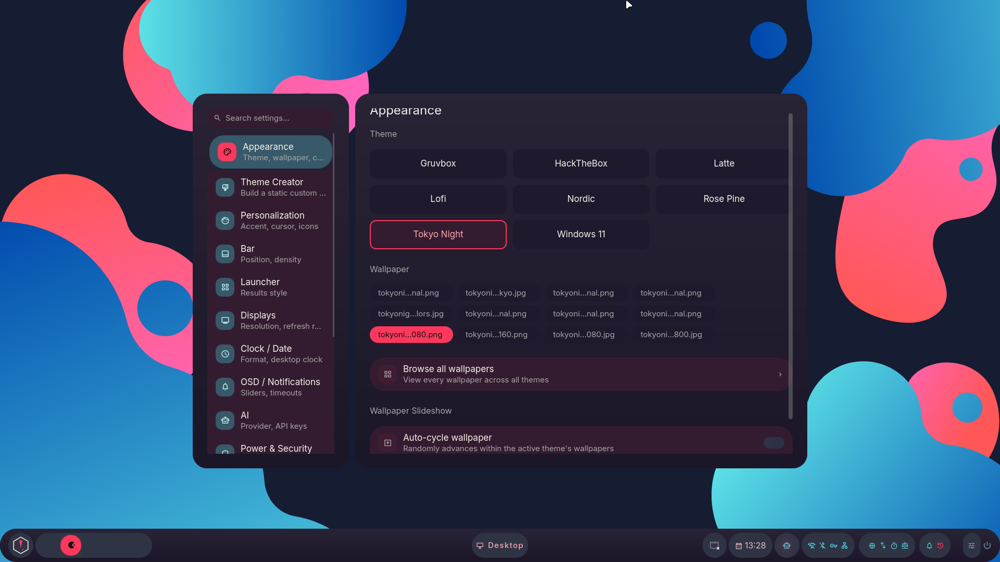
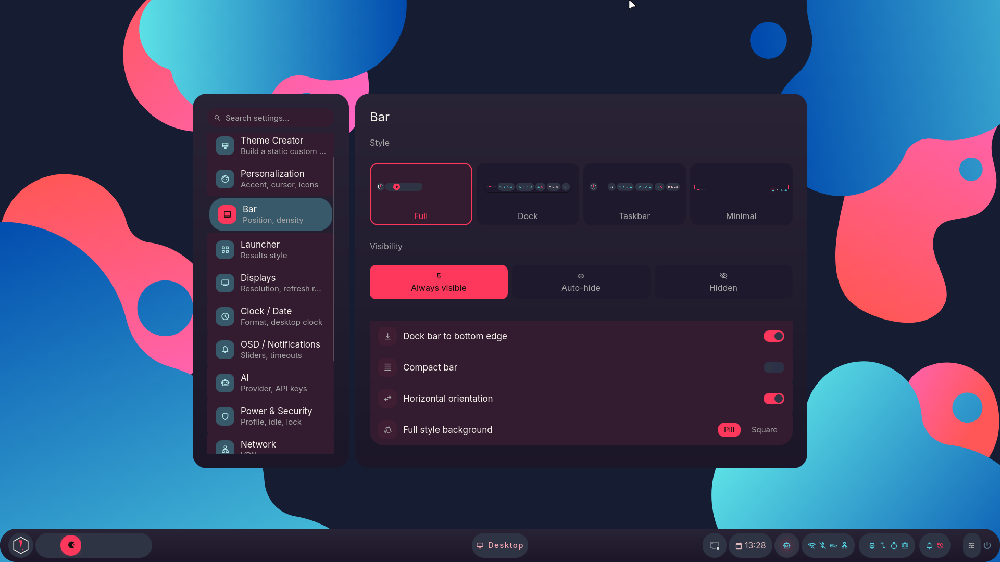
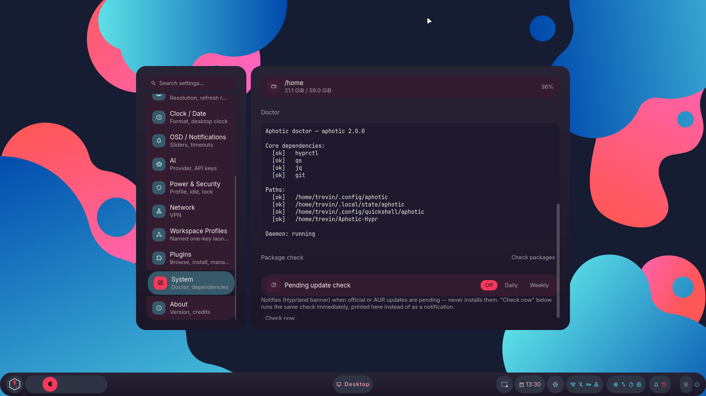

<p align="center">
  
</p>

<p align="center">
  
  
  
  
  
  
</p>

## Overview

Aphotic is a modular Hyprland environment using a single Quickshell
shell for the desktop UI.

It provides four optional profiles:

-   Developer
-   Gaming
-   AI
-   Security

Features are layered rather than enabled as one large desktop stack.
Inactive features should add little to no runtime overhead.

## Preview

One shell, reskinned live from a wallpaper — no rebuild, no relogin. Shown
over **Tokyo Night**, **Lofi**, and **Gruvbox**, three of the eight themes
that ship out of the box:

<p align="center">
  
</p>

Agentic workflow, live render: every Bash and Read call landing on the graph
as the agent makes it, with replay scrubbing and zoom.

https://github.com/user-attachments/assets/a9a2ff29-4c57-4e1f-b4e9-e3a93e995c2a

## Gallery

<details>
<summary><b>Desktop &amp; bar</b></summary>
<br>

<table>
<tr>
<td width="50%"><p align="center"><br><sub>Bar: Full style</sub></p></td>
<td width="50%"><p align="center"><br><sub>Bar: Dock style</sub></p></td>
</tr>
<tr>
<td width="50%"><p align="center"><br><sub>Bar: Taskbar style — window list, grouped by app</sub></p></td>
<td width="50%"><p align="center"><br><sub>Bar: Minimal style — thin strip, DND indicator only</sub></p></td>
</tr>
<tr>
<td width="50%"><p align="center"><br><sub>Workspaces</sub></p></td>
<td width="50%"><p align="center"><br><sub>Launcher</sub></p></td>
</tr>
</table>

</details>

<details>
<summary><b>Command Center</b></summary>
<br>

<table>
<tr>
<td width="50%"><p align="center"><br><sub>Dashboard — clock, calendar, media, focus timer, weather</sub></p></td>
<td width="50%"><p align="center"><br><sub>Performance</sub></p></td>
</tr>
<tr>
<td width="50%"><p align="center"><br><sub>Wallpapers tab — the active theme's own set</sub></p></td>
<td width="50%"><p align="center"><br><sub>AI Chat tab — provider and model picker</sub></p></td>
</tr>
</table>

</details>

<details>
<summary><b>Agents &amp; plugins</b></summary>
<br>

<table>
<tr>
<td width="50%"><p align="center"><br><sub>Agent Graph — every tool call as the agent makes it</sub></p></td>
<td width="50%"><p align="center"><br><sub>The same Command Center without the plugin — the tab is simply gone</sub></p></td>
</tr>
<tr>
<td width="50%"><p align="center"><br><sub>Agents popout — running sessions and today's token use</sub></p></td>
<td width="50%"><p align="center"><br><sub>Middle-click the bar icon to switch harness</sub></p></td>
</tr>
<tr>
<td width="50%"><p align="center"><br><sub>Plugins — browse, install, enable, remove</sub></p></td>
<td width="50%"></td>
</tr>
</table>

</details>

<details>
<summary><b>AI</b></summary>
<br>

<table>
<tr>
<td width="50%"><p align="center"><br><sub>AI Chat</sub></p></td>
<td width="50%"><p align="center"><br><sub>AI Settings</sub></p></td>
</tr>
<tr>
<td width="50%"><p align="center"><br><sub>Aphotic Assistant</sub></p></td>
<td width="50%"></td>
</tr>
</table>

</details>

<details>
<summary><b>Theming &amp; settings</b></summary>
<br>

<table>
<tr>
<td width="50%"><p align="center"><br><sub>Appearance — theme, wallpaper, slideshow</sub></p></td>
<td width="50%"><p align="center"><br><sub>Wallpaper Picker</sub></p></td>
</tr>
<tr>
<td width="50%"><p align="center"><br><sub>Theme Creator</sub></p></td>
<td width="50%"><p align="center"><br><sub>Personalization</sub></p></td>
</tr>
<tr>
<td width="50%"><p align="center"><br><sub>Bar — style, visibility, orientation</sub></p></td>
<td width="50%"><p align="center"><br><sub>Workspace Profiles</sub></p></td>
</tr>
<tr>
<td width="50%"><p align="center"><br><sub>System — doctor, dependency and package checks</sub></p></td>
<td width="50%"></td>
</tr>
</table>

</details>

## Features

-   Quickshell desktop shell
-   Live theme and wallpaper switching
-   Four bar styles
-   Launcher and application search
-   Notifications and OSD
-   Lock and session controls
-   Command Center
-   Settings and theme creator
-   Workspace profiles
-   Plugin system
-   AI provider integration
-   Local Ollama model management
-   Agent workflow graph
-   Resource arbitration
-   Gaming profile with GameMode integration
-   GPU process and VRAM accounting
-   Developer and security tooling

## Architecture

Aphotic separates the base desktop from optional profiles and plugins.

``` text
Aphotic
├── Quickshell
│   ├── Bar
│   ├── Launcher
│   ├── Notifications
│   ├── OSD
│   ├── Lock
│   ├── Command Center
│   └── Settings
│
├── Profiles
│   ├── Developer
│   ├── Gaming
│   ├── AI
│   └── Security
│
└── Plugins
    └── Optional extensions
```

Profiles can interact through the Resource Engine.

``` text
Workload
   ↓
Resource Claim
   ↓
Contention
   ↓
Negotiation
   ↓
Apply
   ↓
Monitor
   ↓
Restore
```

The engine is designed to remain dormant when there is nothing to
manage. Resource polling and process accounting are activated only where
required.

## Profiles

### Developer

Development tools, workspace behavior, terminal integration, and
project-oriented workflows.

### Gaming

GameMode-based gaming sessions with GPU process accounting and resource
negotiation.

Aphotic can detect GPU contention between a running game and other
workloads such as local AI models.

### AI

Optional AI integrations including:

-   Claude
-   Ollama
-   Gemini
-   ChatGPT
-   Aphotic Assistant

Local Ollama models can participate in the Resource Engine through GPU
VRAM claims.

The `ai` layer installs the GPU runner that matches your card:
`ollama-cuda` on NVIDIA, `ollama-rocm` on AMD. Local models then run on
the GPU. With neither card, Ollama falls back to the CPU.

### Security

Optional security-research tooling organized into dedicated layers.

## Plugin System

Optional functionality lives outside the base shell.

Plugins can be installed, enabled, disabled, and removed independently.

The core desktop does not require optional plugins to function.

Repository: [T-Crypt/aphotic-plugins](https://github.com/T-Crypt/aphotic-plugins)

## Themes

Aphotic ships with multiple themes and supports live wallpaper-driven
color generation.

Included themes currently include:

-   Gruvbox
-   Nordic
-   Rosé Pine
-   Tokyo Night
-   Catppuccin Latte
-   Lofi
-   HackTheBox
-   Windows 11

Theme commands:

``` bash
aphotic theme list
aphotic theme set <theme>
aphotic theme next
aphotic theme prev
aphotic wallpaper --random
```

> [!TIP]
> Thunar has a right-click **Set as Theme** action for building a theme
> straight from an image in `$HOME/Pictures` (avoid special characters at
> the front of the path). An SDDM sync script keeps your login screen's
> wallpaper matched to whatever's currently active.

## Installation

> [!IMPORTANT]
> Aphotic assumes an Arch/AUR base. It hasn't been tested on other distros
> and no distro branching is planned — see the [FAQ](#faq).

Clone the repository:

``` bash
git clone https://github.com/T-Crypt/Aphotic-Hypr.git
cd Aphotic-Hypr
```

Run the installer:

``` bash
./install.sh
```

> [!TIP]
> Prefer to skip the prompts entirely:
> ```
> ./install.sh --profile full --with gaming,dev --dry-run
> ```

The installer supports profiles and optional features without requiring
every component to be installed.

See the installation documentation for available options.

> [!NOTE]
> `--dry-run` is checked before anything else runs — no `sudo` prompt, no
> package installs, no filesystem writes happen ahead of it. Re-running
> `install.sh` later detects your last saved config in `aphotic.toml` and
> offers to reuse it without repeating the wizard.

Custom apps live in `profiles/custom_apps.lst` (still readable at the repo root as a symlink, for anyone on an older clone) and are folded into the resolved package list automatically — no separate prompt needed.

### Updating

``` bash
cd Aphotic-Hypr
git pull
./install.sh
```

Aphotic detects your saved `aphotic.toml` and re-resolves your profile/layers against any changes upstream, snapshotting your current configs first exactly as a fresh install would.

### Uninstalling

> [!CAUTION]
> Something went sideways? `./uninstall.sh` restores your most recent
> backup — no manual archaeology through `~/.config-backup/`.

``` bash
./uninstall.sh
```

Pass `--purge-packages` if you also want it to remove everything your profile installed (behind its own separate confirmation).

## Stack

| Component | Implementation |
| --- | --- |
| Compositor | Hyprland |
| Desktop shell | Quickshell |
| Terminal | Kitty |
| File manager | Thunar |
| Wallpaper | awww |
| Shell | ZSH / Starship |
| Audio visualizer | Cava |

> [!NOTE]
> Rofi shipped as the app launcher, clipboard/emoji/wallpaper pickers, and
> power menu through the earlier Waybar-based setup. All four are now
> covered natively by the Quickshell launcher (`SUPER+A`). Rofi isn't
> installed by either profile anymore; nothing in this repo launches it.

## Performance

Aphotic is designed around a simple rule:

> Features that are not being used should not continuously consume
> resources.

The shell favors:

-   compositor-adjacent components
-   event-driven state where practical
-   conditional polling
-   optional profiles
-   optional plugins
-   minimal external daemons
-   graceful degradation when optional dependencies are unavailable

The Resource Engine extends this approach to active workloads instead of
treating system resources as static configuration.

## Keybindings

All keybinds live in one place — [`Configs/hypr/keybinds.lua`](Configs/hypr/keybinds.lua) — grouped exactly as below. Every `qs -c aphotic ipc call ...` target the shell exposes has a keybind; anything below not bound to a key is intentionally IPC-only (scriptable, but not meant to be memorized).

<details>
<summary><strong>Launcher</strong></summary>

| Keys | Action |
| :-- | :-- |
| <kbd>Super</kbd> + <kbd>A</kbd> or <kbd>Super</kbd> + <kbd>Space</kbd> | Open the launcher (apps, clipboard, emoji, windows, wallpaper) |

</details>

<details>
<summary><strong>Apps &amp; tools</strong></summary>

| Keys | Action |
| :-- | :-- |
| <kbd>Super</kbd> + <kbd>T</kbd> | Launch Kitty |
| <kbd>Super</kbd> + <kbd>E</kbd> | Launch Thunar |
| <kbd>Super</kbd> + <kbd>C</kbd> | Launch VS Code |
| <kbd>Super</kbd> + <kbd>F</kbd> | Launch Firefox |
| <kbd>Super</kbd> + <kbd>S</kbd> | Screenshot — simple region select via `grim`/`slurp`/`swappy` |
| <kbd>Super</kbd> + <kbd>W</kbd> | Change wallpaper (random pick) |
| <kbd>Super</kbd> + <kbd>Ctrl</kbd> + <kbd>W</kbd> | Open the launcher's wallpaper picker directly |
| <kbd>Super</kbd> + <kbd>,</kbd> / <kbd>Super</kbd> + <kbd>.</kbd> | Cycle to the previous/next theme |

</details>

<details>
<summary><strong>Quickshell surfaces</strong></summary>

| Keys | Action |
| :-- | :-- |
| <kbd>Super</kbd> + <kbd>D</kbd> | Command Center (tabbed dashboard overlay) |
| <kbd>Super</kbd> + <kbd>I</kbd> | Settings Control Center |
| <kbd>Super</kbd> + <kbd>Shift</kbd> + <kbd>A</kbd> | Intelligence quick-chat popout |
| <kbd>Super</kbd> + <kbd>Shift</kbd> + <kbd>N</kbd> | Clear all notifications |
| <kbd>Super</kbd> + <kbd>Shift</kbd> + <kbd>D</kbd> | Toggle Do Not Disturb |
| <kbd>Super</kbd> + <kbd>L</kbd> | Lock screen |
| <kbd>Super</kbd> + <kbd>Backspace</kbd> | Session / power menu |
| <kbd>Super</kbd> + <kbd>M</kbd> | `wlogout` (fallback power menu) |
| <kbd>Super</kbd> + <kbd>B</kbd> | Restart Quickshell |
| <kbd>Super</kbd> + <kbd>Ctrl</kbd> + <kbd>Shift</kbd> + <kbd>B</kbd> | Cycle bar style (Full → Dock → Taskbar → Minimal) |

</details>

<details>
<summary><strong>Screen capture</strong></summary>

| Keys | Action |
| :-- | :-- |
| <kbd>Super</kbd> + <kbd>Shift</kbd> + <kbd>S</kbd> | Open the picker |
| <kbd>Super</kbd> + <kbd>Ctrl</kbd> + <kbd>S</kbd> | Open the picker in freeze-mode |
| <kbd>Super</kbd> + <kbd>Alt</kbd> + <kbd>S</kbd> | Open the picker, copy to clipboard only |
| <kbd>Super</kbd> + <kbd>Ctrl</kbd> + <kbd>Alt</kbd> + <kbd>S</kbd> | Freeze-mode + clipboard-only combined |
| <kbd>Super</kbd> + <kbd>Shift</kbd> + <kbd>C</kbd> | Eyedropper — click a pixel to copy its hex color |

</details>

<details>
<summary><strong>Media, audio &amp; brightness</strong></summary>

| Keys | Action |
| :-- | :-- |
| <kbd>XF86AudioPlay</kbd> / <kbd>XF86AudioPause</kbd> | Play/pause the active MPRIS player |
| <kbd>XF86AudioNext</kbd> / <kbd>XF86AudioPrev</kbd> | Next/previous track |
| <kbd>Super</kbd> + <kbd>Ctrl</kbd> + <kbd>O</kbd> | Cycle audio output device |
| <kbd>XF86AudioRaiseVolume</kbd> / <kbd>XF86AudioLowerVolume</kbd> | Volume up/down |
| <kbd>XF86AudioMute</kbd> | Toggle mute |
| <kbd>XF86AudioMicMute</kbd> | Toggle mic mute |
| <kbd>XF86MonBrightnessUp</kbd> / <kbd>XF86MonBrightnessDown</kbd> | Brightness up/down |

</details>

<details>
<summary><strong>Windows &amp; layout</strong></summary>

| Keys | Action |
| :-- | :-- |
| <kbd>Super</kbd> + <kbd>Q</kbd> | Close the focused window |
| <kbd>Super</kbd> + <kbd>Alt</kbd> + <kbd>Q</kbd> | Force-kill the focused window |
| <kbd>Super</kbd> + <kbd>V</kbd> | Toggle floating |
| <kbd>Super</kbd> + <kbd>P</kbd> | Toggle pseudo-tiling |
| <kbd>Super</kbd> + <kbd>Ctrl</kbd> + <kbd>F</kbd> | Toggle pin (keep window on every workspace) |
| <kbd>Super</kbd> + <kbd>J</kbd> | Toggle split direction |
| <kbd>Super</kbd> + <kbd>Shift</kbd> + <kbd>F</kbd> | Toggle fullscreen |
| <kbd>Super</kbd> + <kbd>&larr;</kbd>/<kbd>&rarr;</kbd>/<kbd>&uarr;</kbd>/<kbd>&darr;</kbd> | Move focus between windows |
| <kbd>Super</kbd> + <kbd>Shift</kbd> + <kbd>&larr;</kbd>/<kbd>&rarr;</kbd>/<kbd>&uarr;</kbd>/<kbd>&darr;</kbd> | Move (swap) the focused window in a direction |
| <kbd>Alt</kbd> + <kbd>Tab</kbd> | Cycle to the next window |
| <kbd>Alt</kbd> + <kbd>Shift</kbd> + <kbd>Tab</kbd> | Cycle to the previous window |
| <kbd>Super</kbd> + <kbd>G</kbd> | Toggle group |
| <kbd>Super</kbd> + <kbd>Ctrl</kbd> + <kbd>H</kbd> / <kbd>Super</kbd> + <kbd>Ctrl</kbd> + <kbd>L</kbd> | Cycle group tabs backward/forward |
| <kbd>Super</kbd> + <kbd>LMB</kbd> drag | Move window |
| <kbd>Super</kbd> + <kbd>RMB</kbd> drag | Resize window |

</details>

<details>
<summary><strong>Workspaces</strong></summary>

| Keys | Action |
| :-- | :-- |
| <kbd>Super</kbd> + <kbd>0</kbd>–<kbd>9</kbd> | Switch to workspace |
| <kbd>Super</kbd> + <kbd>Shift</kbd> + <kbd>0</kbd>–<kbd>9</kbd> | Move window to workspace |
| <kbd>Super</kbd> + Scroll | Cycle workspaces |
| <kbd>Super</kbd> + <kbd>Ctrl</kbd> + <kbd>&darr;</kbd> | Jump to the nearest empty workspace |
| <kbd>Super</kbd> + <kbd>Ctrl</kbd> + <kbd>Tab</kbd> / <kbd>Super</kbd> + <kbd>Ctrl</kbd> + <kbd>Shift</kbd> + <kbd>Tab</kbd> | Cycle forward/backward through open special (scratchpad) workspaces |

> [!NOTE]
> Special workspaces aren't created by an Aphotic keybind yet — cycling
> only does something once one exists (e.g. via
> `hyprctl dispatch movetoworkspace special:name`). A dedicated
> create/toggle bind is a small future addition.

</details>

## Documentation

-   [Installation](https://github.com/T-Crypt/Aphotic-Hypr/wiki)
-   [CLI
    Reference](https://github.com/T-Crypt/Aphotic-Hypr/wiki/CLI-Reference)
-   [Bar
    Styles](https://github.com/T-Crypt/Aphotic-Hypr/wiki/Bar-Styles)

## Project Status

Aphotic is currently in beta.

Core desktop functionality is stable and actively used. Profiles,
plugins, and runtime features continue to evolve.

Bug reports and hardware-specific issues are welcome.

## Star History

<a href="https://www.star-history.com/?type=date&repos=T-Crypt%2FAphotic-Hypr">
 <picture>
 <source media="(prefers-color-scheme: dark)" srcset="https://api.star-history.com/chart?repos=T-Crypt/Aphotic-Hypr&type=date&theme=dark&legend=top-left&sealed_token=ypXqE7-DQiuJyvY9koFRVoIXk2HPugsrJGClSWh7P1FY8nA7ol-2RDfC5Y41CWpVnHmyqDL_mxAL6UDuAk2yrEhNhsBTCl-hTalGQg3Bp5cYQ1Zp1LGwDA94WqIIP4v30SrycPaZFcqA0L1LzsFi-PZF9vBE26aq4K5ihUzZzG9W0tfUNUlfL1p58oyW" />
 <source media="(prefers-color-scheme: light)" srcset="https://api.star-history.com/chart?repos=T-Crypt/Aphotic-Hypr&type=date&legend=top-left&sealed_token=ypXqE7-DQiuJyvY9koFRVoIXk2HPugsrJGClSWh7P1FY8nA7ol-2RDfC5Y41CWpVnHmyqDL_mxAL6UDuAk2yrEhNhsBTCl-hTalGQg3Bp5cYQ1Zp1LGwDA94WqIIP4v30SrycPaZFcqA0L1LzsFi-PZF9vBE26aq4K5ihUzZzG9W0tfUNUlfL1p58oyW" />
 
 </picture>
</a>

<br>

## License

See [LICENSE](LICENSE).
