<p align="center">
  
</p>

<p align="center">
  
  
  
  
  
  
</p>

## Contents

<p align="center">
  <a href="#overview">Overview</a> ·
  <a href="#preview">Preview</a> ·
  <a href="#gallery">Gallery</a> ·
  <a href="#features">Features</a> ·
  <a href="#architecture">Architecture</a> ·
  <a href="#stack">Stack</a>
  <br>
  <a href="#installation">Installation</a> ·
  <a href="#profiles">Profiles</a> ·
  <a href="#keybindings">Keybindings</a> ·
  <a href="#performance">Performance</a> ·
  <a href="#faq">FAQ</a> ·
  <a href="#documentation">Documentation</a>
  <br>
  <a href="#plugin-system">Plugin System</a> ·
  <a href="#themes">Themes</a> ·
  <a href="#desktop-pets">Desktop Pets</a> ·
  <a href="#project-status">Project Status</a> ·
  <a href="#star-history">Star History</a> ·
  <a href="#license">License</a>
</p>

**New here?** [Installation](#installation) is the short version.
**Looking around?** [Gallery](#gallery) is every surface in screenshots.
**Want the full docs?** Every command, flag, and design decision lives on
the [documentation site](https://t-crypt.github.io/aphotic-hypr); this
README stays short.

## Overview

Aphotic is a modular Hyprland environment using a single Quickshell
shell for the desktop UI.

It provides four optional profiles:

-   Developer
-   Gaming
-   AI
-   Security

Features are layered rather than enabled as one large desktop stack.
Inactive features should add little to no runtime overhead.

## Preview

One shell, reskinned live from a wallpaper. No rebuild, no relogin. Shown
over **Tokyo Night** and **Lofi**, two of the eight themes that ship out of
the box:

<p align="center">
  
</p>

The shell end to end, plus the plugin system adding and removing surfaces
on a running desktop.

https://github.com/user-attachments/assets/9a0674f6-482c-42ce-98a2-e6904b2163b5

## Gallery

<details>
<summary><b>Desktop &amp; bar</b></summary>
<br>

<table>
<tr>
<td width="50%"><p align="center"><br><sub>Bar: Full style</sub></p></td>
<td width="50%"><p align="center"><br><sub>Bar: Dock style</sub></p></td>
</tr>
<tr>
<td width="50%"><p align="center"><br><sub>Bar: Taskbar style, window list grouped by app</sub></p></td>
<td width="50%"><p align="center"><br><sub>Bar: Minimal style, thin strip with DND indicator only</sub></p></td>
</tr>
<tr>
<td width="50%"><p align="center">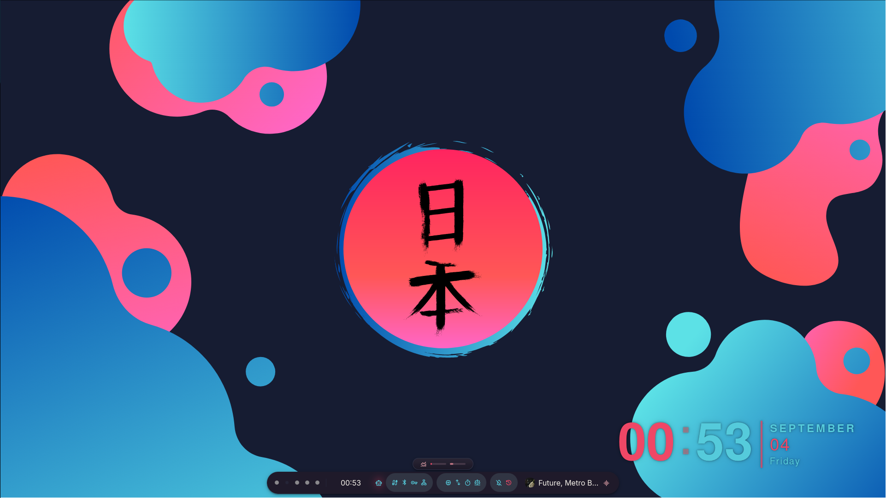<br><sub>Bar: Capsule style, a floating pill with the collapsed notch above it</sub></p></td>
<td width="50%"></td>
</tr>
<tr>
<td width="50%"><p align="center"><br><sub>Workspaces</sub></p></td>
<td width="50%"><p align="center"><br><sub>Launcher</sub></p></td>
</tr>
</table>

</details>

<details>
<summary><b>Notch</b></summary>
<br>

<table>
<tr>
<td width="50%"><p align="center">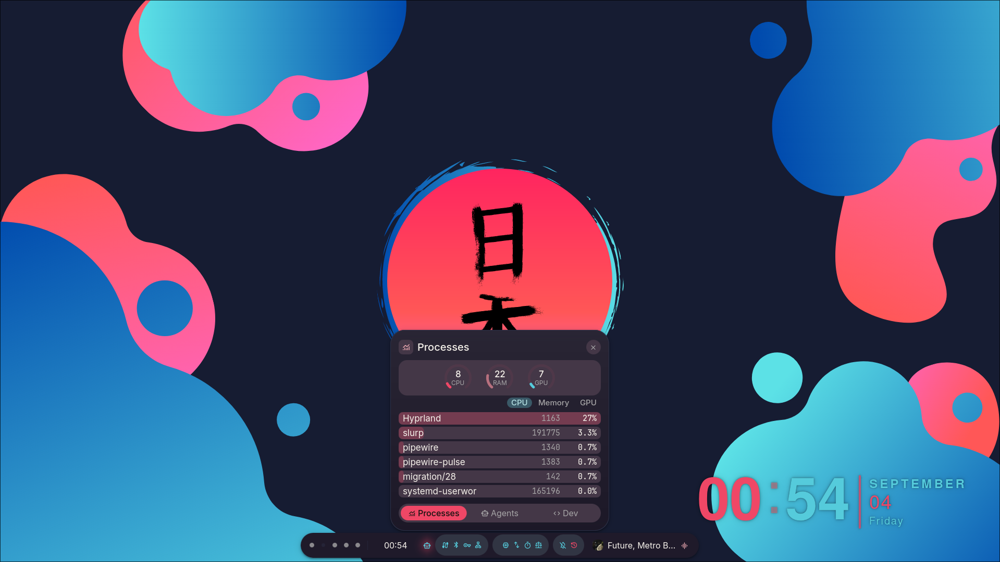<br><sub>Processes tile, live CPU, RAM and GPU gauges over the busiest processes</sub></p></td>
<td width="50%"><p align="center">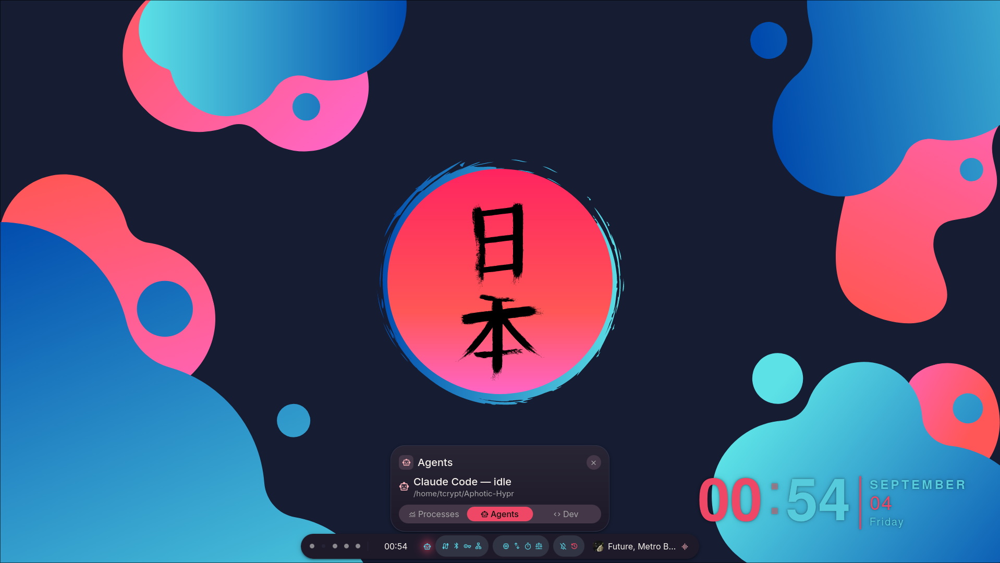<br><sub>Agents tile, contributed by the agent-notch-tile plugin</sub></p></td>
</tr>
<tr>
<td width="50%"><p align="center">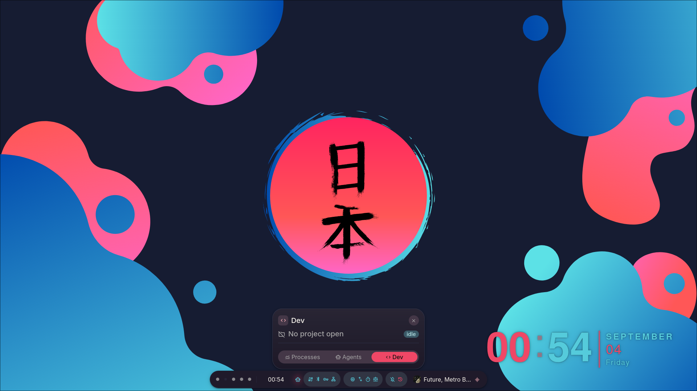<br><sub>Dev tile, the active project and its lifecycle phase</sub></p></td>
<td width="50%"></td>
</tr>
</table>

</details>

<details>
<summary><b>Command Center</b></summary>
<br>

<table>
<tr>
<td width="50%"><p align="center"><br><sub>Dashboard: clock, calendar, media, focus timer, weather</sub></p></td>
<td width="50%"><p align="center"><br><sub>Performance</sub></p></td>
</tr>
<tr>
<td width="50%"><p align="center"><br><sub>Wallpapers tab: the active theme's own set</sub></p></td>
<td width="50%"><p align="center"><br><sub>AI Chat tab: provider and model picker</sub></p></td>
</tr>
</table>

</details>

<details>
<summary><b>Agents &amp; plugins</b></summary>
<br>

<table>
<tr>
<td width="50%"><p align="center"><br><sub>Agent Graph: every tool call as the agent makes it</sub></p></td>
<td width="50%"><p align="center"><br><sub>The same Command Center without the plugin: the tab is gone</sub></p></td>
</tr>
<tr>
<td width="50%"><p align="center"><br><sub>Agents popout: running sessions and today's token use</sub></p></td>
<td width="50%"><p align="center"><br><sub>Middle-click the bar icon to switch harness</sub></p></td>
</tr>
<tr>
<td width="50%"><p align="center"><br><sub>Plugins: browse, install, enable, remove</sub></p></td>
<td width="50%"></td>
</tr>
</table>

</details>

<details>
<summary><b>AI</b></summary>
<br>

<table>
<tr>
<td width="50%"><p align="center"><br><sub>AI Chat</sub></p></td>
<td width="50%"><p align="center"><br><sub>AI Settings</sub></p></td>
</tr>
<tr>
<td width="50%"><p align="center"><br><sub>Aphotic Assistant</sub></p></td>
<td width="50%"></td>
</tr>
</table>

</details>

<details>
<summary><b>Theming &amp; settings</b></summary>
<br>

<table>
<tr>
<td width="50%"><p align="center"><br><sub>Appearance: theme, wallpaper, slideshow</sub></p></td>
<td width="50%"><p align="center"><br><sub>Wallpaper Picker</sub></p></td>
</tr>
<tr>
<td width="50%"><p align="center"><br><sub>Theme Creator</sub></p></td>
<td width="50%"><p align="center"><br><sub>Personalization</sub></p></td>
</tr>
<tr>
<td width="50%"><p align="center"><br><sub>Bar: style, visibility, orientation</sub></p></td>
<td width="50%"><p align="center"><br><sub>Workspace Profiles</sub></p></td>
</tr>
<tr>
<td width="50%"><p align="center"><br><sub>System: doctor, dependency and package checks</sub></p></td>
<td width="50%"></td>
</tr>
</table>

</details>

## Features

-   Quickshell desktop shell
-   Live theme and wallpaper switching
-   Five bar styles
-   Notch with plugin tiles, docked to whichever edge the bar is on
-   Launcher and application search
-   Notifications and OSD
-   Lock and session controls
-   Command Center
-   Settings and theme creator
-   Workspace profiles
-   Plugin system
-   AI provider integration
-   Local Ollama model management
-   Agent workflow graph
-   Resource arbitration
-   Flow resource map in Command Center
-   Gaming profile with GameMode integration
-   GPU process and VRAM accounting
-   Developer and security tooling

## Architecture

Aphotic separates the base desktop from optional profiles and plugins.

``` text
Aphotic
├── Quickshell
│   ├── Bar
│   ├── Notch
│   ├── Launcher
│   ├── Notifications
│   ├── OSD
│   ├── Lock
│   ├── Command Center
│   └── Settings
│
├── Profiles
│   ├── Developer
│   ├── Gaming
│   ├── AI
│   └── Security
│
└── Plugins
    └── Optional extensions
```

Profiles can interact through the Resource Engine. A workload claims a
resource, another profile's claim can contend with it, and Aphotic
negotiates rather than deciding for you. It stays dormant until something
claims a resource. Full mechanism, boundaries, and current state:
[Resource Engine](https://t-crypt.github.io/aphotic-hypr/docs/resource-engine/).

## Profiles

Four optional layers merge onto a `minimal` or `full` base profile:
**Developer** (terminal integration, project workflows), **Gaming**
(GameMode, GPU contention detection against local AI models),
**AI** (Claude/Ollama/Gemini/ChatGPT, plus the Aphotic Assistant), and
**Security** (offensive-research tooling in dedicated sublayers). Full
breakdown, package lists, and how they merge: [Profiles &
Layers](https://t-crypt.github.io/aphotic-hypr/docs/profiles-and-layers/).

## Plugin System

Everything outside the base shell, AI capabilities included, is an
independently installable, removable plugin; the core desktop needs none
of them to function. A plugin can also claim the **Workspace plane**
(<kbd>Super</kbd> + <kbd>Shift</kbd> + <kbd>W</kbd>), a near-full-screen
surface bound only while an installed plugin registers one. Manifest
format, every capability, and the current plugin roster: [Plugin
System](https://t-crypt.github.io/aphotic-hypr/docs/plugin-system/).

Repository: [T-Crypt/aphotic-plugins](https://github.com/T-Crypt/aphotic-plugins)

## Desktop Pets

The `pet` plugin puts a small character on the desktop. It is off until
you ask for it:

```sh
aphotic plugin install pet
```

Three pets come with it. Drag one anywhere and it stays where you put it,
wanders a short way around that spot, looks toward your cursor, and opens
a menu of things to run when you click it. It sits under every window, so
it never covers what you are doing.

Each pet is drawn once and then repainted to match your colours, so it
changes with the theme and with a wallpaper you generate colours from.
Pick one in **Settings > Appearance > Desktop Pet**.

<details>
<summary><b>The three pets</b></summary>

<p align="center">
  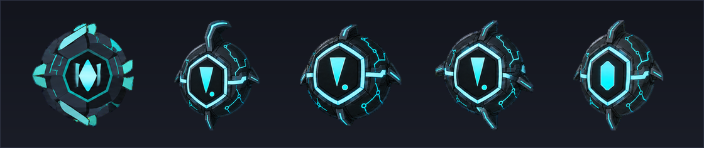<br>
  <sub>Lumen, a sealed lamp with a lit core. Its shell stays dark and its light takes your colour, so it shifts the most between themes.</sub>
</p>

<p align="center">
  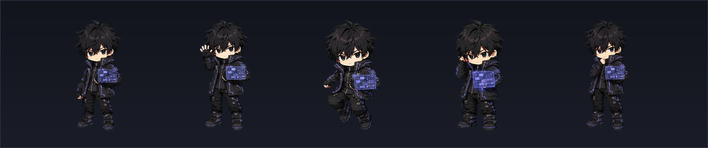<br>
  <sub>Cipher, working at a panel that floats beside him. The seams in his jacket and the lines on the panel carry your colour.</sub>
</p>

<p align="center">
  <br>
  <sub>Kozumi, at a laptop she carries with her. The trim on her coat and the red through her hair take your colour; her face does not.</sub>
</p>

</details>

More pets, and the tools to build your own, live in
[T-Crypt/aphotic-pets](https://github.com/T-Crypt/aphotic-pets).

## Themes

Aphotic ships with multiple themes and supports live wallpaper-driven
color generation.

Included themes currently include:

-   Gruvbox
-   Nordic
-   Rosé Pine
-   Tokyo Night
-   Catppuccin Latte
-   Lofi
-   HackTheBox
-   Windows 11

<details>
<summary><b>All eight, same desktop</b></summary>
<br>

<table>
<tr>
<td width="50%"><p align="center">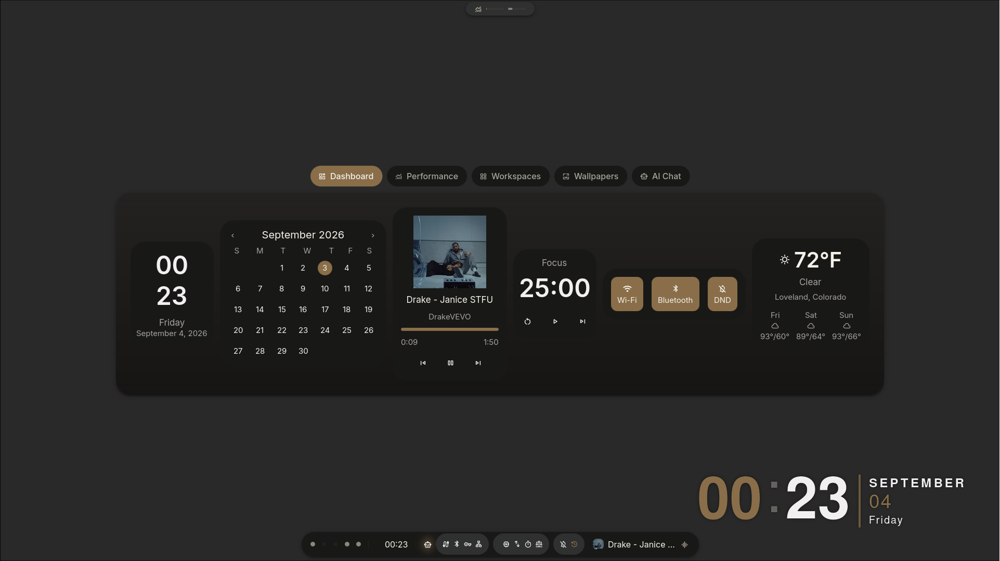<br><sub>Gruvbox</sub></p></td>
<td width="50%"><p align="center">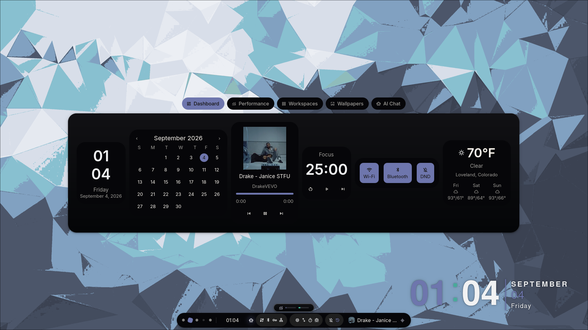<br><sub>Nordic</sub></p></td>
</tr>
<tr>
<td width="50%"><p align="center">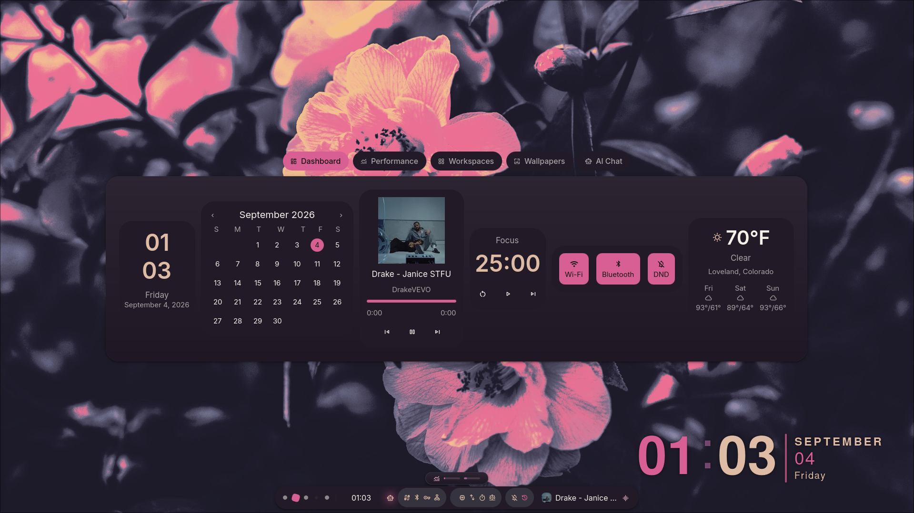<br><sub>Rosé Pine</sub></p></td>
<td width="50%"><p align="center">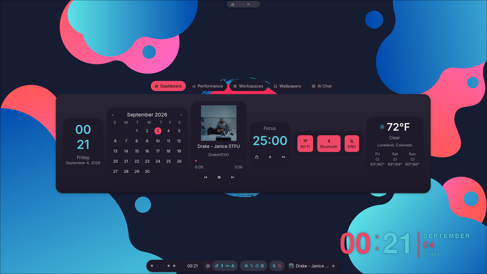<br><sub>Tokyo Night</sub></p></td>
</tr>
<tr>
<td width="50%"><p align="center">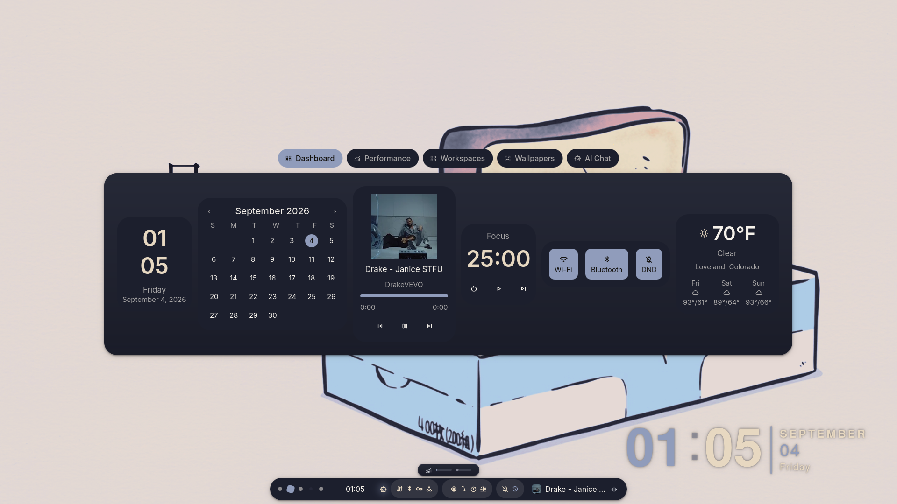<br><sub>Catppuccin Latte</sub></p></td>
<td width="50%"><p align="center">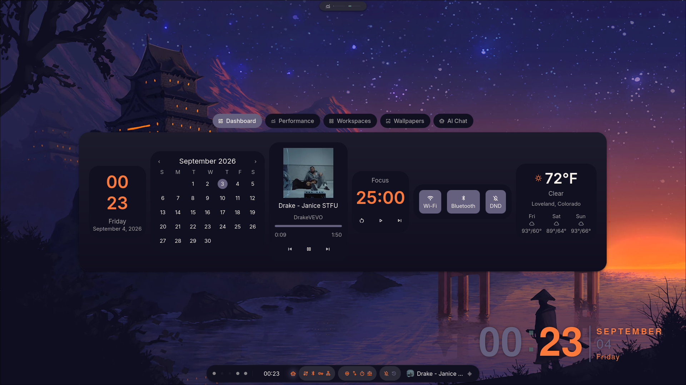<br><sub>Lofi</sub></p></td>
</tr>
<tr>
<td width="50%"><p align="center">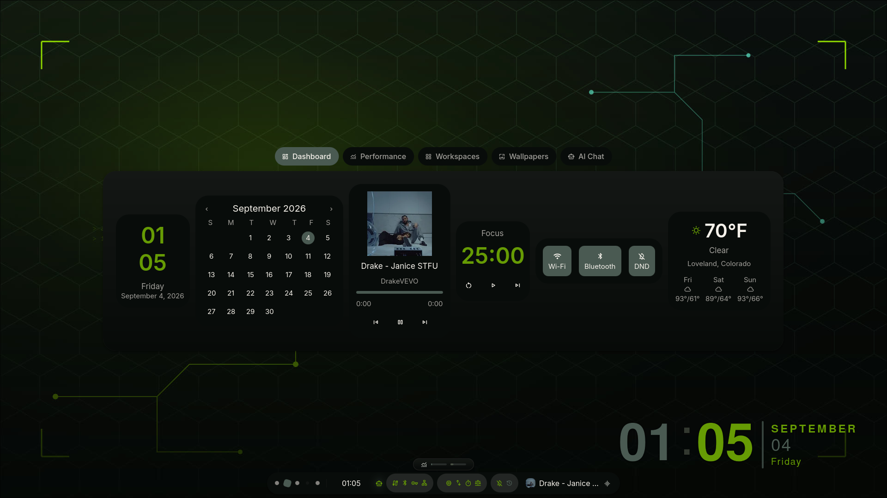<br><sub>HackTheBox</sub></p></td>
<td width="50%"><p align="center">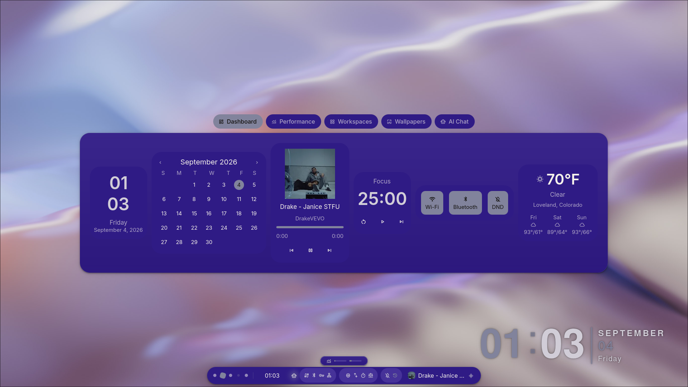<br><sub>Windows 11</sub></p></td>
</tr>
</table>

</details>

Theme commands:

``` bash
aphotic theme list
aphotic theme set <theme>
aphotic theme next
aphotic theme prev
aphotic theme refresh-gtk
aphotic wallpaper --random
```

GTK4/libadwaita apps (Files, Text Editor, Calculator) get themed too.
libadwaita compiles its palette in and ignores the theme name, so this
needs its own mechanism, separate from the GTK3 path. How that works,
plus the full color-generation pipeline and `theme.toml` schema: see
[Theming](https://t-crypt.github.io/aphotic-hypr/docs/theming/).

> [!TIP]
> Thunar has a right-click **Set as Theme** action for building a theme
> straight from an image in `$HOME/Pictures` (avoid special characters at
> the front of the path). An SDDM sync script keeps your login screen's
> wallpaper matched to whatever's currently active.

## Installation

> [!IMPORTANT]
> Aphotic assumes an Arch/AUR base. Tested and supported on plain Arch
> and on [Omarchy](https://omarchy.org/). EndeavourOS installed with
> Desktop Environment: None also works. It's the same Arch/AUR base as a
> minimal install, with nothing extra to account for. See the
> [FAQ](#faq) for distro-specific notes.

Clone the repository:

``` bash
git clone https://github.com/T-Crypt/Aphotic-Hypr.git
cd Aphotic-Hypr
```

Run the installer:

``` bash
./install.sh
```

> [!TIP]
> Prefer to skip the prompts entirely:
> ```
> ./install.sh --profile full --with gaming,dev --dry-run
> ```

> [!TIP]
> Running Proxmox VE? Build an Arch guest and install there before you
> touch the machine you work on. `install.sh` changes go through a VM
> before they ship. The guest needs **VirtIO-GPU** and a **SPICE**
> viewer, since the browser console swallows the SUPER key. Full setup:
> [Proxmox Test VM](https://t-crypt.github.io/aphotic-hypr/docs/proxmox-test-vm/).

> [!NOTE]
> `--dry-run` is checked before anything else runs. No `sudo` prompt, no
> package installs, no filesystem writes happen ahead of it. Re-running
> `install.sh` later detects your last saved config in `aphotic.toml` and
> offers to reuse it without repeating the wizard.

Custom apps live in `profiles/custom_apps.lst` (still readable at the repo root as a symlink, for anyone on an older clone) and are folded into the resolved package list automatically, with no separate prompt needed.

Updating is `git pull && ./install.sh` (or `aphotic update` once
installed); `./uninstall.sh` restores your most recent backup, add
`--purge-packages` to also remove installed packages. Every flag, the
two separate backup mechanisms, and the 1.x-to-2.0 upgrade note: see the
[Installation guide](https://t-crypt.github.io/aphotic-hypr/docs/installation/).

## FAQ

Arch/AUR-based only, but that covers more than plain Arch. Omarchy and
EndeavourOS (Desktop Environment: None) are both tested and supported
directly. Full compatibility notes, plus every other question that comes
up (updating, uninstalling, theming, contributing): [FAQ](https://t-crypt.github.io/aphotic-hypr/docs/faq/) and
[Compatibility](https://t-crypt.github.io/aphotic-hypr/docs/compatibility/).

## Stack

| Component | Implementation |
| --- | --- |
| Compositor | Hyprland |
| Desktop shell | Quickshell |
| Terminal | Kitty |
| File manager | Thunar |
| Wallpaper | awww |
| Shell | ZSH / Starship |
| Audio visualizer | Cava |

> [!NOTE]
> Rofi shipped as the app launcher, clipboard/emoji/wallpaper pickers, and
> power menu through the earlier Waybar-based setup. All four are now
> covered natively by the Quickshell launcher (`SUPER+A`). Rofi isn't
> installed by either profile anymore; nothing in this repo launches it.

## Performance

Aphotic is designed around a simple rule:

> Features that are not being used should not continuously consume
> resources.

The shell favors:

-   compositor-adjacent components
-   event-driven state where practical
-   conditional polling
-   optional profiles
-   optional plugins
-   minimal external daemons
-   graceful degradation when optional dependencies are unavailable

The Resource Engine extends this approach to active workloads instead of
treating system resources as static configuration.

## Keybindings

Keybinds live in one place, [`Configs/hypr/keybinds.lua`](Configs/hypr/keybinds.lua). The ones you'll reach for first:

| Keys | Action |
| :-- | :-- |
| <kbd>Super</kbd> + <kbd>A</kbd> / <kbd>Space</kbd> | Launcher (apps, clipboard, emoji, windows, wallpaper) |
| <kbd>Super</kbd> + <kbd>D</kbd> | Command Center |
| <kbd>Super</kbd> + <kbd>I</kbd> | Settings Control Center |
| <kbd>Super</kbd> + <kbd>L</kbd> | Lock screen |
| <kbd>Super</kbd> + <kbd>Backspace</kbd> | Session / power menu |
| <kbd>Super</kbd> + <kbd>,</kbd> / <kbd>.</kbd> | Cycle theme |
| <kbd>Alt</kbd> + <kbd>Tab</kbd> | Window switcher |
| <kbd>Super</kbd> + <kbd>Shift</kbd> + <kbd>S</kbd> | Screenshot picker |

Every other bind (apps, windows, workspaces, media, screen capture, the
window-switcher submap) is on the [Keybindings
page](https://t-crypt.github.io/aphotic-hypr/docs/keybindings/), one row
per key, grouped the same way.

## Documentation

Every command, design decision, and gotcha that doesn't fit here lives on
the doc site:
**[t-crypt.github.io/aphotic-hypr](https://t-crypt.github.io/aphotic-hypr)**

Jump straight to: [Getting
Started](https://t-crypt.github.io/aphotic-hypr/docs/getting-started/) ·
[CLI Reference](https://t-crypt.github.io/aphotic-hypr/docs/cli-reference/)
· [Bar Styles](https://t-crypt.github.io/aphotic-hypr/docs/bar-styles/) ·
[Architecture](https://t-crypt.github.io/aphotic-hypr/docs/architecture/)
· [Troubleshooting](https://t-crypt.github.io/aphotic-hypr/docs/troubleshooting/)

## Project Status

Aphotic is currently in beta.

Core desktop functionality is stable and actively used. Profiles,
plugins, and runtime features continue to evolve.

Bug reports and hardware-specific issues are welcome.

## Star History

<a href="https://www.star-history.com/?type=date&repos=T-Crypt%2FAphotic-Hypr">
 <picture>
 <source media="(prefers-color-scheme: dark)" srcset="https://api.star-history.com/chart?repos=T-Crypt/Aphotic-Hypr&type=date&theme=dark&legend=top-left&sealed_token=ypXqE7-DQiuJyvY9koFRVoIXk2HPugsrJGClSWh7P1FY8nA7ol-2RDfC5Y41CWpVnHmyqDL_mxAL6UDuAk2yrEhNhsBTCl-hTalGQg3Bp5cYQ1Zp1LGwDA94WqIIP4v30SrycPaZFcqA0L1LzsFi-PZF9vBE26aq4K5ihUzZzG9W0tfUNUlfL1p58oyW" />
 <source media="(prefers-color-scheme: light)" srcset="https://api.star-history.com/chart?repos=T-Crypt/Aphotic-Hypr&type=date&legend=top-left&sealed_token=ypXqE7-DQiuJyvY9koFRVoIXk2HPugsrJGClSWh7P1FY8nA7ol-2RDfC5Y41CWpVnHmyqDL_mxAL6UDuAk2yrEhNhsBTCl-hTalGQg3Bp5cYQ1Zp1LGwDA94WqIIP4v30SrycPaZFcqA0L1LzsFi-PZF9vBE26aq4K5ihUzZzG9W0tfUNUlfL1p58oyW" />
 
 </picture>
</a>

<br>

## License

See [LICENSE](LICENSE).
