<p align="center">
  
</p>

<p align="center">
  
  
  
  
  
  
</p>

<p align="center">
  <em>A Hyprland setup for four identities at once: developer environment, gaming rig, AI-assisted workflow, and security research box. It kept the minimalist bones it started from.</em>
</p>

<p align="center">
  <a href="#preview"><code>Preview</code></a> ·
  <a href="#screenshots"><code>Screenshots</code></a> ·
  <a href="#themes"><code>Themes</code></a> ·
  <a href="#install"><code>Install</code></a> ·
  <a href="#profiles--layers"><code>Profiles</code></a> ·
  <a href="#architecture"><code>Architecture</code></a> ·
  <a href="#quickshell-shell"><code>Quickshell</code></a> ·
  <a href="#settings--control-center"><code>Settings</code></a> ·
  <a href="#theming"><code>Theming</code></a> ·
  <a href="#keybindings"><code>Keybindings</code></a> ·
  <a href="#roadmap"><code>Roadmap</code></a> ·
  <a href="#faq"><code>FAQ</code></a>
</p>

<sub><a id="-top"></a></sub>

<br>

> [!WARNING]
> **Status: Beta.** Aphotic is currently at the version in [`VERSION`](VERSION) and considered beta software. Most core features are stable and in daily use, but this is still an actively evolving desktop shell — expect occasional rough edges, especially around newer modules and edge-case hardware/theme combinations.
>
> If something breaks, looks wrong, or behaves unexpectedly, please open an [Issue](../../issues) with as much detail as you can (theme, profile/layers used, GPU, and steps to reproduce). Bug reports and feedback are what move this out of beta — they're genuinely welcome.

<br>

## Preview

One shell, reskinned live from a wallpaper. No rebuild, no relogin. The Agent Graph tab (an installable plugin — see [Plugin System](#plugin-system)), live, over **Tokyo Night** — reskinned the same way across **Lofi** and **Gruvbox**, two more of the eight themes that ship out of the box:

<p align="center">
  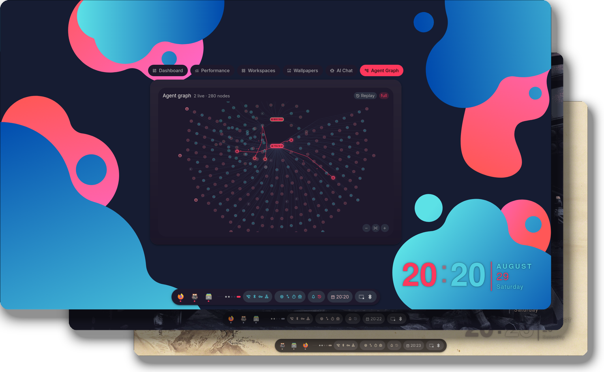
</p>

**Agentic workflow, live render** — 203 nodes across 2 active sessions, every
Bash and Read call landing on the graph as the agent makes it, with replay
scrubbing and zoom:

https://github.com/user-attachments/assets/a9a2ff29-4c57-4e1f-b4e9-e3a93e995c2a

<div align="right"><a href="#-top">🡅 back to top</a></div>

<br>

## Gallery

<!-- All real captures. Add a new one by dropping the file at
     assets/screenshots/<name>.png and adding a matching <td> below. -->

<table>
<tr>
<td width="50%">
<p align="center">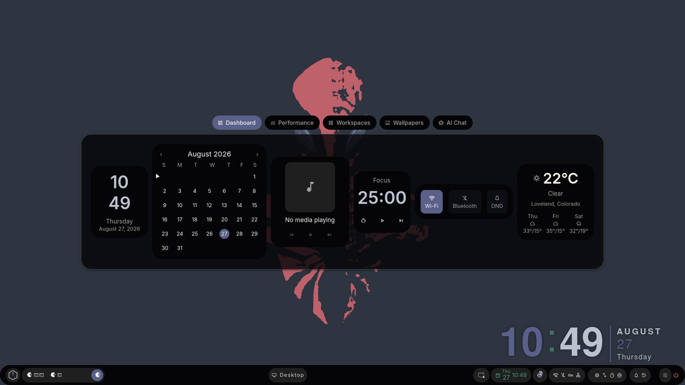<br><sub>Dashboard</sub></p>
</td>
<td width="50%">
<p align="center">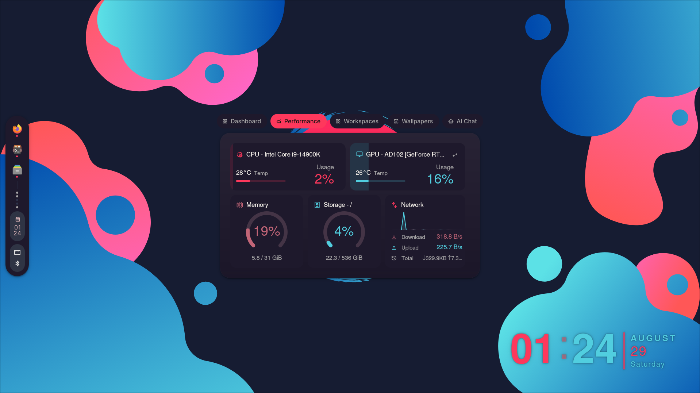<br><sub>Performance</sub></p>
</td>
</tr>
<tr>
<td width="50%">
<p align="center">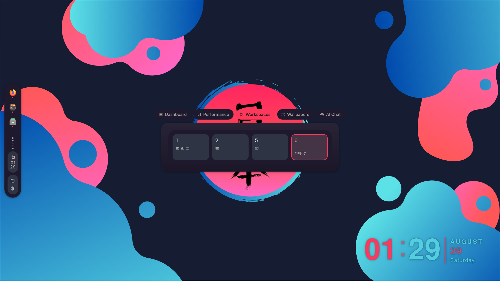<br><sub>Workspaces</sub></p>
</td>
<td width="50%">
<p align="center">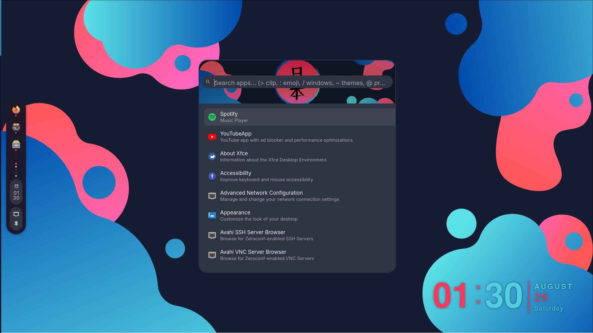<br><sub>Launcher</sub></p>
</td>
</tr>
<tr>
<td width="50%">
<p align="center">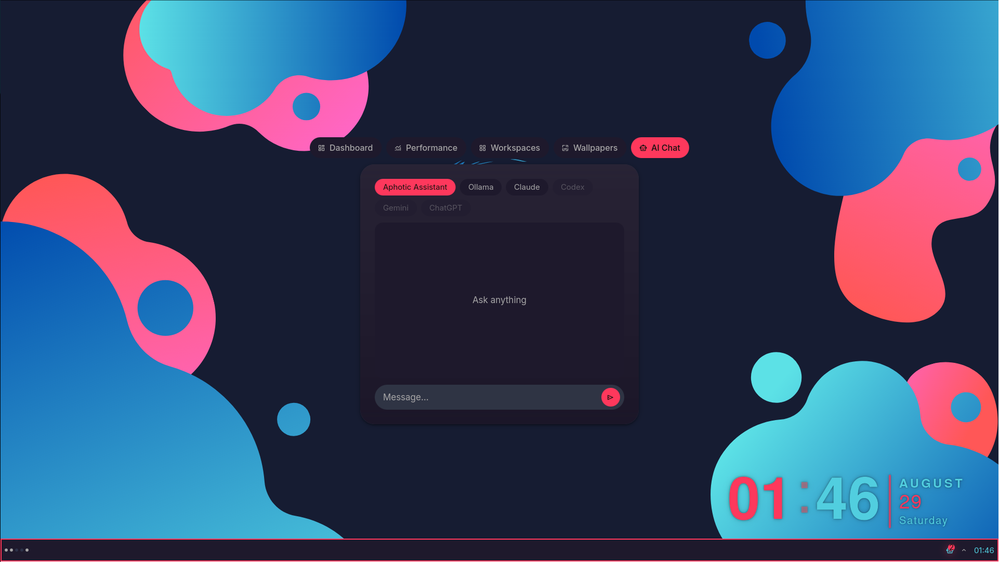<br><sub>AI Chat</sub></p>
</td>
<td width="50%">
<p align="center">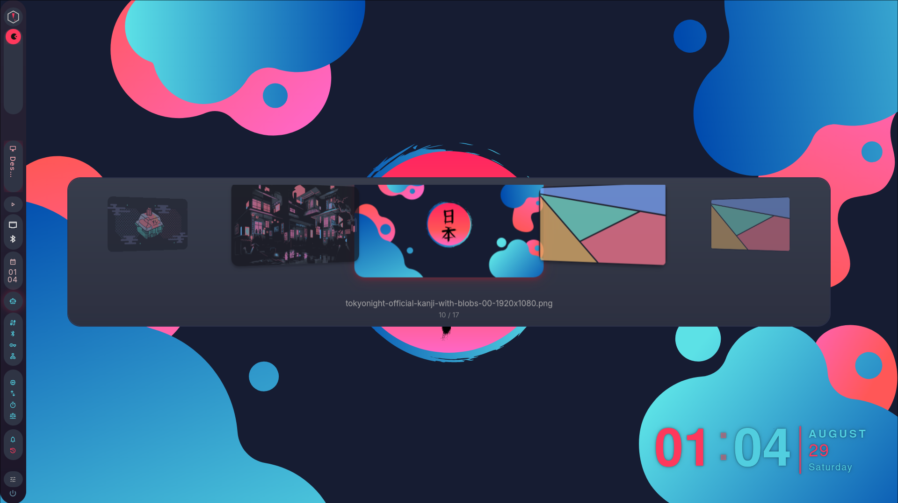<br><sub>Wallpaper Picker</sub></p>
</td>
</tr>
<tr>
<td width="50%">
<p align="center">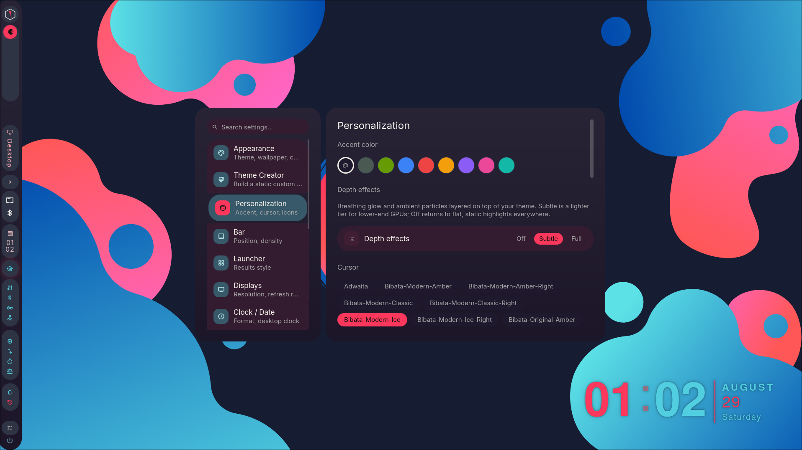<br><sub>Personalization</sub></p>
</td>
<td width="50%">
<p align="center">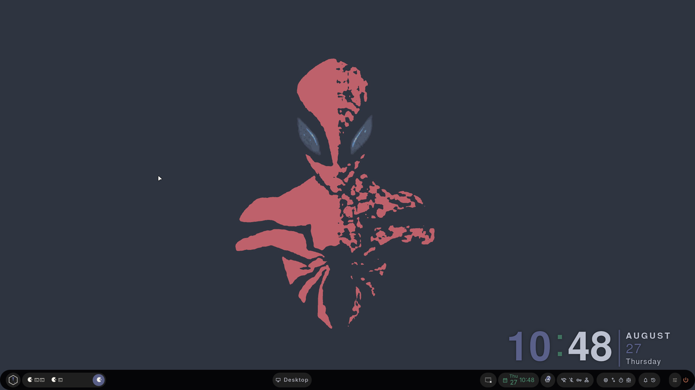<br><sub>Bar — Full Style</sub></p>
</td>
</tr>
<tr>
<td width="50%">
<p align="center">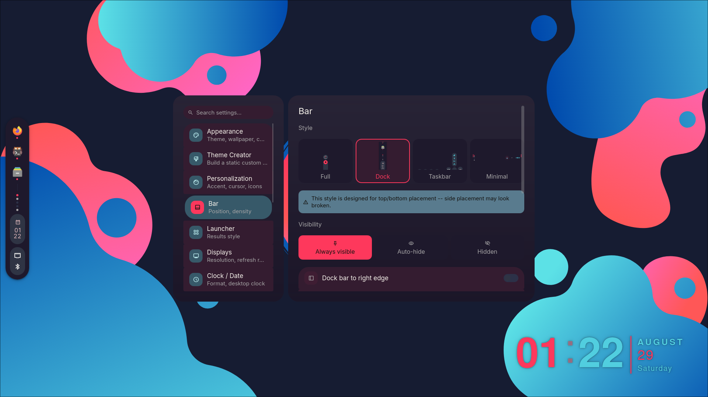<br><sub>Bar — Dock Style</sub></p>
</td>
<td width="50%">
<p align="center">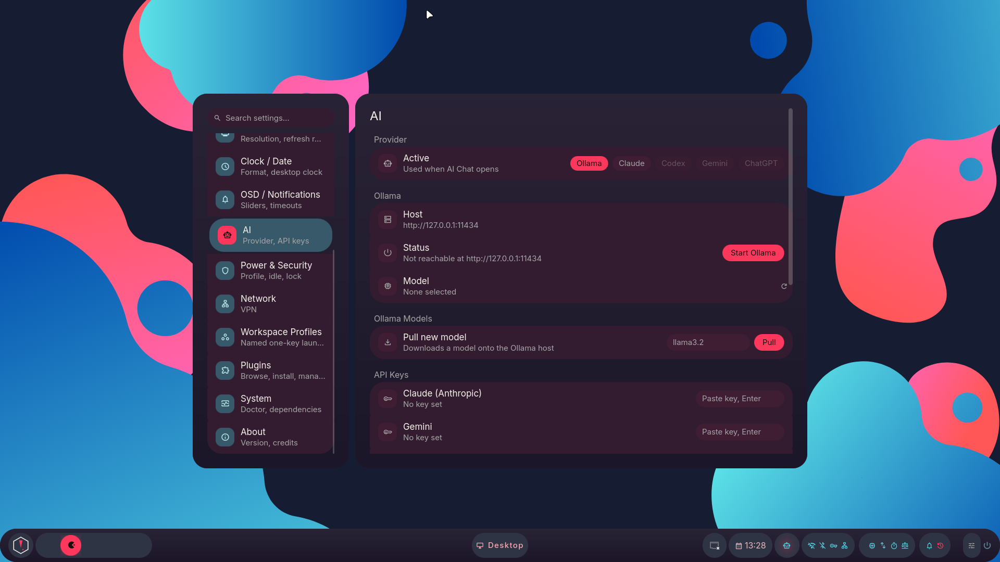<br><sub>AI Settings &amp; Hardware Advisor</sub></p>
</td>
</tr>
<tr>
<td width="50%">
<p align="center">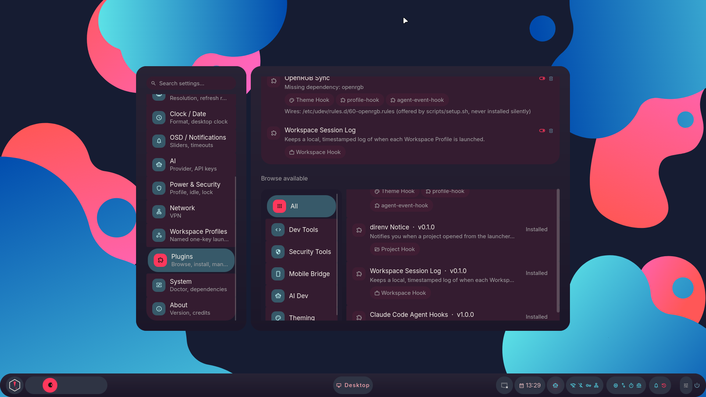<br><sub>Plugins</sub></p>
</td>
<td width="50%">
<p align="center">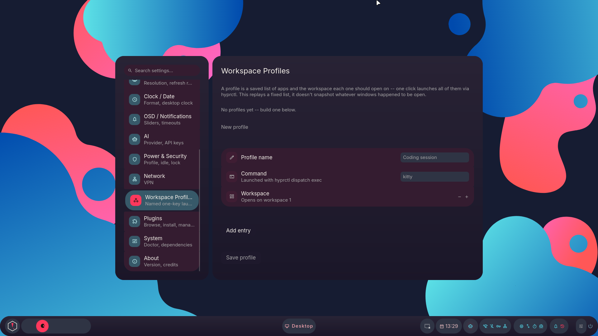<br><sub>Workspace Profiles</sub></p>
</td>
</tr>
<tr>
<td width="50%">
<p align="center">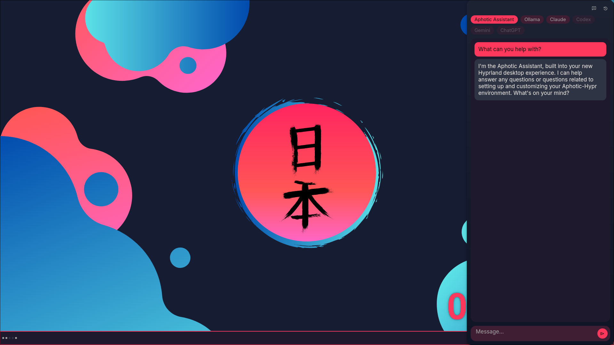<br><sub>Intelligence — Aphotic Assistant</sub></p>
</td>
<td width="50%">
<p align="center">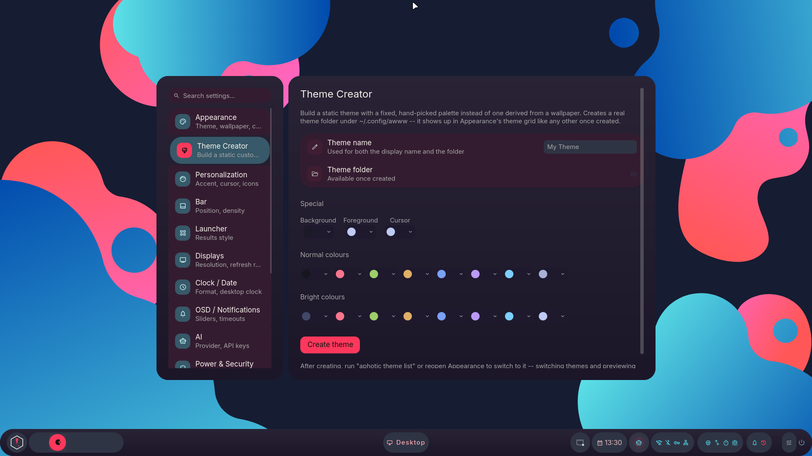<br><sub>Theme Creator</sub></p>
</td>
</tr>
</table>

<div align="right"><a href="#-top">🡅 back to top</a></div>

<br>

## Themes

Eight themes ship out of the box, each a directory-per-theme wallpaper set with its own accent, icon tint, and (for Latte) light-mode variant. Colors below are each theme's real generated accent, pulled straight off its default wallpaper — click a swatch to see that wallpaper:

| | | | |
|:--:|:--:|:--:|:--:|
| [](Configs/awww/gruvbox/sunset.jpg) | [](Configs/awww/nordic/aurora.jpg) | [](Configs/awww/rosepine/pine-moon.jpg) | [](Configs/awww/tokyonight/neon-skyline.jpg) |
| [](Configs/awww/latte/latte-art.jpg) | [](Configs/awww/lofi/cozy-window.jpg) | [](Configs/awww/hackthebox/circuit.jpg) | [](Configs/awww/windows11/bloom.jpg) |

Switch between them live with `aphotic theme next`/`prev` (or <kbd>Super</kbd> + <kbd>,</kbd>/<kbd>.</kbd>), pick one directly in Settings → Appearance, or build your own in the [Theme Creator](#settings--control-center). See [Theming](#theming) for how the palette actually gets generated and applied.

<details>
<summary><strong>CLI reference &amp; wallpaper pool</strong></summary>

```bash
aphotic theme list                   # list theme folders
aphotic theme set <theme-name>       # apply a theme
aphotic theme next / prev            # cycle themes
aphotic scheme set -n <scheme-name>  # apply a named color scheme
aphotic wallpaper -f <path>          # set a specific wallpaper
aphotic wallpaper --random           # pick a random wallpaper
aphotic wallpaper --fetch-extra      # download the larger community wallpaper pool
```

Each theme ships with 4-5 wallpapers committed directly in the repo (under 20MB total across all eight), enough to keep a fresh `git clone` small even on a slow connection. A larger curated pool (roughly 145MB across all themes, sourced from the community wallpaper repos credited at the bottom of this page) stays opt-in rather than bundled:

```bash
aphotic wallpaper --fetch-extra            # every theme's extra pool
aphotic wallpaper --fetch-extra nordic     # just one theme
```

Both commands show the total download size first (skip the prompt with `-y`/`--yes`), verify each file's SHA-256 before keeping it, and only fetch what's still missing on a re-run. `install.sh` asks about this once near the end of setup, defaulting to **no** so a bandwidth-limited connection isn't stuck downloading wallpapers it never asked for.

</details>

<div align="right"><a href="#-top">🡅 back to top</a></div>

<br>

## Stack

| Layer | Choice |
|---|---|
| Window Manager | [Hyprland](https://github.com/hyprwm/Hyprland) |
| Shell (bar, launcher, notifications, OSD, lock, power menu, dashboard, screenshot picker) | [Quickshell](https://quickshell.org) — hand-vendored, fully custom QML |
| Terminal | [Kitty](https://github.com/kovidgoyal/kitty) |
| File Manager | [Thunar](https://github.com/xfce-mirror/thunar) |
| Wallpaper Engine | [awww](https://codeberg.org/LGFae/awww) |
| Terminal shell | [ZSH](https://sourceforge.net/projects/zsh/) or [Starship](https://github.com/starship/starship) |
| Audio Visualizer | [Cava](https://github.com/karlstav/cava) |

> [!NOTE]
> Rofi shipped as the app launcher, clipboard/emoji/wallpaper pickers, and power menu through the earlier Waybar-based setup. All four are now covered natively by the Quickshell launcher (`SUPER+A`) — see [Launcher modes](#quickshell-shell) below. Rofi isn't installed by either profile now, and nothing in this repo launches it.

<div align="right"><a href="#-top">🡅 back to top</a></div>

<br>

## Quickshell Shell

Waybar, Mako, Swaylock, and Rofi are retired in favor of one hand-vendored [Quickshell](https://quickshell.org) shell. It isn't an installed dependency: the QML lives in `Configs/quickshell/aphotic/`, and no native C++ plugin is required. Color comes from `wallust`, the same engine as everything else — Quickshell doesn't bring its own theming.

| Module | Replaces | Notes |
|---|---|---|
| Bar | Waybar | Four swappable bar styles -- Full (dockable left/right/top/bottom, pill or square background), Dock (floating macOS-style app dock), Taskbar (Windows-style grouped task list), Minimal (Omarchy-style thin icon strip) -- switchable live from Settings → Bar, `aphotic bar style <name>`, or SUPER+CTRL+SHIFT+B to cycle. Full's workspaces/active window/tray/clock/status icons all keep their real hover popouts (see below). Anyone with `barSkin: "minimal"` already saved is migrated automatically |
| Bar popouts | — | Hover any status icon, the tray, or the active window pill for a real detail panel — volume, Wi-Fi, Bluetooth, battery/power profile, agent sessions, host info, Pomodoro, window title, keyboard layout, lock state, live resource meter |
| Launcher | Rofi (drun, clipboard, emoji, wallpaper) | One search box, mode switched by a prefix — see [Launcher modes](#launcher-modes) below |
| Screenshot picker | `grim`/`slurp` combo scripts | Drag-select a region with live client-window snapping and a freeze-mode preview — `SUPER+Shift+S` (see [Keybindings](#keybindings) for the freeze/clipboard variants); the plain `grim`/`slurp`/`swappy` combo stays on `SUPER+S` |
| Notifications | Mako | Popup toasts, top-right — `SUPER+Shift+N` clears them all |
| OSD | — | Volume/mic/brightness popups on change, enable flags and hide-delay configurable in Settings |
| Lock screen | Swaylock | Real `ext-session-lock-v1` + real PAM auth via the system's own `/etc/pam.d/swaylock` service — `SUPER+L` |
| Session/power menu | Rofi's powermenu | Lock, suspend, log out, hibernate, reboot, shut down — `SUPER+Backspace` |
| Command Center | — | Tabbed dashboard overlay — Dashboard (clock/calendar/media, weather, Pomodoro, Wi-Fi/Bluetooth/DND quick toggles), Performance (live CPU/GPU/memory/storage/network cards), Workspaces (numbered grid, click to jump), Wallpapers (cycle/pick within the active theme live, without opening Settings), AI Chat (Claude/Ollama/Gemini/ChatGPT, see below) — `SUPER+D` |
| Settings | — | Full-screen Control Center — searchable category rail (Appearance, Theme Creator, Personalization, Bar, Launcher, Displays, Clock/Date, OSD/Notifications, AI, Power & Security, Network, Workspace Profiles, Plugins, System, About), cross-theme wallpaper picker, live doctor output — `SUPER+I` |
| Intelligence | — | Right-docked quick-chat popout, separate from the Command Center's AI Chat tab — persisted session history, per-session provider/model, click-outside or `Esc` to dismiss — `SUPER+Shift+A` (see below) |
| Eyedropper | — | Single-click screen color picker — samples one pixel via `grim`, copies its hex to the clipboard, confirms with a notification carrying a generated color swatch icon — `SUPER+Shift+C` |

Every module is a deliberately-scoped-down, hand-built implementation, not a kitchen-sink port — things needing a native C++ plugin (fingerprint/face auth, a calculator, Material-You scheme switching) were left out in favor of what Aphotic actually needs; the resource-meter and dashboard gaps a plugin would otherwise cover are hand-implemented instead (see Performance/System above), not skipped.

<details>
<summary><strong>AI Chat</strong> — four providers behind one interface, plus a local model manager and an optional Assistant</summary>

The Command Center's AI Chat tab talks to four providers behind one interface, plus a fifth if you've installed the Assistant (see below):

- **Claude** (via the `claude` CLI, needs `ANTHROPIC_API_KEY`), **Ollama** (direct HTTP to a configurable local/LAN host, no key needed), **Gemini** and **ChatGPT** (direct HTTP, need their own API keys). A provider with no key/host configured shows a clear inline message telling you what to set instead of failing silently. Keys live in `~/.config/aphotic/ai-keys.json` (`chmod 600`); the active provider and Ollama host/model persist in `~/.config/aphotic/ai-config.json`. Neither ships with a real address baked in — set your Ollama host from the model picker, or export `OLLAMA_BASE_URL`.
- **Ollama model manager** (Settings → AI) — every installed model with live/idle status and VRAM usage, one click to set active, delete, or pull-by-name to download a new one, straight against Ollama's own REST API.
- **Weather card** (Command Center → Dashboard) — current temperature/condition plus a 3-day forecast via Open-Meteo. Leave the location blank for IP-based auto-detection, or set an explicit city + Celsius/Fahrenheit in Settings → Clock/Date. The resolved location and last-good forecast are cached to disk, so a fresh shell start shows the last known weather immediately instead of a blank card.
- **Aphotic Assistant** (opt-in) — a local chatbot pinned to a fixed persona/system-prompt, installed via `install.sh` on NVIDIA machines that have (or add) the `ai` layer. Shows up as a fifth provider pill once installed, in both AI Chat and Intelligence. Picks its model via `llmfit`'s hardware-aware recommendation at install time (a small broadly-compatible default if `llmfit` isn't available), greets you once on first open, and Settings → AI shows its installed model with reinstall/uninstall controls. `install.sh --with-assistant`/`--no-assistant` skip the prompt; silently unavailable on non-NVIDIA machines.
- **Agent module** (bar icon) — tracks three CLI providers, Claude Code/Codex/Ollama, behind one switchable icon: left-click for a session/token-usage or loaded-models panel, right-click launches the provider in a new terminal, middle-click cycles providers. Usage comes from a 15-minute local-transcript scan (aggregate token counts only, never prompts/responses); the Claude Code hook's live per-session data is read and rendered as real per-session rows in the panel. The agent stack as a whole follows the installer's `ai` layer — with it off, the hook is never wired and the module doesn't run.

</details>

<details>
<summary><strong>Intelligence</strong> — a right-docked quick-chat popout with persisted session history</summary>

`SUPER+Shift+A` opens **Intelligence**, a right-docked quick-chat popout that stays out of the way until summoned — distinct from the Command Center's AI Chat tab (`SUPER+D`), which is a fixed tab inside a bigger overlay. Both share the same backend (`AiProviders`, `AiConfig`, `AiKeys`): same providers, same keys, same Ollama host. What Intelligence adds is real conversation history — every session (title, provider, model, full message log) persists to `~/.local/state/aphotic/intelligence-sessions.json`, survives a shell restart, and is independently switchable/renamable/deletable from a collapsible history panel. Each session remembers its own provider/model rather than always following the AI Chat tab's active pick; Settings → AI has a default-provider/model override for new sessions plus max-sessions/auto-prune-by-age limits. Replies render with minimal markdown (fenced code blocks get a monospace block, everything else is plain wrapped text) and, like the AI Chat tab, aren't streamed token-by-token yet (a real streaming rewrite across all four providers is future work, not silently stubbed).

</details>

<details>
<summary><strong>Bar icons</strong> — host info, Pomodoro timer, Do Not Disturb</summary>

Three small bar icons round out the QoL set, each with its own Personalization accent-color override:

- **Host info** — click to copy your LAN IP to the clipboard, hover for hostname + IP with per-row copy.
- **Pomodoro timer** — 25/5 focus/break cycle, click to start/pause, hover for reset/skip, notified on phase change, with a matching Dashboard card.
- **Do Not Disturb** (`SUPER+Shift+D`) — suppresses notification popups (they still land in history). Pomodoro's focus phase auto-engages it and auto-releases it when focus ends, without clobbering a DND you'd already turned on manually.

</details>

<details id="launcher-modes">
<summary><strong>Launcher modes</strong> — one search box, mode switched by a prefix character</summary>

`SUPER+A` (or `SUPER+SPACE`) opens the launcher in app-search mode. Typing one of these characters first switches what you're searching, all inside the same box:

| Type | Mode | Backed by |
|:--:|---|---|
| *(nothing)* | Search & launch installed apps, sorted by how often you actually use them | Desktop entries + a per-app launch count |
| `>` | Clipboard history (pin frequent snippets/commands with the pin icon so they survive `cliphist`'s rolling history) | `cliphist` |
| `:` | Emoji picker | `Configs/quickshell/aphotic/data/emoji.txt` |
| `/` | Switch to an open window | Hyprland's own window list |
| `~` | Change wallpaper | Files in `~/.config/awww` |
| `@` | Jump to a project — opens a terminal running `claude` plus an editor | Git repos found under `~/Projects`/`~/repos` (or `Settings.projectRoots`) |

</details>

<div align="right"><a href="#-top">🡅 back to top</a></div>

<br>

## Settings — Control Center

`SUPER+I` (or `qs -c aphotic ipc call settings toggle`) opens a full-screen panel — a searchable, scrollable category rail on the left, the selected category's controls on the right, sliding between them instead of a flat crossfade:

<details>
<summary><strong>Full category reference</strong></summary>

| Category | What's in it |
|---|---|
| Appearance | Theme grid, wallpaper-in-active-theme quick picker, a **Browse all wallpapers** grid spanning every theme, and a wallpaper slideshow (auto-advance on a configurable interval) |
| Theme Creator | Build your own **static** theme — a full palette editor (background/foreground/cursor + 16 ANSI colors, common-color presets or a real HSV color wheel) writes a fixed colorscheme + generated wallpaper straight into `~/.config/awww`, no wallpaper-derived palette needed. Shows up in Appearance's theme grid like any other once created, plus a folder icon to open it in Thunar |
| Personalization | Accent color override, cursor theme + size, icon theme, and independent color overrides for the Bluetooth/Wi-Fi/Power-profile/Performance/host-info/Pomodoro bar icons (each defaults to the theme's own tone, override any of them or leave as-is) |
| Bar | Four live-previewed styles (Full/Dock/Taskbar/Minimal, click a preview to switch), dock left/right or top/bottom, compact density, vertical orientation, Full's own pill/square background choice, plus per-style options (Dock auto-hide + pinned apps, Taskbar grouping, Minimal's DND indicator) |
| Displays | Live per-monitor info — name, resolution, refresh rate, scale, primary badge (read-only; live resolution/scale editing isn't wired up yet, see the Displays entry in the roadmap for why) |
| Clock / Date | 12-hour clock, show date in bar clock, desktop clock, weather location override + Celsius/Fahrenheit |
| OSD / Notifications | Show/hide OSD, brightness/mic sliders, OSD hide delay, notification timeout |
| AI | Active provider, Ollama host/model + manager, masked API keys, an `llmfit` Hardware Advisor, Model Storage (Ollama/GGUF directories), Intelligence session defaults, and Assistant status — see [AI Chat](#quickshell-shell) above |
| Power & Security | Power profile switcher (Saver/Balanced/Performance), idle lock/screen-off/suspend timeouts (generates `hypridle.conf`), lockout info |
| Workspace Profiles | Named, one-key launch groups — save a list of commands + target workspaces, launch them all at once via `hyprctl dispatch exec`. Not a live session snapshot (Hyprland/X11 apps don't expose one), just a saved replay list |
| Plugins | Link to the [`aphotic-plugins`](https://github.com/T-Crypt/aphotic-plugins) repo, an **Installed** list (enable/disable/remove, missing-dependency warnings), and a **Browse available** list pulled live from the repo's index, filterable by category (Dev/Security/Mobile/AI/Theming/Productivity) — install with one click. Security-category plugins stay hidden behind a separate trust step. See [Plugin system](#plugin-system) below |
| System | Live `aphotic doctor` output, an Overview (theme, install profile, daemon status), Hardware (CPU/GPU/RAM/disk), and an on-demand package check |
| About | Real Aphotic logo, version (read from `VERSION`), repo link |

</details>

Every toggle here persists to `~/.local/state/aphotic/settings.json` and survives a shell restart. Adding a new setting is a data addition to an existing pane, not new UI — every row shares one component (`SettingsRow`, grouped into connected-card sections by `SettingsGroup`) for the icon-badge/title/description/control layout. Pane content and the category rail both scroll independently once they outgrow the panel, so a long pane never gets clipped. See [Preview](#preview) above for the panel itself, live across three different themes.

<div align="right"><a href="#-top">🡅 back to top</a></div>

<br>

## Plugin System

Aphotic base is the shell, rice/theming, Settings, and core Quickshell modules — everything else, AI capabilities included, is an independently installable/removable plugin. A plugin is a directory with a `plugin.toml` manifest (manifest v3) declaring what it is and what it touches:

- **Hooks** — every theme apply (`aphotic theme`, the Wallpapers picker, or `wallswitcher.py`) fires each enabled plugin's `on_theme_change` hook with the freshly-resolved palette as JSON on stdin; a project opened from the launcher's `@` mode or a Workspace Profile launch fires `on_project_open`/`on_workspace_launch` for any plugin declaring interest. All hooks are fire-and-forget, backgrounded, with a 5-second timeout so a slow or broken plugin can't stall what it's piggybacking on.
- **`[owns]`** — declares the config keys a plugin's presence affects, so install/remove stays auditable instead of each plugin hand-rolling its own cleanup logic.
- **`[ui.dashboard_tab]`** — lets a plugin contribute a real Command Center tab, loaded dynamically at runtime (no shell rebuild) and gone the instant the plugin is disabled or removed, no leftover UI. **Agent Graph** (live tool-call graph + run replay for Claude Code/Codex, see [Preview](#preview)) is the flagship example — fully out of the base shell, only activates once the `ai` layer is enabled *and* a harness is actually configured.

A `category` field (dev/security/mobile/ai/theming/productivity) drives filtering in `aphotic plugin list --remote` and Settings → Plugins; security-category plugins live in a separate index that stays untrusted (and unfetched) until explicitly opted into.

Plugins are distributed from a separate, purpose-built repo, [`aphotic-plugins`](https://github.com/T-Crypt/aphotic-plugins) — kept apart from the main dotfiles so plugins can version and release independently. `aphotic plugin list --remote` (and Settings → Plugins' **Browse available** list) reads that repo's lightweight `index.json` without needing a full clone; `aphotic plugin install <name>` (or the Settings UI's Install button) clones just that plugin locally, auto-syncing the registry repo first if it isn't already on disk — no manual clone step required. Besides Agent Graph, the registry also carries **OpenRGB Sync** (RGB lighting synced to the theme's accent color), **direnv Notice**, and **Workspace Session Log** — all hook-only plugins, no dashboard tab.

```
aphotic plugin list [--remote] [--json]   # installed, or browse the remote index
aphotic plugin install <name> [--link]    # clone (or symlink, for local dev) a plugin
aphotic plugin enable|disable <name>
aphotic plugin remove <name>
```

> [!NOTE]
> Gaming, Dev, and Security don't have their own plugins yet — the shared substrate they'd sit on (a resource-engine core) is still ahead. `ai` is the only domain with real plugins today.

<div align="right"><a href="#-top">🡅 back to top</a></div>

<br>

## Why Aphotic

Most rices are a snapshot: a config someone tuned once and stopped touching, distributed as a pile of dotfiles you copy over your own and hope for the best. Aphotic is built to keep moving. Underneath the visuals is a small, deliberate piece of infrastructure:

- **Package sets are data.** They live in `profiles/*.toml`, not as bash arrays buried in an install script. Changing what ships means editing a TOML file, not doing surgery on `install.sh`.
- **Profiles and layers compose.** A base profile (`minimal` or `full`) plus any combination of layers (`gaming`, `dev`, `ai`, `exploit` and its sublayers) resolve into one merged package list at install time. Add a layer without touching the base, or a base without touching the layers.
- **Every install is safe to repeat.** Each run snapshots your configs to a timestamped backup first, and writes the resolved choice to `aphotic.toml` so a re-run reuses it instead of asking the same questions again.
- **`--dry-run` shows the whole plan.** Every package, every layer, every detected system fact, before anything runs. No `sudo` prompt until you've agreed to something concrete.
- **`./uninstall.sh` reverses it.** It restores your most recent backup on request. Trying Aphotic doesn't require burning your current setup down first.

None of this is unique by itself. Together it turns a rice from something you install once into something you keep living in.

<div align="right"><a href="#-top">🡅 back to top</a></div>

<br>

## Install

> [!IMPORTANT]
> Aphotic assumes an Arch/AUR base. It hasn't been tested on other distros and no distro branching is planned — see the [FAQ](#faq).

```
git clone https://github.com/T-Crypt/Aphotic-Hypr && cd Aphotic-Hypr
chmod +x install.sh
./install.sh
```

Running with no flags installs Aphotic's daily-driver setup — full profile, no optional layers — with zero prompts. It writes your choices to `aphotic.toml`, the source of truth for every re-run after that.

> [!TIP]
> Want gaming/dev/ai/exploit layers? Either pick them directly:
> ```
> ./install.sh --profile full --with gaming,dev --dry-run
> ```
> or launch the interactive picker (profile, optional layers, theme):
> ```
> ./install.sh --opt-in
> ```
> Layers can always be added later by re-running either form.

<details>
<summary><strong>Full flag reference</strong></summary>

| Flag | Effect |
|---|---|
| `--profile <minimal\|full>` | Selects the base package set. Skips the profile prompt. |
| `--with <layer,layer,...>` | Comma-separated layers to merge in: `gaming`, `dev`, `ai`, `exploit` (a convenience bundle of `exploit-recon`+`exploit-web`+`exploit-network`), or any individual `exploit-*` sublayer (`exploit-recon`, `exploit-web`, `exploit-network`, `exploit-passwords`, `exploit-wordlists`, `exploit-reversing`, `exploit-forensics`, `exploit-reporting`). Skips the layer prompts. |
| `--opt-in` | Interactive layer picker (preset or cherry-pick prompts). Without this flag (and without `--profile`/`--with`), a fresh install defaults to the daily-driver setup instead. |
| `--accept-exploit-disclaimer` | Required alongside `--with` in non-interactive/scripted installs when any `exploit`/`exploit-*` layer is selected — accepts the authorized-use disclaimer without the interactive typed-confirmation prompt. The disclaimer text is shown in full before anything is installed. |
| `--theme <name>` | Pre-selects a theme. Skips the theme prompt. |
| `--with-assistant` / `--no-assistant` | Install (or skip) the Aphotic Assistant without being asked. `--with-assistant` implies the `ai` layer and needs an NVIDIA GPU. |
| `--nvidia-driver <keep\|reinstall>` | Only relevant when an NVIDIA driver is already installed. `keep` leaves it alone, `reinstall` replaces it with Aphotic's recommended `nvidia-open-dkms`. Non-interactive runs default to `keep` — a working driver is never replaced without being told to. |
| `--config-only` | Config sync only: back up, copy `Configs/` over `~/.config/`, restart the shell. No packages, no system prep, no wizard, no `sudo`, and `aphotic.toml` is left untouched. See [Config sync only](#config-sync-only). |
| `--dry-run` | Prints the full resolved install plan and exits — nothing is installed, backed up, or written. |
| `--no-backup` | Skips the pre-install config snapshot. Off by default; use with intent. |
| `--keep-backups <N>` | How many timestamped backups to retain before pruning. Defaults to 5. |
| `-h`, `--help` | Full flag reference. |
| `-v`, `--version` | Prints the installed Aphotic version and exits. |

</details>

> [!NOTE]
> `--dry-run` is checked before anything else runs — no `sudo` prompt, no package installs, no filesystem writes happen before it. Re-running `install.sh` later detects your last saved config in `aphotic.toml` and offers to reuse it without repeating the wizard.

Custom apps live in `profiles/custom_apps.lst` (still readable at the repo root as a symlink, for anyone on an older clone) and are folded into the resolved package list automatically — no separate prompt needed.

### Updating

```
cd Aphotic-Hypr
git pull
./install.sh
```

Aphotic detects your saved `aphotic.toml` and re-resolves your profile/layers against any changes upstream, snapshotting your current configs first exactly as a fresh install would.

#### Config sync only

Most updates are shell changes — Quickshell QML, Hyprland config, keybinds — with no package churn behind them. `--config-only` syncs just those:

```
cd Aphotic-Hypr
git pull
./install.sh --config-only
```

It backs up your current configs, copies `Configs/` over `~/.config/`, and restarts the shell. **No package installs, no system prep, no wizard, no `sudo` prompt**, and `aphotic.toml` is left exactly as it is — so your saved profile and layers are reused, never re-resolved or rewritten. Your `hypr/custom.lua` is preserved the same way a full run preserves it, and `--no-backup` works here too if you want to skip the snapshot.

Use the full `./install.sh` instead when a release adds or removes packages, or when you want to change your profile/layers.

> [!NOTE]
> Once Aphotic is installed, `aphotic update` does the same job from anywhere — it pulls the repo, re-deploys configs, and reloads the shell in one step. `./install.sh --config-only` is the equivalent when you're already sitting in the repo, or when you want the config copy without the git pull.

### Uninstalling

> [!CAUTION]
> Something went sideways? `./uninstall.sh` restores your most recent backup — no manual archaeology through `~/.config-backup/`.

```
./uninstall.sh
```

Pass `--purge-packages` if you also want it to remove everything your profile installed (behind its own separate confirmation).

<div align="right"><a href="#-top">🡅 back to top</a></div>

<br>

## Profiles & Layers

A **profile** is the base package set. A **layer** is an optional add-on merged on top. Pick one profile, any number of layers.

| Profile | What you get |
|---|---|
| `minimal` | Hyprland, Quickshell, Kitty, awww, plus the binaries the always-loaded Quickshell shell itself needs (wallust, grim/slurp/swappy, brightnessctl, swaylock-effects) — the bare tiling desktop, nothing else. |
| `full` | Everything in `minimal`, plus the complete Aphotic experience: theming (Pywal, Pywalfox, Dracula GTK/icons), shell tooling (ZSH, Powerlevel10k, Starship), media (mpv, Cava, Swappy), file management (Thunar plus archive/GVFS plugins), Bluetooth, SDDM, and more. |

| Layer | Adds |
|---|---|
| `gaming` | GameMode, MangoHud (both with 32-bit variants), Steam. |
| `dev` | Neovim, tmux, fzf, ripgrep, fd, lazygit. |
| `ai` | Ollama as a local AI backend, plus [llmfit](https://github.com/AlexsJones/llmfit) for hardware-aware model recommendations — `aphotic ai fit` on the CLI, a Hardware Advisor + Model Storage card in Settings → AI. This layer also turns on Aphotic's agent tooling: it wires Claude Code hooks into `~/.claude/settings.json` (merged with `jq`, never overwriting hooks you already have) and enables a local usage-tracking timer. Leave the layer off and none of that is installed or run; de-select it on a re-run and `install.sh` removes the hook entries it previously added. |
| `exploit` | Offensive-security/CTF tooling, split into focused sublayers (`exploit-recon`, `-web`, `-network`, `-passwords`, `-wordlists`, `-reversing`, `-forensics`, `-reporting`) — `exploit` itself is a convenience bundle of recon+web+network. Most sublayers **enable the BlackArch repo**, which is less stable than Arch's official repos; `install.sh` prints a warning and asks for explicit confirmation before touching `/etc/pacman.conf`. Selecting any of them also requires accepting a one-time authorized-use disclaimer. `./install.sh --help` documents the full sublayer taxonomy and the disclaimer flow. |

Layers are additive and dedupe against the base and each other, so `--with gaming,dev,ai` on top of `full` merges cleanly with no duplicate installs. Combine whatever fits: a `minimal` install with just `dev` is a lean coding box; `full` with `gaming` and `dev` is closer to a daily driver that also game-modes on demand.

<div align="right"><a href="#-top">🡅 back to top</a></div>

<br>

## Architecture

Aphotic's repo mirrors what actually gets installed, plus the machinery that decides what that is:

<details>
<summary><strong>Full repo layout</strong></summary>

```
Aphotic-Hypr/
├── install.sh / uninstall.sh   Thin orchestrators — wizard or flags in, resolved plan out
├── aphotic.toml                 Generated on first install: the resolved source of truth
├── lib/
│   ├── install/                 Wizard prompts, AUR helper detection, backups, config linking
│   └── toml/                    Profile + layer merge logic
├── profiles/
│   ├── base/                    minimal.toml, full.toml
│   └── layers/                  gaming.toml, dev.toml, ai.toml, exploit.toml (meta) + exploit-*.toml sublayers
├── themes/                      Swappable theme presets (THEME_SPEC.md documents the contract)
└── Configs/                     Mirrors ~/.config — the configs that actually land on disk
    ├── systemd/user/              aphotic-shell.service — Restart=on-failure supervision for qs
    ├── quickshell/aphotic/        Hand-vendored Quickshell shell (see below)
    │   ├── config/                Tokens/Config/GlobalConfig singletons (hand-written, no native plugin)
    │   ├── services/               Colours (wallust-generated), Audio, Hypr, Players, Notifs, ...
    │   │   └── ai/                   AiConfig/AiKeys/AiProviders — Command Center's AI Chat + Settings → AI backend
    │   ├── components/             Shared UI primitives (StyledText, MaterialIcon, StateLayer,
    │   │                            SettingsRow/SettingsGroup/SettingsToggleRow/SettingsPresetRow, Logo, ...)
    │   └── modules/                bar/ (+ real popouts), launcher/ (apps/clip/emoji/windows/wallpaper),
    │                                areapicker/, notifications/, osd/, lock/, session/,
    │                                dashboard/ (Command Center), settings/ (Control Center, 15 categories)
    ├── hypr/                     hyprland.lua, keybinds.lua, custom.lua (never overwritten, see below)
    └── .local/
        ├── bin/aphotic            aphotic CLI entry point, symlinked onto PATH by install.sh
        └── lib/aphotic/           aphotic CLI internals (commands/, globalcontrol.sh)
```

</details>

`install.sh` never hardcodes a package list — it resolves one at runtime by merging `profiles/base/<profile>.toml` with each selected `profiles/layers/<layer>.toml`, deduplicating as it goes. Everything downstream (backups, AUR helper choice, config copying) reads from that single resolved plan.

`~/.config/hypr/custom.lua` is the one file `install.sh` never touches once it exists — put your own Hyprland tweaks there and a re-run or `aphotic update` won't clobber them, the same idea as ML4W's protected `custom.conf`.

<div align="right"><a href="#-top">🡅 back to top</a></div>

<br>

## Theming

Wallpaper-driven color generation, applied consistently across the stack:

- Kitty
- Quickshell (bar, launcher, notifications, OSD, lock, session menu, dashboard)
- Cava
- Firefox — requires the [Pywalfox extension](https://addons.mozilla.org/en-US/firefox/addon/pywalfox/)
- VS Code — requires the [Wal Theme extension](https://marketplace.visualstudio.com/items?itemName=dlasagno.wal-theme) (bundled and installed automatically by `install.sh`, along with setting it as the active color theme) and updates live off `wallust`'s own `~/.cache/wal/colors`/`colors.json` output. If it doesn't pick up a change immediately after a fresh install, reload the VS Code window once — its file watcher needs `~/.cache/wal/` to already exist when it starts
- GTK — in progress

> [!TIP]
> Thunar has a right-click **Set as Theme** action for building a theme straight from an image in `$HOME/Pictures` (avoid special characters at the front of the path). An SDDM sync script keeps your login screen's wallpaper matched to whatever's currently active.

<div align="right"><a href="#-top">🡅 back to top</a></div>

<br>

## Keybindings

All keybinds live in one place — [`Configs/hypr/keybinds.lua`](Configs/hypr/keybinds.lua) — grouped exactly as below. Every `qs -c aphotic ipc call ...` target the shell exposes has a keybind; anything below not bound to a key is intentionally IPC-only (scriptable, but not meant to be memorized).

<details>
<summary><strong>Launcher</strong> — see the <a href="#launcher-modes">modes table</a> above for what each prefix does inside it</summary>

| Keys | Action |
| :-- | :-- |
| <kbd>Super</kbd> + <kbd>A</kbd> or <kbd>Super</kbd> + <kbd>Space</kbd> | Open the launcher (apps, clipboard, emoji, windows, wallpaper) |

</details>

<details>
<summary><strong>Apps & tools</strong></summary>

| Keys | Action |
| :-- | :-- |
| <kbd>Super</kbd> + <kbd>T</kbd> | Launch Kitty |
| <kbd>Super</kbd> + <kbd>E</kbd> | Launch Thunar |
| <kbd>Super</kbd> + <kbd>C</kbd> | Launch VS Code |
| <kbd>Super</kbd> + <kbd>F</kbd> | Launch Firefox |
| <kbd>Super</kbd> + <kbd>S</kbd> | Screenshot — simple region select via `grim`/`slurp`/`swappy`, no extra frills |
| <kbd>Super</kbd> + <kbd>W</kbd> | Change wallpaper (random pick) — open the launcher and type `~` to pick a specific one instead |
| <kbd>Super</kbd> + <kbd>Ctrl</kbd> + <kbd>W</kbd> | Open the launcher's wallpaper picker directly |
| <kbd>Super</kbd> + <kbd>,</kbd> / <kbd>Super</kbd> + <kbd>.</kbd> | Cycle to the previous/next theme — same as `aphotic theme prev`/`next` |

</details>

<details>
<summary><strong>Quickshell surfaces</strong></summary>

| Keys | Action |
| :-- | :-- |
| <kbd>Super</kbd> + <kbd>D</kbd> | Command Center (tabbed dashboard overlay) |
| <kbd>Super</kbd> + <kbd>I</kbd> | Settings Control Center |
| <kbd>Super</kbd> + <kbd>Shift</kbd> + <kbd>A</kbd> | Intelligence quick-chat popout |
| <kbd>Super</kbd> + <kbd>Shift</kbd> + <kbd>N</kbd> | Clear all notifications |
| <kbd>Super</kbd> + <kbd>Shift</kbd> + <kbd>D</kbd> | Toggle Do Not Disturb |
| <kbd>Super</kbd> + <kbd>L</kbd> | Lock screen |
| <kbd>Super</kbd> + <kbd>Backspace</kbd> | Session / power menu — lock, suspend, log out, hibernate, reboot, shut down |
| <kbd>Super</kbd> + <kbd>M</kbd> | `wlogout` (fallback power menu) |
| <kbd>Super</kbd> + <kbd>B</kbd> | Restart Quickshell |
| <kbd>Super</kbd> + <kbd>Ctrl</kbd> + <kbd>Shift</kbd> + <kbd>B</kbd> | Cycle bar style (Full → Dock → Taskbar → Minimal) |

</details>

<details>
<summary><strong>Screen capture</strong> — the real Quickshell picker (drag-select with live client-window snapping and a freeze-mode preview), distinct from the plain Super+S script above</summary>

| Keys | Action |
| :-- | :-- |
| <kbd>Super</kbd> + <kbd>Shift</kbd> + <kbd>S</kbd> | Open the picker |
| <kbd>Super</kbd> + <kbd>Ctrl</kbd> + <kbd>S</kbd> | Open the picker in freeze-mode (screen freezes first, then select) |
| <kbd>Super</kbd> + <kbd>Alt</kbd> + <kbd>S</kbd> | Open the picker, copy to clipboard only (no file saved) |
| <kbd>Super</kbd> + <kbd>Ctrl</kbd> + <kbd>Alt</kbd> + <kbd>S</kbd> | Freeze-mode + clipboard-only combined |
| <kbd>Super</kbd> + <kbd>Shift</kbd> + <kbd>C</kbd> | Eyedropper — click a pixel to copy its hex color to the clipboard |

</details>

<details>
<summary><strong>Media, audio & brightness</strong></summary>

| Keys | Action |
| :-- | :-- |
| <kbd>XF86AudioPlay</kbd> / <kbd>XF86AudioPause</kbd> | Play/pause the active MPRIS player |
| <kbd>XF86AudioNext</kbd> / <kbd>XF86AudioPrev</kbd> | Next/previous track |
| <kbd>Super</kbd> + <kbd>Ctrl</kbd> + <kbd>O</kbd> | Cycle audio output device |
| <kbd>XF86AudioRaiseVolume</kbd> / <kbd>XF86AudioLowerVolume</kbd> | Volume up/down |
| <kbd>XF86AudioMute</kbd> | Toggle mute |
| <kbd>XF86AudioMicMute</kbd> | Toggle mic mute |
| <kbd>XF86MonBrightnessUp</kbd> / <kbd>XF86MonBrightnessDown</kbd> | Brightness up/down |

</details>

<details>
<summary><strong>Windows & layout</strong></summary>

| Keys | Action |
| :-- | :-- |
| <kbd>Super</kbd> + <kbd>Q</kbd> | Close the focused window |
| <kbd>Super</kbd> + <kbd>Alt</kbd> + <kbd>Q</kbd> | Force-kill the focused window |
| <kbd>Super</kbd> + <kbd>V</kbd> | Toggle floating |
| <kbd>Super</kbd> + <kbd>P</kbd> | Toggle pseudo-tiling |
| <kbd>Super</kbd> + <kbd>Ctrl</kbd> + <kbd>F</kbd> | Toggle pin (keep window on every workspace) |
| <kbd>Super</kbd> + <kbd>J</kbd> | Toggle split direction |
| <kbd>Super</kbd> + <kbd>Shift</kbd> + <kbd>F</kbd> | Toggle fullscreen |
| <kbd>Super</kbd> + <kbd>&larr;</kbd>/<kbd>&rarr;</kbd>/<kbd>&uarr;</kbd>/<kbd>&darr;</kbd> | Move focus between windows |
| <kbd>Super</kbd> + <kbd>Shift</kbd> + <kbd>&larr;</kbd>/<kbd>&rarr;</kbd>/<kbd>&uarr;</kbd>/<kbd>&darr;</kbd> | Move (swap) the focused window in a direction |
| <kbd>Alt</kbd> + <kbd>Tab</kbd> | Cycle to the next window |
| <kbd>Alt</kbd> + <kbd>Shift</kbd> + <kbd>Tab</kbd> | Cycle to the previous window |
| <kbd>Super</kbd> + <kbd>G</kbd> | Toggle group |
| <kbd>Super</kbd> + <kbd>Ctrl</kbd> + <kbd>H</kbd> / <kbd>Super</kbd> + <kbd>Ctrl</kbd> + <kbd>L</kbd> | Cycle group tabs backward/forward |
| <kbd>Super</kbd> + <kbd>LMB</kbd> drag | Move window |
| <kbd>Super</kbd> + <kbd>RMB</kbd> drag | Resize window |

</details>

<details>
<summary><strong>Workspaces</strong></summary>

| Keys | Action |
| :-- | :-- |
| <kbd>Super</kbd> + <kbd>0</kbd>–<kbd>9</kbd> | Switch to workspace |
| <kbd>Super</kbd> + <kbd>Shift</kbd> + <kbd>0</kbd>–<kbd>9</kbd> | Move window to workspace |
| <kbd>Super</kbd> + Scroll | Cycle workspaces |
| <kbd>Super</kbd> + <kbd>Ctrl</kbd> + <kbd>&darr;</kbd> | Jump to the nearest empty workspace |
| <kbd>Super</kbd> + <kbd>Ctrl</kbd> + <kbd>Tab</kbd> / <kbd>Super</kbd> + <kbd>Ctrl</kbd> + <kbd>Shift</kbd> + <kbd>Tab</kbd> | Cycle forward/backward through open special (scratchpad) workspaces |

> [!NOTE]
> Special workspaces aren't created by an Aphotic keybind yet — cycling only does something once one exists (e.g. via `hyprctl dispatch movetoworkspace special:name`). A dedicated create/toggle bind is a small future addition, tracked in the [Roadmap](#roadmap).

</details>

<details>
<summary><strong>Terminal games</strong> — a few small games built into the <code>aphotic</code> CLI</summary>

`aphotic play` runs three small terminal games: Hangman (classic word-guessing), Snake, and a number-guessing game.

```bash
aphotic play hangman
aphotic play snake
aphotic play guess
```

</details>

<div align="right"><a href="#-top">🡅 back to top</a></div>

<br>

## Roadmap

Aphotic is at **v2.0.0**. The Quickshell shell, per-theme wallpapers, the unified theme/wallpaper/scheme state contract, a CI-tested installer, and the modular plugin architecture (base shell + independently installable capabilities, see [Plugin System](#plugin-system)) are the shipped baseline. Active development continues directly on `main` via PR (see [Contributing](CONTRIBUTING.md)). Full shipped-item history lives in the repo's changelog so this list stays short — here's what's still open:

- **`matugen` as a second color engine** — next up. `theme.toml` reserves the config slot; wiring it in gives themes a real tonal-spot/vibrant/expressive variant picker alongside wallust.
- **Settings panel gaps** — a Sidebar module, a System-updates action (distinct from the current read-only doctor output), a Theme-palette swatch view, and a Widgets tab. Live per-monitor resolution/scale editing in the Displays pane is blocked on a real Hyprland limitation (`hyprctl keyword monitor` doesn't reapply), not just unbuilt. (Network is already shipped — NetworkManager-backed VPN status/connect in Settings → Network, plus a bar icon; Audio/Bluetooth already get real hover popouts off the bar, see [Bar popouts](#quickshell-shell).)
- **Dock and Minimal bar styles have no hover-popout system at all** — Full and Taskbar do (volume, Wi-Fi, Bluetooth, battery, etc. on hover); picking Dock or Minimal currently means losing that layer of detail entirely, not just a cosmetic gap.
- **Keyboard scratchpad workflow** — `SUPER+Ctrl+Tab` already cycles between open special workspaces, but nothing yet creates/toggles one from the keyboard; a dedicated create/toggle bind is a small follow-up.
- **Gaming profile** — a real performance-mode toggle that frees GPU VRAM (unloads resident Ollama models) before Steam/Proton launches, MangoHud bar integration, and general Proton/Steam polish.
- **Dev environment** — a git-status bar module, a build/test-status OSD, and code-aware clipboard history, on top of the `ai` layer's AI Chat tab and the launcher's project switcher, which already cover the interactive side of this.
- **Maintenance tooling** — release tagging and migration tooling; versioning and CI are already in place.
- **AI-native differentiators, still open** — AI chat context injection and session handoff. (Live per-session agent status now reads the hook's data and renders it in the panel, and the Agent Graph tab above covers live multi-session visibility — both shipped.)
- **Shader-driven telemetry materials** — bar and panel surfaces whose shaders react to live system and agent telemetry: CPU and GPU load, network throughput, agent activity. First rung of a longer GPU-rendering track; not yet started.
- **True window-peek thumbnails** — Aero Peek-style window previews for Hyprland that actually show the window updating, not a frozen screenshot. Nothing in the Hyprland/Quickshell ecosystem ships this today, which is most of the appeal. Depends on the shader work above landing first.

Longer-term, the plan is a full wiki: install walkthroughs, theme authoring docs, and a troubleshooting reference, instead of cramming everything into this README forever.

<div align="right"><a href="#-top">🡅 back to top</a></div>

<br>

## FAQ

<details>
<summary><strong>Does this work outside Arch?</strong></summary>
<br>
Not currently, by design. Aphotic assumes Arch/AUR and leans on that assumption throughout the installer — no distro branching is planned.
</details>

<details>
<summary><strong>Can I run this on top of an existing Hyprland setup?</strong></summary>
<br>
Yes. The installer snapshots your existing configs before touching anything (unless you pass <code>--no-backup</code>), and <code>./uninstall.sh</code> restores the most recent snapshot if you want to back out.
<br><br>
At the <strong>Deploying configs</strong> stage it asks <code>Would you like to copy config files? (y,n)</code> — answer <strong>y</strong> to actually apply Aphotic's <code>Configs/</code> over <code>~/.config/</code>. Answering <strong>n</strong> skips that copy, so packages install but your existing (or default) Hyprland config stays untouched and Aphotic won't actually take effect. Re-running <code>./install.sh</code> later (see <a href="#updating">Updating</a>) asks the same question again each time, so pulling new fixes still needs a <strong>y</strong> to land on disk.
</details>

<details>
<summary><strong>What if I only want a subset of what <code>full</code> installs?</strong></summary>
<br>
Start from <code>minimal</code> and add only the layers you want, or edit <code>profiles/custom_apps.lst</code> before installing. Profiles and layers are just TOML — nothing stops you from forking one to fit exactly what you need.
</details>

<details>
<summary><strong>Firefox isn't picking up my theme.</strong></summary>
<br>
Install the <a href="https://addons.mozilla.org/en-US/firefox/addon/pywalfox/">Pywalfox</a> extension — Firefox theming depends on it and won't apply without it.
</details>

<div align="right"><a href="#-top">🡅 back to top</a></div>

<br>

## Star History

<p align="center">
  <a href="https://star-history.com/#T-Crypt/Aphotic-Hypr&Date">
    
  </a>
</p>

<br>

## License

[GPL-3.0](LICENSE).

## Credit

Inspired by and built with gratitude toward [Tittu](https://github.com/prasanthrangan)'s minimalist Hyprland dotfiles — Aphotic started as a fork of that philosophy and has been growing its own identity ever since. The Quickshell shell's earliest visual direction also owes a debt to [caelestia-dots/shell](https://github.com/caelestia-dots/shell).

Theme wallpapers (the curated set committed in each `Configs/awww/<theme>/` and the larger pool behind `aphotic wallpaper --fetch-extra`, see [Themes](#themes)) are pulled from the community wallpaper repos below — full credit to their authors and the original artists:

- Gruvbox: [AngelJumbo/gruvbox-wallpapers](https://github.com/AngelJumbo/gruvbox-wallpapers), [vctrblck/gruvbox-wallpapers](https://github.com/vctrblck/gruvbox-wallpapers)
- Nord: [Ahmosys/nordpapers](https://github.com/Ahmosys/nordpapers), [ChrisTitusTech/nord-background](https://github.com/ChrisTitusTech/nord-background), [dxnst/nord-backgrounds](https://github.com/dxnst/nord-backgrounds)
- Rosé Pine: [rose-pine/wallpapers](https://github.com/rose-pine/wallpapers), [p4rfait/rose-pine-wallpapers](https://github.com/p4rfait/rose-pine-wallpapers), [theurbanspirit/sakura_walls](https://github.com/theurbanspirit/sakura_walls), [LeonidPilyugin/kawaii-wallpapers](https://github.com/LeonidPilyugin/kawaii-wallpapers)
- Tokyo Night: [tokyo-night/wallpapers](https://github.com/tokyo-night/wallpapers), [atraxsrc/tokyonight-wallpapers](https://github.com/atraxsrc/tokyonight-wallpapers)
- Catppuccin Latte: [zhichaoh/catppuccin-wallpapers](https://github.com/zhichaoh/catppuccin-wallpapers), [iambluie/masterpiecewallpapers](https://github.com/iambluie/masterpiecewallpapers), [rishav12s/Cat-Latte](https://github.com/rishav12s/Cat-Latte), [harilvfs/wallpapers](https://github.com/harilvfs/wallpapers)
- Lofi: [leanghok120/cozywalls](https://github.com/leanghok120/cozywalls), [SleepyCatHey/CozyPixels](https://github.com/SleepyCatHey/CozyPixels)
- HackTheBox: [haltman-io/wallpaper](https://github.com/haltman-io/wallpaper), [doulos0/hackerwall](https://github.com/doulos0/hackerwall), [dolphin-electric/Cryotech-Wallpapers](https://github.com/dolphin-electric/Cryotech-Wallpapers)
- Windows 11: [bartekl1/windows-ui-assets](https://github.com/bartekl1/windows-ui-assets), [Abdughafur/Win11-wallpapers](https://github.com/Abdughafur/Win11-wallpapers)

<p align="center">
  <sub>after dark, always.</sub>
</p>
