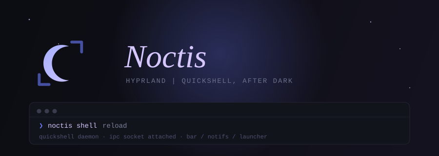

<p align="center">
  
</p>

<p align="center">
  
  
  
  
</p>

<p align="center">
  <em>A Hyprland setup built for four identities at once — developer environment, gaming rig, AI-assisted workflow, and security research box — without losing the minimalist bones it started from.</em>
</p>

<p align="center">
  <a href="#install"><code>Install</code></a> ·
  <a href="#profiles--layers"><code>Profiles</code></a> ·
  <a href="#architecture"><code>Architecture</code></a> ·
  <a href="#quickshell-shell"><code>Quickshell</code></a> ·
  <a href="#theming"><code>Theming</code></a> ·
  <a href="#in-motion"><code>Screenshots</code></a> ·
  <a href="#keybindings"><code>Keybindings</code></a> ·
  <a href="#roadmap"><code>Roadmap</code></a> ·
  <a href="#faq"><code>FAQ</code></a>
</p>

<sub><a id="-top"></a></sub>

<br>

## Stack

| Layer | Choice |
|---|---|
| Window Manager | [Hyprland](https://github.com/hyprwm/Hyprland) |
| Shell (bar, launcher, notifications, OSD, lock, power menu, dashboard, screenshot picker) | [Quickshell](https://quickshell.org) — hand-vendored, visually cloned from [caelestia-dots/shell](https://github.com/caelestia-dots/shell) |
| Terminal | [Kitty](https://github.com/kovidgoyal/kitty) |
| File Manager | [Thunar](https://github.com/xfce-mirror/thunar) |
| Wallpaper Engine | [awww](https://codeberg.org/LGFae/awww) |
| Terminal shell | [ZSH](https://sourceforge.net/projects/zsh/) or [Starship](https://github.com/starship/starship) |
| Audio Visualizer | [Cava](https://github.com/karlstav/cava) |

> [!NOTE]
> Rofi shipped as the app launcher, clipboard/emoji/wallpaper pickers, and power menu through the earlier Waybar-based setup. All four are now covered natively by the Quickshell launcher (`SUPER+A`) — see [Launcher modes](#quickshell-shell) below. Rofi isn't installed by either profile anymore; nothing in this repo launches it.

<div align="right"><a href="#-top">🡅 back to top</a></div>

<br>

## Quickshell Shell

Waybar, Mako, Swaylock, and Rofi have all been fully retired in favor of one hand-vendored [Quickshell](https://quickshell.org) shell — visually cloned from [caelestia-dots/shell](https://github.com/caelestia-dots/shell) (GPL-3.0), not an installed dependency: the QML is checked into `Configs/quickshell/noctis/`, with no native C++ plugin required. Color comes from `wallust` the same as everything else — Quickshell doesn't bring its own theming engine.

| Module | Replaces | Notes |
|---|---|---|
| Bar | Waybar | Left-side vertical bar — workspaces, active window, tray, clock, status icons, power button, all with real hover popouts (see below) |
| Bar popouts | — (new) | Hover any status icon, the tray, or the active window pill for a real detail panel — volume slider + output picker, Wi-Fi list, Bluetooth devices, battery + power profile, full window title, keyboard layout, lock state |
| Launcher | Rofi (drun, clipboard, emoji, wallpaper) | One search box, mode switched by a prefix — see the table below |
| Screenshot picker | `grim`/`slurp` combo scripts | Drag-select a region with live client-window snapping and a freeze-mode preview, `SUPER+S` still works standalone too |
| Notifications | Mako | Popup toasts, top-right |
| OSD | — (new) | Volume/mic/brightness popups on change |
| Lock screen | Swaylock | Real `ext-session-lock-v1` + real PAM auth via the system's own `/etc/pam.d/swaylock` service — `SUPER+L` |
| Session/power menu | Rofi's powermenu | Lock, suspend, log out, hibernate, reboot, shut down — `SUPER+Backspace` |
| Dashboard | — (new) | Clock, calendar, now-playing media — `qs -c noctis ipc call dashboard toggle` |

Every module is a thin, deliberately-scoped-down rewrite of its caelestia counterpart, not a faithful port — things needing caelestia's own native plugin (fingerprint/face auth, a calculator, Material-You scheme switching, weather, resource meters) were left out in favor of what Noctis actually needs.

### Launcher modes

`SUPER+A` (or `SUPER+SPACE`) opens the launcher in app-search mode. Typing one of these characters first switches what you're searching, all inside the same box:

| Type | Mode | Backed by |
|:--:|---|---|
| *(nothing)* | Search & launch installed apps | Desktop entries |
| `>` | Clipboard history | `cliphist` |
| `:` | Emoji picker | `Configs/quickshell/noctis/data/emoji.txt` |
| `/` | Switch to an open window | Hyprland's own window list |
| `~` | Change wallpaper | Files in `~/.config/awww` |

<p align="center">
  
  
</p>

<div align="right"><a href="#-top">🡅 back to top</a></div>

<br>

## Why Noctis

Most rices are a snapshot — a config someone tuned once and stopped touching, distributed as a pile of dotfiles you copy over your own and hope for the best. Noctis is built to keep moving. Underneath the visuals is a small, deliberate piece of infrastructure:

- **Declarative, not hardcoded.** Package sets live as data (`profiles/*.toml`), not as bash arrays buried in an install script. Changing what ships means editing a TOML file, not surgery on `install.sh`.
- **Composable, not monolithic.** A base profile (`minimal` or `full`) plus any combination of layers (`gaming`, `dev`, `ai`, `exploit`) resolve into one merged package list at install time. Add a layer without touching the base; add a base without touching the layers.
- **Safe to run twice.** Every install is snapshotted to a timestamped backup before anything changes, and the resolved choice is written to `noctis.toml` so a re-run can detect and reuse it instead of asking the same questions again.
- **Honest about what it will do.** `--dry-run` prints the entire install plan — every package, every layer, every detected system fact — and touches nothing. No surprises, no `sudo` running until you've actually agreed to something.
- **Reversible.** `./uninstall.sh` restores your most recent backup on request. Trying Noctis was never supposed to mean burning your current setup down first.

None of this is unique in isolation, but it's what turns a rice from something you install once into something you can actually keep living in.

<div align="right"><a href="#-top">🡅 back to top</a></div>

<br>

## Install

> [!IMPORTANT]
> Noctis assumes an Arch/AUR base. It hasn't been tested on other distros and no distro branching is planned — see the [FAQ](#faq).

```
git clone https://github.com/T-Crypt/Noctis-Hypr && cd Noctis-Hypr
chmod +x install.sh
./install.sh
```

Running with no flags launches a short wizard — profile, optional layers, theme — and writes your choices to `noctis.toml`, which becomes the source of truth for every re-run after that.

> [!TIP]
> Prefer to skip the prompts entirely:
> ```
> ./install.sh --profile full --with gaming,dev --dry-run
> ```

| Flag | Effect |
|---|---|
| `--profile <minimal\|full>` | Selects the base package set. Skips the profile prompt. |
| `--with <layer,layer,...>` | Comma-separated layers to merge in: `gaming`, `dev`, `ai`, `exploit`. Skips the layer prompts. |
| `--theme <name>` | Pre-selects a theme. Skips the theme prompt. |
| `--dry-run` | Prints the full resolved install plan and exits — nothing is installed, backed up, or written. |
| `--no-backup` | Skips the pre-install config snapshot. Off by default; use with intent. |
| `--keep-backups <N>` | How many timestamped backups to retain before pruning. Defaults to 5. |
| `-h`, `--help` | Full flag reference. |

> [!NOTE]
> `--dry-run` is checked before anything else runs — no `sudo` prompt, no package installs, no filesystem writes happen ahead of it. Re-running `install.sh` later detects your last saved config in `noctis.toml` and offers to reuse it without repeating the wizard.

Custom apps live in `profiles/custom_apps.lst` (still readable at the repo root as a symlink, for anyone on an older clone) and are folded into the resolved package list automatically — no separate prompt needed.

### Updating

```
cd Noctis-Hypr
git pull
./install.sh
```

Noctis detects your saved `noctis.toml` and re-resolves your profile/layers against any changes upstream, snapshotting your current configs first exactly as a fresh install would.

### Uninstalling

> [!CAUTION]
> Something went sideways? `./uninstall.sh` restores your most recent backup — no manual archaeology through `~/.config-backup/`.

```
./uninstall.sh
```

Pass `--purge-packages` if you also want it to remove everything your profile installed (behind its own separate confirmation).

<div align="right"><a href="#-top">🡅 back to top</a></div>

<br>

## Profiles & Layers

A **profile** is the base package set. A **layer** is an optional add-on merged on top. Pick one profile, any number of layers.

| Profile | What you get |
|---|---|
| `minimal` | Hyprland, Quickshell, Kitty, awww, plus the binaries the always-loaded Quickshell shell itself needs (wallust, grim/slurp/swappy, brightnessctl, swaylock-effects) — the bare tiling desktop, nothing else. |
| `full` | Everything in `minimal`, plus the complete Noctis experience: theming (Pywal, Pywalfox, Dracula GTK/icons), shell tooling (ZSH, Powerlevel10k, Starship), media (mpv, Cava, Swappy), file management (Thunar plus archive/GVFS plugins), Bluetooth, SDDM, and more. |

| Layer | Adds |
|---|---|
| `gaming` | GameMode, MangoHud (both with 32-bit variants), Steam. |
| `dev` | Neovim, tmux, fzf, ripgrep, fd, lazygit. |
| `ai` | Ollama, as a local AI backend — package-layer only for now; workflow integration is a later roadmap phase. |
| `exploit` | `nmap`, `dirbuster`, `gobuster`, `ffuf`, `nikto`, `whatweb`, `sqlmap`, `hydra`, `john` — offensive-security/CTF tooling via the BlackArch repo. **Enables the BlackArch repo**, which is less stable than Arch's official repos; `install.sh` prints a warning and asks for explicit confirmation before touching `/etc/pacman.conf`. See [`docs/exploit-layer.md`](docs/exploit-layer.md) for the stability tradeoffs and how to recover if a package breaks. |

Layers are additive and dedupe against the base and each other, so `--with gaming,dev,ai` on top of `full` merges cleanly with no duplicate installs. Combine whatever fits: a `minimal` install with just `dev` is a lean coding box; `full` with `gaming` and `dev` is closer to a daily driver that also game-modes on demand.

<div align="right"><a href="#-top">🡅 back to top</a></div>

<br>

## Architecture

Noctis's repo mirrors what actually gets installed, plus the machinery that decides what that is:

```
Noctis-Hypr/
├── install.sh / uninstall.sh   Thin orchestrators — wizard or flags in, resolved plan out
├── noctis.toml                 Generated on first install: the resolved source of truth
├── lib/
│   ├── install/                 Wizard prompts, AUR helper detection, backups, config linking
│   └── toml/                    Profile + layer merge logic
├── profiles/
│   ├── base/                    minimal.toml, full.toml
│   └── layers/                  gaming.toml, dev.toml, ai.toml, exploit.toml
├── themes/                      Swappable theme presets (THEME_SPEC.md documents the contract)
└── Configs/                     Mirrors ~/.config — the configs that actually land on disk
    ├── quickshell/noctis/        Hand-vendored Quickshell shell (see below)
    │   ├── config/                Tokens/Config/GlobalConfig singletons (hand-written, no native plugin)
    │   ├── services/               Colours (wallust-generated), Audio, Hypr, Players, Notifs, ...
    │   ├── components/             Shared UI primitives (StyledText, MaterialIcon, StateLayer, ...)
    │   └── modules/                bar/ (+ real popouts), launcher/ (apps/clip/emoji/windows/wallpaper),
    │                                areapicker/, notifications/, osd/, lock/, session/, dashboard/
    ├── hypr/                     hyprland.lua, keybinds.lua, custom.lua (never overwritten, see below)
    └── .local/
        ├── bin/noctis            noctis CLI entry point, symlinked onto PATH by install.sh
        └── lib/noctis/           noctis CLI internals (commands/, globalcontrol.sh)
```

`install.sh` never hardcodes a package list — it resolves one at runtime by merging `profiles/base/<profile>.toml` with each selected `profiles/layers/<layer>.toml`, deduplicating as it goes. Everything downstream (backups, AUR helper choice, config copying) reads from that single resolved plan.

`~/.config/hypr/custom.lua` is the one file `install.sh` never touches once it exists — put your own Hyprland tweaks there and a re-run or `noctis update` won't clobber them, the same idea as ML4W's protected `custom.conf`.

<div align="right"><a href="#-top">🡅 back to top</a></div>

<br>

## Theming

Wallpaper-driven color generation, applied consistently across the stack:

- Kitty
- Quickshell (bar, launcher, notifications, OSD, lock, session menu, dashboard)
- Cava
- Firefox — requires the [Pywalfox extension](https://addons.mozilla.org/en-US/firefox/addon/pywalfox/)
- VS Code
- GTK — in progress

> [!TIP]
> Thunar has a right-click **Set as Theme** action for building a theme straight from an image in `$HOME/Pictures` (avoid special characters at the front of the path). An SDDM sync script keeps your login screen's wallpaper matched to whatever's currently active.

## Theme Picker Integration

Noctis now features a complete theming system with:
- CLI commands for theme management (`noctis theme list`, `set`, `next`, `prev`)
- <kbd>Super</kbd> + <kbd>,</kbd> / <kbd>Super</kbd> + <kbd>.</kbd> keybinds to cycle themes without leaving the keyboard
- Automatic palette regeneration when schemes change
- State tracking for current theme and wallpaper
- Integration with Quickshell's color system via wallust engine
- Support for multiple color schemes (wallust backends and matugen variants)

### Theme Commands

```bash
# List available themes
noctis theme list

# Apply a specific theme
noctis theme set <theme-name>

# Cycle through themes
noctis theme next    # Switch to next theme
noctis theme prev    # Switch to previous theme

# Manage color schemes
noctis scheme set -n <scheme-name>  # Apply a named color scheme

# Wallpaper management
noctis wallpaper -f <path>     # Set specific wallpaper
noctis wallpaper --random      # Pick random wallpaper
```

The system automatically tracks your current theme and wallpaper state, enabling seamless cycling through themes and real-time palette updates when schemes are changed.

<div align="right"><a href="#-top">🡅 back to top</a></div>

<br>

## In Motion

<a id="screenshots"></a>

**Desktop** — bar, workspace pill, and status icons re-themed live from the wallpaper

<p align="center">
  
</p>

**Bar popout & screenshot picker** — real detail panels on hover, drag-select captures with client snapping

<p align="center">
  
  
</p>

**Launcher** — see [Launcher modes](#quickshell-shell) above for the full picture

<div align="right"><a href="#-top">🡅 back to top</a></div>

<br>

## Keybindings

All keybinds live in one place — [`Configs/hypr/keybinds.lua`](Configs/hypr/keybinds.lua) — grouped exactly as below.

**Launcher** — see the [modes table](#quickshell-shell) above for what each prefix does inside it.

| Keys | Action |
| :-- | :-- |
| <kbd>Super</kbd> + <kbd>A</kbd> or <kbd>Super</kbd> + <kbd>Space</kbd> | Open the launcher (apps, clipboard, emoji, windows, wallpaper) |

**Apps & tools**

| Keys | Action |
| :-- | :-- |
| <kbd>Super</kbd> + <kbd>T</kbd> | Launch Kitty |
| <kbd>Super</kbd> + <kbd>E</kbd> | Launch Thunar |
| <kbd>Super</kbd> + <kbd>C</kbd> | Launch VS Code |
| <kbd>Super</kbd> + <kbd>F</kbd> | Launch Firefox |
| <kbd>Super</kbd> + <kbd>S</kbd> | Screenshot — region select via `grim`/`slurp`/`swappy`. The Quickshell picker (drag-select with client snapping + freeze preview) is available via `qs -c noctis ipc call picker open` |
| <kbd>Super</kbd> + <kbd>W</kbd> | Change wallpaper (random pick) — open the launcher and type `~` to pick a specific one instead |
| <kbd>Super</kbd> + <kbd>Ctrl</kbd> + <kbd>W</kbd> | Open the launcher's wallpaper picker directly |
| <kbd>Super</kbd> + <kbd>,</kbd> / <kbd>Super</kbd> + <kbd>.</kbd> | Cycle to the previous/next theme — same as `noctis theme prev`/`next` |

**Shell (Quickshell)**

| Keys | Action |
| :-- | :-- |
| <kbd>Super</kbd> + <kbd>L</kbd> | Lock screen |
| <kbd>Super</kbd> + <kbd>Backspace</kbd> | Session / power menu — lock, suspend, log out, hibernate, reboot, shut down |
| <kbd>Super</kbd> + <kbd>M</kbd> | `wlogout` (fallback power menu) |
| <kbd>Super</kbd> + <kbd>B</kbd> | Restart Quickshell |

**Windows & layout**

| Keys | Action |
| :-- | :-- |
| <kbd>Super</kbd> + <kbd>Q</kbd> | Quit the focused window |
| <kbd>Super</kbd> + <kbd>V</kbd> | Toggle floating |
| <kbd>Super</kbd> + <kbd>P</kbd> | Toggle pseudo-tiling |
| <kbd>Super</kbd> + <kbd>J</kbd> | Toggle split direction |
| <kbd>Super</kbd> + <kbd>G</kbd> | Toggle group |
| <kbd>Super</kbd> + <kbd>Shift</kbd> + <kbd>F</kbd> | Toggle fullscreen |
| <kbd>Super</kbd> + <kbd>&larr;</kbd>/<kbd>&rarr;</kbd>/<kbd>&uarr;</kbd>/<kbd>&darr;</kbd> | Move focus between windows |
| <kbd>Super</kbd> + <kbd>LMB</kbd> drag | Move window |
| <kbd>Super</kbd> + <kbd>RMB</kbd> drag | Resize window |

**Workspaces**

| Keys | Action |
| :-- | :-- |
| <kbd>Super</kbd> + <kbd>0</kbd>–<kbd>9</kbd> | Switch to workspace |
| <kbd>Super</kbd> + <kbd>Shift</kbd> + <kbd>0</kbd>–<kbd>9</kbd> | Move window to workspace |
| <kbd>Super</kbd> + Scroll | Cycle workspaces |

**Media & brightness** *(laptop keys)*

| Keys | Action |
| :-- | :-- |
| <kbd>XF86AudioRaiseVolume</kbd> / <kbd>XF86AudioLowerVolume</kbd> | Volume up/down |
| <kbd>XF86AudioMute</kbd> | Toggle mute |
| <kbd>XF86AudioMicMute</kbd> | Toggle mic mute |
| <kbd>XF86MonBrightnessUp</kbd> / <kbd>XF86MonBrightnessDown</kbd> | Brightness up/down |

## Terminal Games

Noctis includes some fun terminal-based games accessible through the `noctis play` command:

- **Hangman**: Classic word-guessing game
- **Snake**: Control a snake to eat food and grow longer
- **Number Guessing**: Try to guess a randomly generated number

Play them with:
```bash
noctis play hangman
noctis play snake
noctis play guess
```

<div align="right"><a href="#-top">🡅 back to top</a></div>

<br>

## Roadmap

Noctis is being built in phases, on top of the manifest-driven installer already shipped:

- ~~**Identity** — a live bar-position toggle.~~ Superseded: wallust already replaced Pywal as the color engine, and the bar is now Quickshell's own fixed left-side layout rather than a repositionable Waybar.
- **Quickshell shell** — ✅ done. Waybar, Mako, Swaylock, and Rofi all retired in favor of one hand-vendored Quickshell shell (bar with real popouts, launcher with app/clipboard/emoji/window/wallpaper modes, screenshot picker, notifications, OSD, lock, session menu, dashboard) — see [Quickshell Shell](#quickshell-shell) above.
- **Gaming profile** — a real performance-mode toggle, MangoHud bar integration, Proton/Steam polish.
- **Dev environment** — deeper terminal and editor tooling, AI CLI workflow integration on top of the `ai` layer.
- **Theming architecture** — next up. Directory-per-theme wallpaper sets, a tracked "last wallpaper per theme" state, and a QML theme picker to go with it.
- **Settings CLI** — next up alongside theming. The `noctis` command already covers theme/wallpaper/scheme switching, backups, and shell control (`noctis shell <ipc-call>` reaches every Quickshell module's IPC surface directly); still to come: wiring those stubs to the new theming architecture, a real `noctis doctor` drift check, and an optional GTK4 welcome window.
- **Maintenance tooling** — versioning, migrations, and CI.

Longer-term, once the roadmap phases land, the plan is a full wiki — install walkthroughs, theme authoring docs, and a troubleshooting reference — rather than trying to cram everything into this README forever.

<div align="right"><a href="#-top">🡅 back to top</a></div>

<br>

## FAQ

<details>
<summary><strong>Does this work outside Arch?</strong></summary>
<br>
Not currently by design. Noctis assumes Arch/AUR and leans on that assumption throughout the installer — no distro branching is planned.
</details>

<details>
<summary><strong>Can I run this on top of an existing Hyprland setup?</strong></summary>
<br>
Yes. The installer snapshots your existing configs before touching anything (unless you pass <code>--no-backup</code>), and <code>./uninstall.sh</code> restores the most recent snapshot if you want to back out.
</details>

<details>
<summary><strong>What if I only want a subset of what <code>full</code> installs?</strong></summary>
<br>
Start from <code>minimal</code> and add only the layers you want, or edit <code>profiles/custom_apps.lst</code> before installing. Profiles and layers are just TOML — nothing stops you from forking one to fit exactly what you need.
</details>

<details>
<summary><strong>Firefox isn't picking up my theme.</strong></summary>
<br>
Install the <a href="https://addons.mozilla.org/en-US/firefox/addon/pywalfox/">Pywalfox</a> extension — Firefox theming depends on it and won't apply without it.
</details>

<div align="right"><a href="#-top">🡅 back to top</a></div>

<br>

## Star History

<p align="center">
  <a href="https://star-history.com/#T-Crypt/Noctis-Hypr&Date">
    
  </a>
</p>

<br>

## Credit

Inspired by and built with gratitude toward [Tittu](https://github.com/prasanthrangan)'s minimalist Hyprland dotfiles — Noctis started as a fork of that philosophy and has been growing its own identity ever since.

<p align="center">
  <sub>after dark, always.</sub>
</p>
