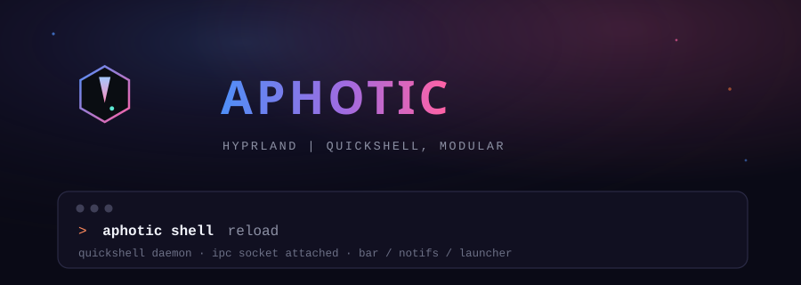
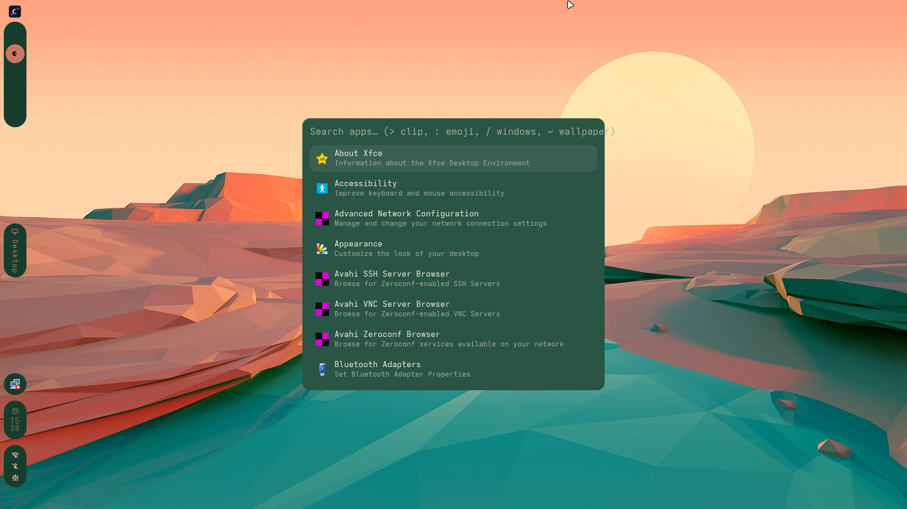
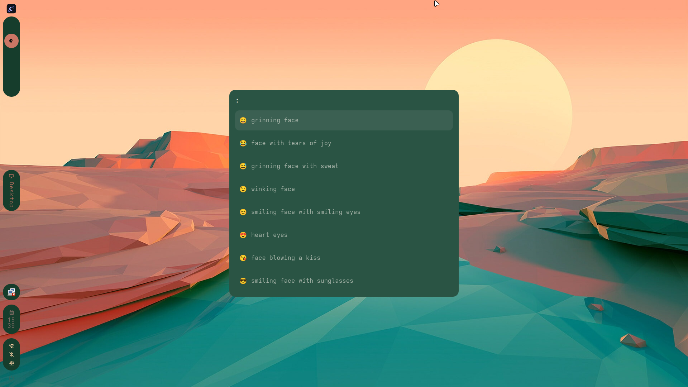
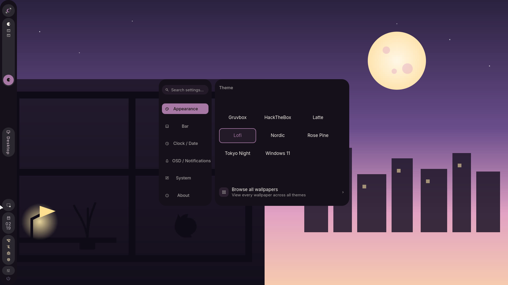
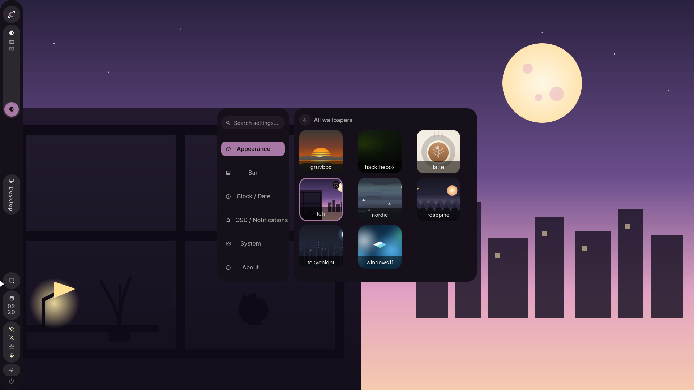
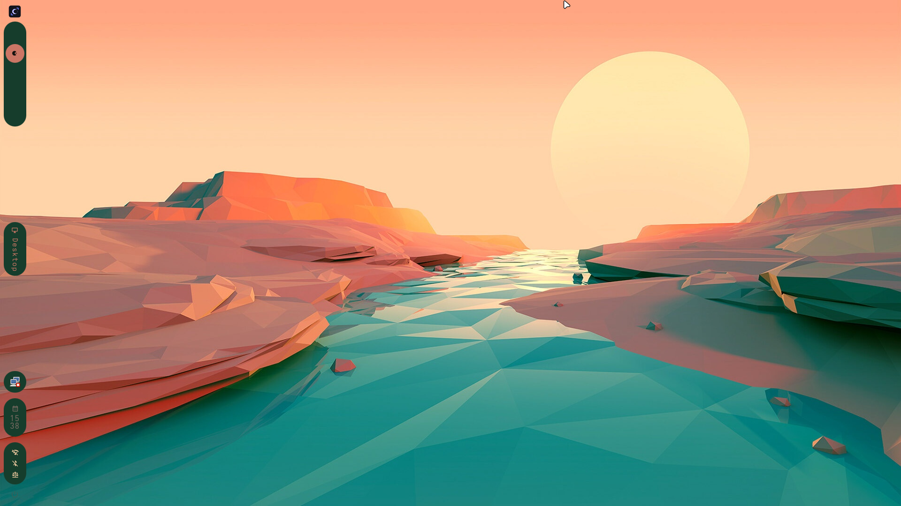
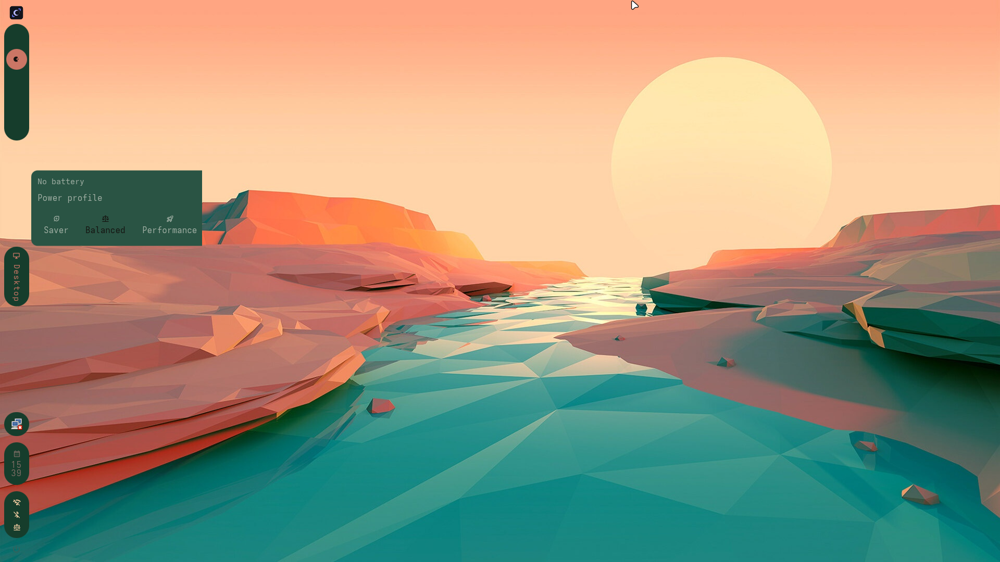
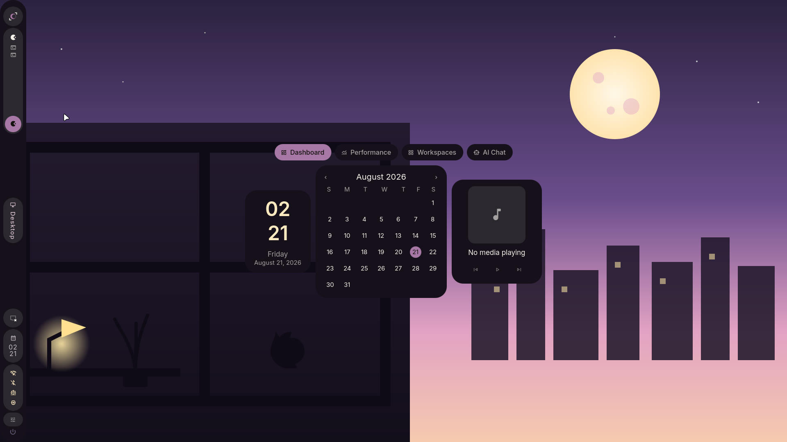

<p align="center">
  
</p>

<p align="center">
  
  
  
  
  
</p>

<p align="center">
  <em>A Hyprland setup built for four identities at once — developer environment, gaming rig, AI-assisted workflow, and security research box — without losing the minimalist bones it started from.</em>
</p>

<p align="center">
  <a href="#install"><code>Install</code></a> ·
  <a href="#profiles--layers"><code>Profiles</code></a> ·
  <a href="#architecture"><code>Architecture</code></a> ·
  <a href="#quickshell-shell"><code>Quickshell</code></a> ·
  <a href="#settings--control-center"><code>Settings</code></a> ·
  <a href="#theming"><code>Theming</code></a> ·
  <a href="#in-motion"><code>Screenshots</code></a> ·
  <a href="#keybindings"><code>Keybindings</code></a> ·
  <a href="#roadmap"><code>Roadmap</code></a> ·
  <a href="#faq"><code>FAQ</code></a>
</p>

<sub><a id="-top"></a></sub>

<br>

## Stack

| Layer | Choice |
|---|---|
| Window Manager | [Hyprland](https://github.com/hyprwm/Hyprland) |
| Shell (bar, launcher, notifications, OSD, lock, power menu, dashboard, screenshot picker) | [Quickshell](https://quickshell.org) — hand-vendored, visually cloned from [caelestia-dots/shell](https://github.com/caelestia-dots/shell) |
| Terminal | [Kitty](https://github.com/kovidgoyal/kitty) |
| File Manager | [Thunar](https://github.com/xfce-mirror/thunar) |
| Wallpaper Engine | [awww](https://codeberg.org/LGFae/awww) |
| Terminal shell | [ZSH](https://sourceforge.net/projects/zsh/) or [Starship](https://github.com/starship/starship) |
| Audio Visualizer | [Cava](https://github.com/karlstav/cava) |

> [!NOTE]
> Rofi shipped as the app launcher, clipboard/emoji/wallpaper pickers, and power menu through the earlier Waybar-based setup. All four are now covered natively by the Quickshell launcher (`SUPER+A`) — see [Launcher modes](#quickshell-shell) below. Rofi isn't installed by either profile anymore; nothing in this repo launches it.

<div align="right"><a href="#-top">🡅 back to top</a></div>

<br>

## Quickshell Shell

Waybar, Mako, Swaylock, and Rofi have all been fully retired in favor of one hand-vendored [Quickshell](https://quickshell.org) shell — visually inspired from [caelestia-dots/shell](https://github.com/caelestia-dots/shell) (GPL-3.0), not an installed dependency: the QML is checked into `Configs/quickshell/aphotic/`, with no native C++ plugin required. Color comes from `wallust` the same as everything else — Quickshell doesn't bring its own theming engine.

| Module | Replaces | Notes |
|---|---|---|
| Bar | Waybar | Dockable left or right, standard or compact density, three selectable bar styles — pill/square/minimal (Settings → Bar) — workspaces, active window, tray, clock, status icons, power button, all with real hover popouts (see below) |
| Bar popouts | — (new) | Hover any status icon, the tray, or the active window pill for a real detail panel — volume slider + output picker, Wi-Fi list, Bluetooth devices, battery + power profile, active Claude Code session count, full window title, keyboard layout, lock state, live CPU/GPU/memory/disk/network meter |
| Launcher | Rofi (drun, clipboard, emoji, wallpaper) | One search box, mode switched by a prefix — see the table below |
| Screenshot picker | `grim`/`slurp` combo scripts | Drag-select a region with live client-window snapping and a freeze-mode preview — `SUPER+Shift+S` (see [Keybindings](#keybindings) for the freeze/clipboard variants); the plain `grim`/`slurp`/`swappy` combo stays on `SUPER+S` |
| Notifications | Mako | Popup toasts, top-right — `SUPER+Shift+N` clears them all |
| OSD | — (new) | Volume/mic/brightness popups on change, enable flags and hide-delay configurable in Settings |
| Lock screen | Swaylock | Real `ext-session-lock-v1` + real PAM auth via the system's own `/etc/pam.d/swaylock` service — `SUPER+L` |
| Session/power menu | Rofi's powermenu | Lock, suspend, log out, hibernate, reboot, shut down — `SUPER+Backspace` |
| Command Center | — (new) | Tabbed dashboard overlay — Dashboard (clock/calendar/media), Performance (live CPU/GPU/memory/storage/network cards), Workspaces (numbered grid, click to jump), Wallpapers (cycle/pick within the active theme live, without opening Settings), AI Chat (Claude/Ollama/Gemini/ChatGPT, see below) — `SUPER+D` |
| Settings | — (new) | Full-screen Control Center — searchable category rail (Appearance, Theme Creator, Personalization, Bar, Displays, Clock/Date, OSD/Notifications, AI, Power & Security, Workspace Profiles, System, About), cross-theme wallpaper picker, live doctor output — `SUPER+I` |

Every module is a thin, deliberately-scoped-down rewrite of its caelestia counterpart, not a faithful port — things needing caelestia's own native plugin (fingerprint/face auth, a calculator, Material-You scheme switching) were left out in favor of what Aphotic actually needs; the resource-meter and dashboard gaps that plugin would otherwise cover are hand-implemented instead (see Performance/System above), not skipped.

### AI Chat

The Command Center's AI Chat tab talks to four providers behind one interface: **Claude** (via the `claude` CLI, needs `ANTHROPIC_API_KEY`), **Ollama** (direct HTTP to a configurable local/LAN host, no key needed), **Gemini** and **ChatGPT** (direct HTTP, need their own API keys). A provider with no key/host configured shows a clear inline message telling you what to set instead of failing silently. Keys live in `~/.config/aphotic/ai-keys.json` (`chmod 600`, separate from the general shell config); the active provider and Ollama host/model persist in `~/.config/aphotic/ai-config.json`. Neither ships with a real address baked in — set your Ollama host from the model picker in the AI Chat tab, or export `OLLAMA_BASE_URL` in your shell.

Settings → AI also has a full **Ollama model manager**: every installed model with live/idle status and VRAM usage, one click to set the active model, a delete button, and a pull-by-name field to download a new one — all straight against Ollama's own REST API, no separate CLI needed.

The bar's status icons include a small **Claude Code session indicator** — a live count of running `claude` CLI sessions, filled/outlined to show idle vs. active, click to focus the nearest terminal running one. Its color (like Bluetooth/Wi-Fi/Performance/Power profile) can be overridden independently in Settings → Personalization → Status icon accents.

### Launcher modes

`SUPER+A` (or `SUPER+SPACE`) opens the launcher in app-search mode. Typing one of these characters first switches what you're searching, all inside the same box:

| Type | Mode | Backed by |
|:--:|---|---|
| *(nothing)* | Search & launch installed apps | Desktop entries |
| `>` | Clipboard history | `cliphist` |
| `:` | Emoji picker | `Configs/quickshell/aphotic/data/emoji.txt` |
| `/` | Switch to an open window | Hyprland's own window list |
| `~` | Change wallpaper | Files in `~/.config/awww` |
| `@` | Jump to a project — opens a terminal running `claude` plus an editor | Git repos found under `~/Projects`/`~/repos` (or `Settings.projectRoots`) |

<p align="center">
  
  
</p>

<div align="right"><a href="#-top">🡅 back to top</a></div>

<br>

## Settings — Control Center

`SUPER+I` (or `qs -c aphotic ipc call settings toggle`) opens a full-screen panel — a searchable, scrollable category rail on the left, the selected category's controls on the right, sliding between them instead of a flat crossfade:

| Category | What's in it |
|---|---|
| Appearance | Theme grid (fills the available space, not a fixed-size row), wallpaper-in-active-theme quick picker, and a **Browse all wallpapers** grid spanning every theme (click any thumbnail to switch theme + wallpaper + colorscheme together) |
| Theme Creator | Build your own **static** theme — a full palette editor (background/foreground/cursor + 16 ANSI colors, common-color presets or a real HSV color wheel) writes a fixed colorscheme + generated wallpaper straight into `~/.config/awww`, no wallpaper-derived palette needed. Shows up in Appearance's theme grid like any other once created, plus a folder icon to open it in Thunar |
| Personalization | Accent color override, cursor theme + size, icon theme, and independent color overrides for the Bluetooth/Wi-Fi/Power-profile/Performance/Claude-session bar icons (each defaults to the theme's own tone, override any of them or leave as-is) |
| Bar | Dock left/right or top/bottom, compact density, vertical orientation, three selectable bar styles (pill/square/minimal) |
| Displays | Live per-monitor info — name, resolution, refresh rate, scale, primary badge (read-only; live resolution/scale editing isn't wired up yet, see the Displays entry in the roadmap for why) |
| Clock / Date | 12-hour clock, show date in bar clock, desktop clock |
| OSD / Notifications | Show/hide OSD, brightness/mic sliders, OSD hide delay, notification timeout |
| AI | Active provider (Ollama/Claude/Gemini/ChatGPT), live Ollama host + model picker, an Ollama model manager (VRAM per loaded model, delete, pull-by-name), masked API-key entry for each provider — same backend as the Command Center's AI Chat tab |
| Power & Security | Power profile switcher (Saver/Balanced/Performance), idle lock/screen-off/suspend timeouts (generates `hypridle.conf`), lockout info |
| Workspace Profiles | Named, one-key launch groups — save a list of commands + target workspaces, launch them all at once via `hyprctl dispatch exec`. Not a live session snapshot (Hyprland/X11 apps don't expose one), just a saved replay list |
| System | Live `aphotic doctor` output, an Overview (theme, install profile, daemon status), Hardware (CPU/GPU/RAM/disk), and an on-demand package check |
| About | Real Aphotic logo, version (read from `VERSION`), repo link, wallpaper art credits |

Every toggle here persists to `~/.local/state/aphotic/settings.json` and survives a shell restart. Adding a new setting is a data addition to an existing pane, not new UI — every row shares one component (`SettingsRow`, grouped into connected-card sections by `SettingsGroup`) for the icon-badge/title/description/control layout. Pane content and the category rail both scroll independently once they outgrow the panel, so a long pane never gets clipped.

<p align="center">
  
  
</p>

<div align="right"><a href="#-top">🡅 back to top</a></div>

<br>

## Why Aphotic

Most rices are a snapshot — a config someone tuned once and stopped touching, distributed as a pile of dotfiles you copy over your own and hope for the best. Aphotic is built to keep moving. Underneath the visuals is a small, deliberate piece of infrastructure:

- **Declarative, not hardcoded.** Package sets live as data (`profiles/*.toml`), not as bash arrays buried in an install script. Changing what ships means editing a TOML file, not surgery on `install.sh`.
- **Composable, not monolithic.** A base profile (`minimal` or `full`) plus any combination of layers (`gaming`, `dev`, `ai`, `exploit`) resolve into one merged package list at install time. Add a layer without touching the base; add a base without touching the layers.
- **Safe to run twice.** Every install is snapshotted to a timestamped backup before anything changes, and the resolved choice is written to `aphotic.toml` so a re-run can detect and reuse it instead of asking the same questions again.
- **Honest about what it will do.** `--dry-run` prints the entire install plan — every package, every layer, every detected system fact — and touches nothing. No surprises, no `sudo` running until you've actually agreed to something.
- **Reversible.** `./uninstall.sh` restores your most recent backup on request. Trying Aphotic was never supposed to mean burning your current setup down first.

None of this is unique in isolation, but it's what turns a rice from something you install once into something you can actually keep living in.

<div align="right"><a href="#-top">🡅 back to top</a></div>

<br>

## Install

> [!IMPORTANT]
> Aphotic assumes an Arch/AUR base. It hasn't been tested on other distros and no distro branching is planned — see the [FAQ](#faq).

```
git clone https://github.com/T-Crypt/Aphotic-Hypr && cd Aphotic-Hypr
chmod +x install.sh
./install.sh
```

Running with no flags launches a short wizard — profile, optional layers, theme — and writes your choices to `aphotic.toml`, which becomes the source of truth for every re-run after that.

> [!TIP]
> Prefer to skip the prompts entirely:
> ```
> ./install.sh --profile full --with gaming,dev --dry-run
> ```

| Flag | Effect |
|---|---|
| `--profile <minimal\|full>` | Selects the base package set. Skips the profile prompt. |
| `--with <layer,layer,...>` | Comma-separated layers to merge in: `gaming`, `dev`, `ai`, `exploit`. Skips the layer prompts. |
| `--theme <name>` | Pre-selects a theme. Skips the theme prompt. |
| `--dry-run` | Prints the full resolved install plan and exits — nothing is installed, backed up, or written. |
| `--no-backup` | Skips the pre-install config snapshot. Off by default; use with intent. |
| `--keep-backups <N>` | How many timestamped backups to retain before pruning. Defaults to 5. |
| `-h`, `--help` | Full flag reference. |

> [!NOTE]
> `--dry-run` is checked before anything else runs — no `sudo` prompt, no package installs, no filesystem writes happen ahead of it. Re-running `install.sh` later detects your last saved config in `aphotic.toml` and offers to reuse it without repeating the wizard.

Custom apps live in `profiles/custom_apps.lst` (still readable at the repo root as a symlink, for anyone on an older clone) and are folded into the resolved package list automatically — no separate prompt needed.

### Updating

```
cd Aphotic-Hypr
git pull
./install.sh
```

Aphotic detects your saved `aphotic.toml` and re-resolves your profile/layers against any changes upstream, snapshotting your current configs first exactly as a fresh install would.

### Uninstalling

> [!CAUTION]
> Something went sideways? `./uninstall.sh` restores your most recent backup — no manual archaeology through `~/.config-backup/`.

```
./uninstall.sh
```

Pass `--purge-packages` if you also want it to remove everything your profile installed (behind its own separate confirmation).

<div align="right"><a href="#-top">🡅 back to top</a></div>

<br>

## Profiles & Layers

A **profile** is the base package set. A **layer** is an optional add-on merged on top. Pick one profile, any number of layers.

| Profile | What you get |
|---|---|
| `minimal` | Hyprland, Quickshell, Kitty, awww, plus the binaries the always-loaded Quickshell shell itself needs (wallust, grim/slurp/swappy, brightnessctl, swaylock-effects) — the bare tiling desktop, nothing else. |
| `full` | Everything in `minimal`, plus the complete Aphotic experience: theming (Pywal, Pywalfox, Dracula GTK/icons), shell tooling (ZSH, Powerlevel10k, Starship), media (mpv, Cava, Swappy), file management (Thunar plus archive/GVFS plugins), Bluetooth, SDDM, and more. |

| Layer | Adds |
|---|---|
| `gaming` | GameMode, MangoHud (both with 32-bit variants), Steam. |
| `dev` | Neovim, tmux, fzf, ripgrep, fd, lazygit. |
| `ai` | Ollama, as a local AI backend — package-layer only for now; workflow integration is a later roadmap phase. |
| `exploit` | `nmap`, `dirbuster`, `gobuster`, `ffuf`, `nikto`, `whatweb`, `sqlmap`, `hydra`, `john` — offensive-security/CTF tooling via the BlackArch repo. **Enables the BlackArch repo**, which is less stable than Arch's official repos; `install.sh` prints a warning and asks for explicit confirmation before touching `/etc/pacman.conf`. See [`docs/exploit-layer.md`](docs/exploit-layer.md) for the stability tradeoffs and how to recover if a package breaks. |

Layers are additive and dedupe against the base and each other, so `--with gaming,dev,ai` on top of `full` merges cleanly with no duplicate installs. Combine whatever fits: a `minimal` install with just `dev` is a lean coding box; `full` with `gaming` and `dev` is closer to a daily driver that also game-modes on demand.

<div align="right"><a href="#-top">🡅 back to top</a></div>

<br>

## Architecture

Aphotic's repo mirrors what actually gets installed, plus the machinery that decides what that is:

```
Aphotic-Hypr/
├── install.sh / uninstall.sh   Thin orchestrators — wizard or flags in, resolved plan out
├── aphotic.toml                 Generated on first install: the resolved source of truth
├── lib/
│   ├── install/                 Wizard prompts, AUR helper detection, backups, config linking
│   └── toml/                    Profile + layer merge logic
├── profiles/
│   ├── base/                    minimal.toml, full.toml
│   └── layers/                  gaming.toml, dev.toml, ai.toml, exploit.toml
├── themes/                      Swappable theme presets (THEME_SPEC.md documents the contract)
└── Configs/                     Mirrors ~/.config — the configs that actually land on disk
    ├── systemd/user/              aphotic-shell.service — Restart=on-failure supervision for qs
    ├── quickshell/aphotic/        Hand-vendored Quickshell shell (see below)
    │   ├── config/                Tokens/Config/GlobalConfig singletons (hand-written, no native plugin)
    │   ├── services/               Colours (wallust-generated), Audio, Hypr, Players, Notifs, ...
    │   │   └── ai/                   AiConfig/AiKeys/AiProviders — Command Center's AI Chat + Settings → AI backend
    │   ├── components/             Shared UI primitives (StyledText, MaterialIcon, StateLayer,
    │   │                            SettingsRow/SettingsGroup/SettingsToggleRow/SettingsPresetRow, Logo, ...)
    │   └── modules/                bar/ (+ real popouts), launcher/ (apps/clip/emoji/windows/wallpaper),
    │                                areapicker/, notifications/, osd/, lock/, session/,
    │                                dashboard/ (Command Center), settings/ (Control Center, 7 panes)
    ├── hypr/                     hyprland.lua, keybinds.lua, custom.lua (never overwritten, see below)
    └── .local/
        ├── bin/aphotic            aphotic CLI entry point, symlinked onto PATH by install.sh
        └── lib/aphotic/           aphotic CLI internals (commands/, globalcontrol.sh)
```

`install.sh` never hardcodes a package list — it resolves one at runtime by merging `profiles/base/<profile>.toml` with each selected `profiles/layers/<layer>.toml`, deduplicating as it goes. Everything downstream (backups, AUR helper choice, config copying) reads from that single resolved plan.

`~/.config/hypr/custom.lua` is the one file `install.sh` never touches once it exists — put your own Hyprland tweaks there and a re-run or `aphotic update` won't clobber them, the same idea as ML4W's protected `custom.conf`.

<div align="right"><a href="#-top">🡅 back to top</a></div>

<br>

## Theming

Wallpaper-driven color generation, applied consistently across the stack:

- Kitty
- Quickshell (bar, launcher, notifications, OSD, lock, session menu, dashboard)
- Cava
- Firefox — requires the [Pywalfox extension](https://addons.mozilla.org/en-US/firefox/addon/pywalfox/)
- VS Code
- GTK — in progress

> [!TIP]
> Thunar has a right-click **Set as Theme** action for building a theme straight from an image in `$HOME/Pictures` (avoid special characters at the front of the path). An SDDM sync script keeps your login screen's wallpaper matched to whatever's currently active.

## Theme Picker Integration

Aphotic now features a complete theming system with:
- CLI commands for theme management (`aphotic theme list`, `set`, `next`, `prev`)
- <kbd>Super</kbd> + <kbd>,</kbd> / <kbd>Super</kbd> + <kbd>.</kbd> keybinds to cycle themes without leaving the keyboard
- Automatic palette regeneration when schemes change
- State tracking for current theme and wallpaper
- Integration with Quickshell's color system via wallust engine
- Support for multiple color schemes (wallust backends and matugen variants)

### Theme Commands

```bash
# List available themes
aphotic theme list

# Apply a specific theme
aphotic theme set <theme-name>

# Cycle through themes
aphotic theme next    # Switch to next theme
aphotic theme prev    # Switch to previous theme

# Manage color schemes
aphotic scheme set -n <scheme-name>  # Apply a named color scheme

# Wallpaper management
aphotic wallpaper -f <path>     # Set specific wallpaper
aphotic wallpaper --random      # Pick random wallpaper
```

The system automatically tracks your current theme and wallpaper state, enabling seamless cycling through themes and real-time palette updates when schemes are changed.

<div align="right"><a href="#-top">🡅 back to top</a></div>

<br>

## In Motion

<a id="screenshots"></a>

**Desktop** — bar, workspace pill, and status icons re-themed live from the wallpaper

<p align="center">
  
</p>

**Bar popout & screenshot picker** — real detail panels on hover, drag-select captures with client snapping

<p align="center">
  
  
</p>

**Launcher** — see [Launcher modes](#quickshell-shell) above for the full picture

**Command Center** — tabbed dashboard overlay (Dashboard/Performance/Workspaces/AI Chat)

<p align="center">
  
</p>

<div align="right"><a href="#-top">🡅 back to top</a></div>

<br>

## Keybindings

All keybinds live in one place — [`Configs/hypr/keybinds.lua`](Configs/hypr/keybinds.lua) — grouped exactly as below. Every `qs -c aphotic ipc call ...` target the shell exposes has a keybind; anything below not bound to a key is intentionally IPC-only (scriptable, but not meant to be memorized).

**Launcher** — see the [modes table](#quickshell-shell) above for what each prefix does inside it.

| Keys | Action |
| :-- | :-- |
| <kbd>Super</kbd> + <kbd>A</kbd> or <kbd>Super</kbd> + <kbd>Space</kbd> | Open the launcher (apps, clipboard, emoji, windows, wallpaper) |

**Apps & tools**

| Keys | Action |
| :-- | :-- |
| <kbd>Super</kbd> + <kbd>T</kbd> | Launch Kitty |
| <kbd>Super</kbd> + <kbd>E</kbd> | Launch Thunar |
| <kbd>Super</kbd> + <kbd>C</kbd> | Launch VS Code |
| <kbd>Super</kbd> + <kbd>F</kbd> | Launch Firefox |
| <kbd>Super</kbd> + <kbd>S</kbd> | Screenshot — simple region select via `grim`/`slurp`/`swappy`, no extra frills |
| <kbd>Super</kbd> + <kbd>W</kbd> | Change wallpaper (random pick) — open the launcher and type `~` to pick a specific one instead |
| <kbd>Super</kbd> + <kbd>Ctrl</kbd> + <kbd>W</kbd> | Open the launcher's wallpaper picker directly |
| <kbd>Super</kbd> + <kbd>,</kbd> / <kbd>Super</kbd> + <kbd>.</kbd> | Cycle to the previous/next theme — same as `aphotic theme prev`/`next` |

**Quickshell surfaces**

| Keys | Action |
| :-- | :-- |
| <kbd>Super</kbd> + <kbd>D</kbd> | Command Center (tabbed dashboard overlay) |
| <kbd>Super</kbd> + <kbd>I</kbd> | Settings Control Center |
| <kbd>Super</kbd> + <kbd>Shift</kbd> + <kbd>N</kbd> | Clear all notifications |
| <kbd>Super</kbd> + <kbd>L</kbd> | Lock screen |
| <kbd>Super</kbd> + <kbd>Backspace</kbd> | Session / power menu — lock, suspend, log out, hibernate, reboot, shut down |
| <kbd>Super</kbd> + <kbd>M</kbd> | `wlogout` (fallback power menu) |
| <kbd>Super</kbd> + <kbd>B</kbd> | Restart Quickshell |

**Screen capture** — the real Quickshell picker (drag-select with live client-window snapping and a freeze-mode preview), distinct from the plain <kbd>Super</kbd> + <kbd>S</kbd> script above:

| Keys | Action |
| :-- | :-- |
| <kbd>Super</kbd> + <kbd>Shift</kbd> + <kbd>S</kbd> | Open the picker |
| <kbd>Super</kbd> + <kbd>Ctrl</kbd> + <kbd>S</kbd> | Open the picker in freeze-mode (screen freezes first, then select) |
| <kbd>Super</kbd> + <kbd>Alt</kbd> + <kbd>S</kbd> | Open the picker, copy to clipboard only (no file saved) |
| <kbd>Super</kbd> + <kbd>Ctrl</kbd> + <kbd>Alt</kbd> + <kbd>S</kbd> | Freeze-mode + clipboard-only combined |

**Media, audio & brightness**

| Keys | Action |
| :-- | :-- |
| <kbd>XF86AudioPlay</kbd> / <kbd>XF86AudioPause</kbd> | Play/pause the active MPRIS player |
| <kbd>XF86AudioNext</kbd> / <kbd>XF86AudioPrev</kbd> | Next/previous track |
| <kbd>Super</kbd> + <kbd>Ctrl</kbd> + <kbd>O</kbd> | Cycle audio output device |
| <kbd>XF86AudioRaiseVolume</kbd> / <kbd>XF86AudioLowerVolume</kbd> | Volume up/down |
| <kbd>XF86AudioMute</kbd> | Toggle mute |
| <kbd>XF86AudioMicMute</kbd> | Toggle mic mute |
| <kbd>XF86MonBrightnessUp</kbd> / <kbd>XF86MonBrightnessDown</kbd> | Brightness up/down |

**Windows & layout**

| Keys | Action |
| :-- | :-- |
| <kbd>Super</kbd> + <kbd>Q</kbd> | Close the focused window |
| <kbd>Super</kbd> + <kbd>Alt</kbd> + <kbd>Q</kbd> | Force-kill the focused window |
| <kbd>Super</kbd> + <kbd>V</kbd> | Toggle floating |
| <kbd>Super</kbd> + <kbd>P</kbd> | Toggle pseudo-tiling |
| <kbd>Super</kbd> + <kbd>Ctrl</kbd> + <kbd>F</kbd> | Toggle pin (keep window on every workspace) |
| <kbd>Super</kbd> + <kbd>J</kbd> | Toggle split direction |
| <kbd>Super</kbd> + <kbd>Shift</kbd> + <kbd>F</kbd> | Toggle fullscreen |
| <kbd>Super</kbd> + <kbd>&larr;</kbd>/<kbd>&rarr;</kbd>/<kbd>&uarr;</kbd>/<kbd>&darr;</kbd> | Move focus between windows |
| <kbd>Super</kbd> + <kbd>Shift</kbd> + <kbd>&larr;</kbd>/<kbd>&rarr;</kbd>/<kbd>&uarr;</kbd>/<kbd>&darr;</kbd> | Move (swap) the focused window in a direction |
| <kbd>Alt</kbd> + <kbd>Tab</kbd> | Cycle to the next window |
| <kbd>Alt</kbd> + <kbd>Shift</kbd> + <kbd>Tab</kbd> | Cycle to the previous window |
| <kbd>Super</kbd> + <kbd>G</kbd> | Toggle group |
| <kbd>Super</kbd> + <kbd>Ctrl</kbd> + <kbd>H</kbd> / <kbd>Super</kbd> + <kbd>Ctrl</kbd> + <kbd>L</kbd> | Cycle group tabs backward/forward |
| <kbd>Super</kbd> + <kbd>LMB</kbd> drag | Move window |
| <kbd>Super</kbd> + <kbd>RMB</kbd> drag | Resize window |

**Workspaces**

| Keys | Action |
| :-- | :-- |
| <kbd>Super</kbd> + <kbd>0</kbd>–<kbd>9</kbd> | Switch to workspace |
| <kbd>Super</kbd> + <kbd>Shift</kbd> + <kbd>0</kbd>–<kbd>9</kbd> | Move window to workspace |
| <kbd>Super</kbd> + Scroll | Cycle workspaces |
| <kbd>Super</kbd> + <kbd>Ctrl</kbd> + <kbd>&darr;</kbd> | Jump to the nearest empty workspace |
| <kbd>Super</kbd> + <kbd>Ctrl</kbd> + <kbd>Tab</kbd> / <kbd>Super</kbd> + <kbd>Ctrl</kbd> + <kbd>Shift</kbd> + <kbd>Tab</kbd> | Cycle forward/backward through open special (scratchpad) workspaces |

> [!NOTE]
> Special workspaces aren't created by a Aphotic keybind yet — cycling only does something once one exists (e.g. via `hyprctl dispatch movetoworkspace special:name`). A dedicated create/toggle bind is a small future addition, tracked in the [Roadmap](#roadmap).

## Terminal Games

Aphotic includes some fun terminal-based games accessible through the `aphotic play` command:

- **Hangman**: Classic word-guessing game
- **Snake**: Control a snake to eat food and grow longer
- **Number Guessing**: Try to guess a randomly generated number

Play them with:
```bash
aphotic play hangman
aphotic play snake
aphotic play guess
```

<div align="right"><a href="#-top">🡅 back to top</a></div>

<br>

## Roadmap

Aphotic reached **v1.0** on `main` — the Quickshell shell, per-theme wallpapers, the unified theme/wallpaper/scheme state contract, and a CI-tested installer are the shipped baseline, not a work in progress. Active development continues on `test`:

- ~~**Identity** — a live bar-position toggle.~~ Shipped: Settings → Bar docks left/right and toggles compact density live.
- ~~**Quickshell shell**~~ — ✅ shipped in full: bar with real popouts + a live resource meter, launcher with app/clipboard/emoji/window/wallpaper modes, screenshot picker, notifications, OSD, lock, session menu, Command Center (tabbed dashboard + AI Chat), and a full Settings Control Center — see [Quickshell Shell](#quickshell-shell) and [Settings](#settings--control-center) above.
- ~~**Theming architecture**~~ — ✅ shipped: directory-per-theme wallpaper sets, tracked per-theme wallpaper state, and a wallpaper picker (Settings → Appearance) covering every theme in one grid.
- **Shell restart supervision** — ✅ shipped: a `systemd --user` unit (`aphotic-shell.service`) auto-restarts the Quickshell daemon on crash instead of requiring a manual `SUPER+B`.
- **`matugen` as a second color engine** — next up. `theme.toml` already reserves the config slot; wiring it in gives themes a real tonal-spot/vibrant/expressive variant picker alongside wallust.
- ~~**AI settings pane**~~ — ✅ shipped: Settings → AI covers active provider, Ollama host/model, and masked API-key entry for Claude/Gemini/ChatGPT.
- ~~**Bar orientation**~~ — ✅ shipped: a true vertical (left/right-docked) bar mode, plus three selectable bar styles (pill/square/minimal, Settings → Bar).
- ~~**Theme-colors swatch view**~~ — ✅ shipped, and further than originally scoped: a full **Theme Creator** (Settings → Theme Creator) — build a static theme from a hand-picked palette (common-color presets or an HSV color wheel), writes a real theme + colorscheme + generated wallpaper into `~/.config/awww`.
- ~~**Ollama model management**~~ — ✅ shipped: Settings → AI's Ollama Models section (live VRAM per loaded model, delete, pull-by-name, set active model).
- **AI-native differentiators** — first pass shipped: a bar "agentic module" showing live Claude Code session presence/count with click-to-focus, and a launcher project switcher (`@` sigil — jump to a git repo with a terminal + `claude` + editor in one action). Deeper integration (live per-session thinking/editing status via a Claude Code hook, AI chat context injection, session handoff) is still open.
- **Workspace profiles** — ✅ shipped: named, one-key launch groups (Settings → Workspace Profiles) — not a live session snapshot, a saved replay list dispatched via `hyprctl`.
- **Settings panel expansion** — the Control Center's architecture (one row component, one pane-per-category) is built to grow further: a System-updates action (distinct from the current read-only doctor output), and a Plugins category once a real plugin architecture exists to back it. Network/Audio/Bluetooth pages (matching the bar's existing popouts) are also planned.
- **Keyboard scratchpad workflow** — `SUPER+Ctrl+Tab` already cycles between open special workspaces, but nothing yet creates/toggles one from the keyboard; a dedicated create/toggle bind is a small follow-up.
- **Gaming profile** — a real performance-mode toggle, MangoHud bar integration, Proton/Steam polish.
- **Dev environment** — deeper terminal and editor tooling, AI CLI workflow integration on top of the `ai` layer (the Command Center's AI Chat tab and the launcher's project switcher now cover the interactive side of this).
- **Maintenance tooling** — release tagging and migration tooling; versioning and CI are already in place.

Longer-term, the plan is a full wiki — install walkthroughs, theme authoring docs, and a troubleshooting reference — rather than trying to cram everything into this README forever.

<div align="right"><a href="#-top">🡅 back to top</a></div>

<br>

## FAQ

<details>
<summary><strong>Does this work outside Arch?</strong></summary>
<br>
Not currently by design. Aphotic assumes Arch/AUR and leans on that assumption throughout the installer — no distro branching is planned.
</details>

<details>
<summary><strong>Can I run this on top of an existing Hyprland setup?</strong></summary>
<br>
Yes. The installer snapshots your existing configs before touching anything (unless you pass <code>--no-backup</code>), and <code>./uninstall.sh</code> restores the most recent snapshot if you want to back out.
</details>

<details>
<summary><strong>What if I only want a subset of what <code>full</code> installs?</strong></summary>
<br>
Start from <code>minimal</code> and add only the layers you want, or edit <code>profiles/custom_apps.lst</code> before installing. Profiles and layers are just TOML — nothing stops you from forking one to fit exactly what you need.
</details>

<details>
<summary><strong>Firefox isn't picking up my theme.</strong></summary>
<br>
Install the <a href="https://addons.mozilla.org/en-US/firefox/addon/pywalfox/">Pywalfox</a> extension — Firefox theming depends on it and won't apply without it.
</details>

<div align="right"><a href="#-top">🡅 back to top</a></div>

<br>

## Star History

<p align="center">
  <a href="https://star-history.com/#T-Crypt/Aphotic-Hypr&Date">
    
  </a>
</p>

<br>

## License

[GPL-3.0](LICENSE) — required by, and compatible with, the vendored/adapted
[caelestia-dots/shell](https://github.com/caelestia-dots/shell) QML this
project's Quickshell shell builds on (see [Quickshell Shell](#quickshell-shell)
above).

## Credit

Inspired by and built with gratitude toward [Tittu](https://github.com/prasanthrangan)'s minimalist Hyprland dotfiles — Aphotic started as a fork of that philosophy and has been growing its own identity ever since.

<p align="center">
  <sub>after dark, always.</sub>
</p>
