<p align="center">
  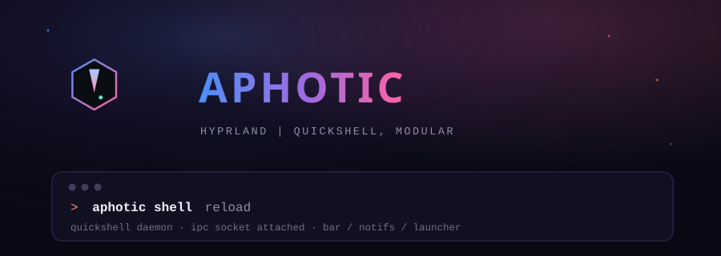
</p>

<p align="center">
  
  
  
  
  
  
</p>

<p align="center">
  A modular Hyprland desktop built on one Quickshell shell.<br>
  Eight themes, a plugin platform, and a live map of what your GPU is doing.
</p>

<p align="center">
  <a href="#themes">Themes</a> ·
  <a href="#install">Install</a> ·
  <a href="#keybindings">Keybindings</a> ·
  <a href="https://t-crypt.github.io/aphotic-hypr">Documentation</a> ·
  <a href="https://github.com/T-Crypt/aphotic-plugins">Plugins</a>
</p>

<p align="center">
  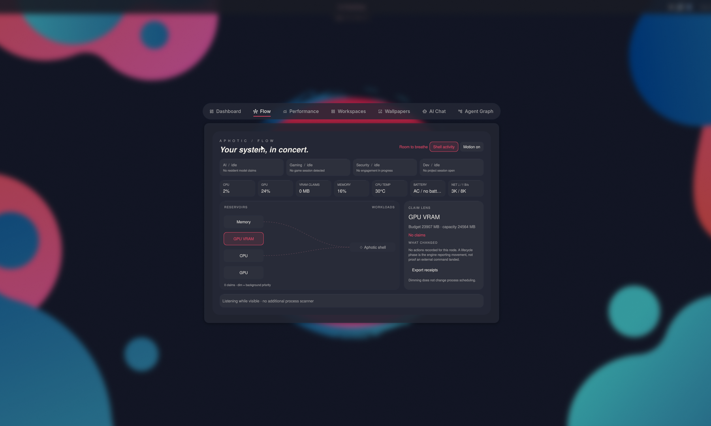
</p>

## What you get

- **One shell for the whole desktop.** Bar, notch, launcher, notifications,
  lock screen, settings and Command Center, all in Quickshell. The
  screenshots use the Signal line skin: **Settings > Bar > Signal line**.
- **Eight themes, switched live.** Or generate one from any wallpaper. No
  rebuild, no relogin.
- **Plugins for everything extra.** AI chat, agent tracking, dev tools and
  desktop pets install and remove on a running desktop.
- **A resource map that negotiates.** Flow shows which workloads fight over
  GPU memory and offers a fix. It never kills anything on its own.
- **Profiles you opt into.** Developer, Gaming, AI and Security layers sit on
  a minimal or full base.

## Gallery

<table>
<tr>
<td width="50%"><p align="center">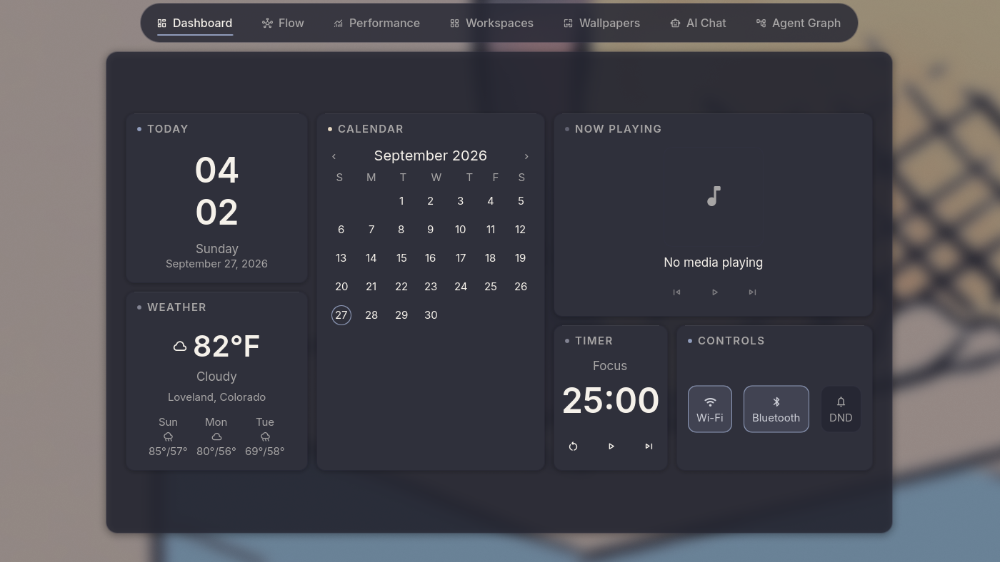<br><sub>Command Center: clock, calendar, media, focus timer, weather</sub></p></td>
<td width="50%"><p align="center">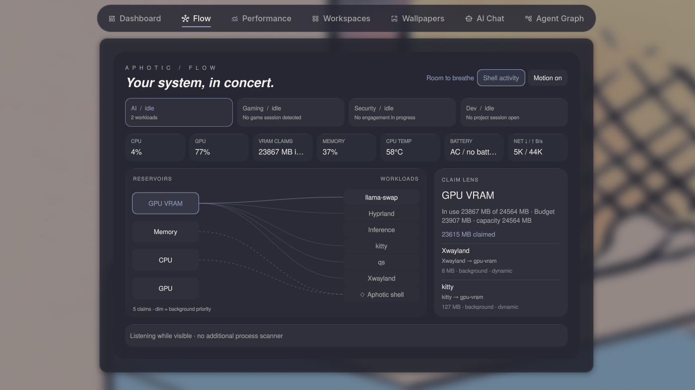<br><sub>Flow: every workload and what it holds</sub></p></td>
</tr>
<tr>
<td width="50%"><p align="center">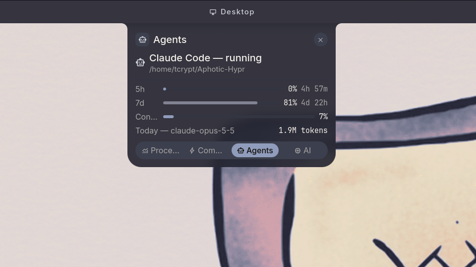<br><sub>Agents: the running session and its usage limits</sub></p></td>
<td width="50%"><p align="center">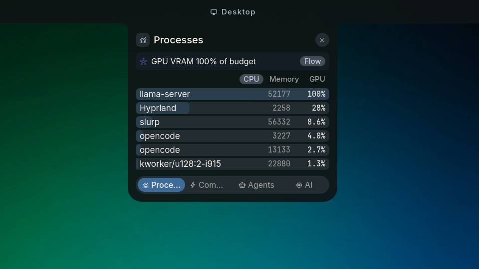<br><sub>Processes: the busiest processes by CPU, memory or GPU</sub></p></td>
</tr>
<tr>
<td width="50%"><p align="center">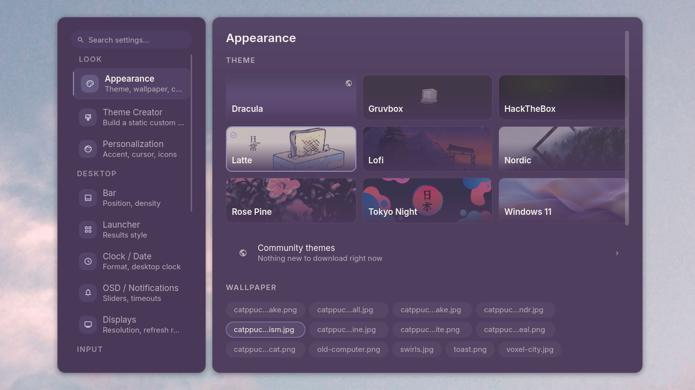<br><sub>Settings: themes and wallpapers</sub></p></td>
<td width="50%"><p align="center">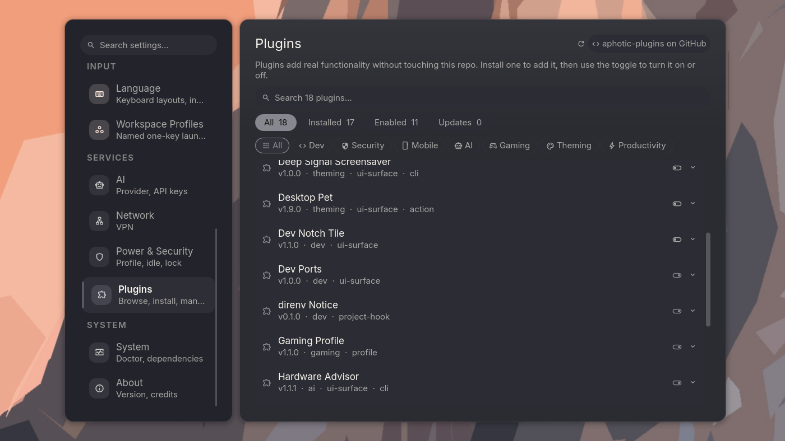<br><sub>Settings: browse, install and toggle plugins</sub></p></td>
</tr>
<tr>
<td width="50%"><p align="center">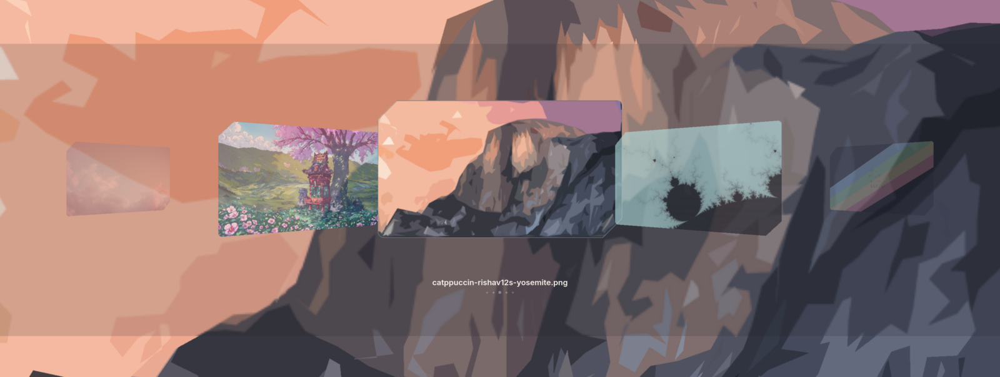<br><sub>Wallpaper picker, carousel layout</sub></p></td>
<td width="50%"><p align="center">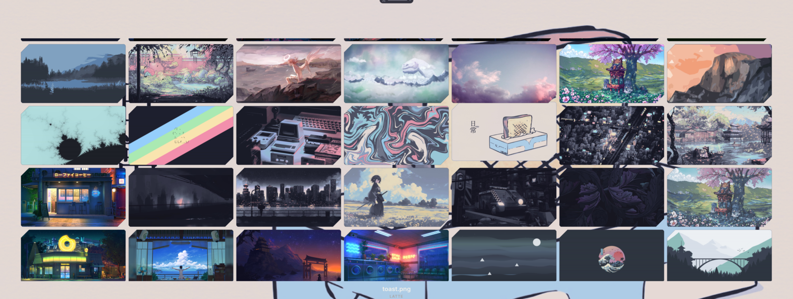<br><sub>Wallpaper picker, grid layout</sub></p></td>
</tr>
</table>

<p align="center">
  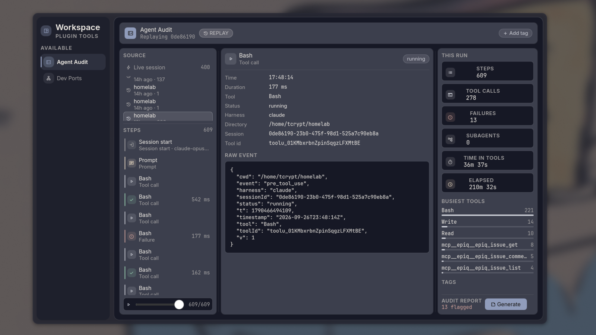<br>
  <sub>Workspace plane: a full-screen surface a plugin can claim, here replaying an agent run step by step</sub>
</p>

## Themes

Eight themes ship with Aphotic, and `aphotic theme download` adds community ones. Switch with <kbd>Super</kbd> + <kbd>,</kbd> / <kbd>.</kbd>,
or build your own from any wallpaper in **Settings > Theme Creator**.

<details>
<summary><b>Every theme, same desktop</b></summary>
<br>

<table>
<tr>
<td width="50%"><p align="center">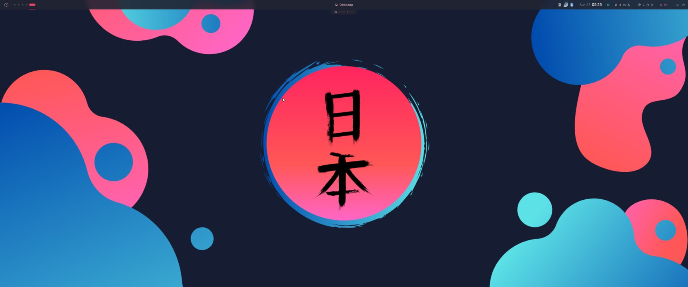<br><sub>Tokyo Night</sub></p></td>
<td width="50%"><p align="center">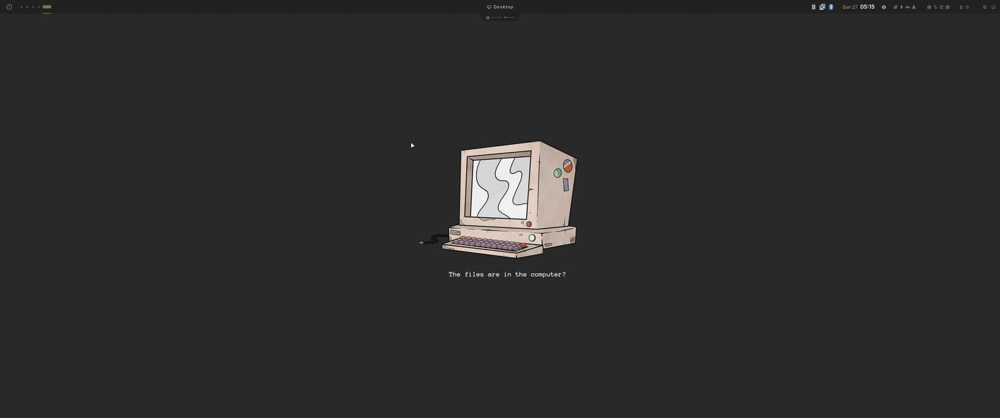<br><sub>Gruvbox</sub></p></td>
</tr>
<tr>
<td width="50%"><p align="center">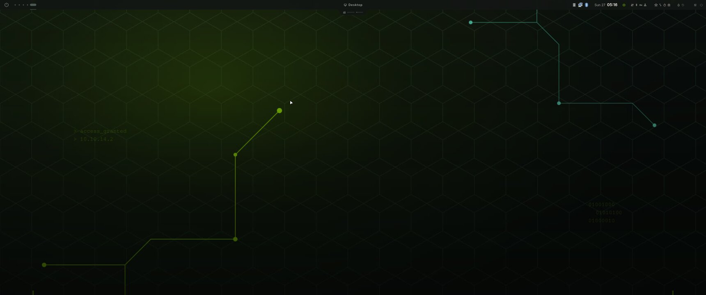<br><sub>HackTheBox</sub></p></td>
<td width="50%"><p align="center">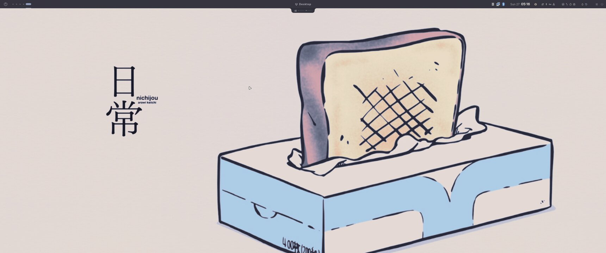<br><sub>Catppuccin Latte</sub></p></td>
</tr>
<tr>
<td width="50%"><p align="center">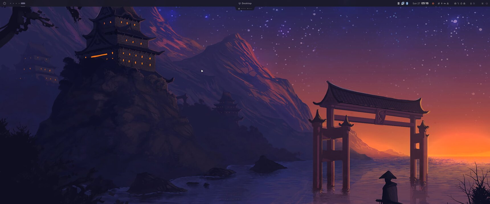<br><sub>Lofi</sub></p></td>
<td width="50%"><p align="center">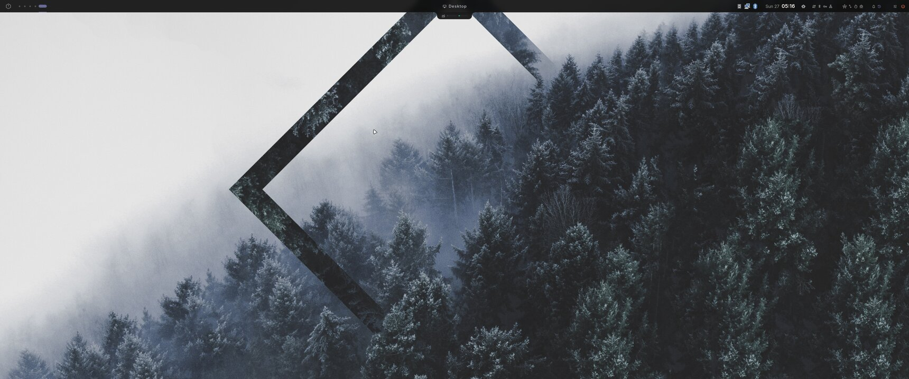<br><sub>Nordic</sub></p></td>
</tr>
<tr>
<td width="50%"><p align="center">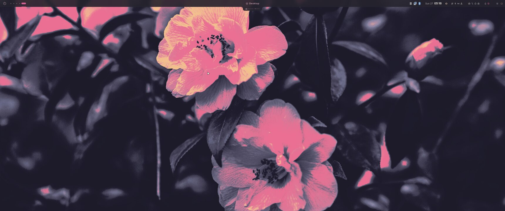<br><sub>Rosé Pine</sub></p></td>
<td width="50%"><p align="center">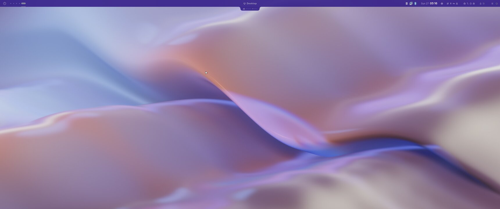<br><sub>Windows 11</sub></p></td>
</tr>
<tr>
<td width="50%"><p align="center">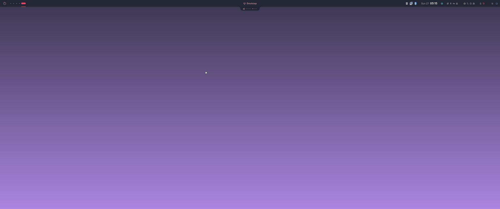<br><sub>Dracula (community)</sub></p></td>
</tr>
</table>

</details>

## Install

Aphotic needs an Arch/AUR base. Plain Arch, [Omarchy](https://omarchy.org/)
and EndeavourOS (Desktop Environment: None) are tested.

```bash
git clone https://github.com/T-Crypt/Aphotic-Hypr.git
cd Aphotic-Hypr
./install.sh
```

The installer makes the Aphotic greeter your login screen and keeps sddm
installed as the way back. Pass `--keep-sddm` to stay on sddm. Omarchy keeps
its own login.

Add `--dry-run` to see every change first; it runs before any `sudo` prompt
or write. Update with `aphotic update`, remove with `./uninstall.sh`.

Every flag, profile and backup detail is in the
[Installation guide](https://t-crypt.github.io/aphotic-hypr/docs/installation/).

## Keybindings

| Keys | Action |
| :-- | :-- |
| <kbd>Super</kbd> + <kbd>A</kbd> / <kbd>Space</kbd> | Launcher (apps, clipboard, emoji, windows, wallpaper) |
| <kbd>Super</kbd> + <kbd>D</kbd> | Command Center |
| <kbd>Super</kbd> + <kbd>I</kbd> | Settings |
| <kbd>Super</kbd> + <kbd>Shift</kbd> + <kbd>W</kbd> | Workspace plane, while a plugin provides one |
| <kbd>Super</kbd> + <kbd>W</kbd> | Wallpaper picker |
| <kbd>Super</kbd> + <kbd>L</kbd> | Lock screen |
| <kbd>Super</kbd> + <kbd>Backspace</kbd> | Session menu |
| <kbd>Super</kbd> + <kbd>,</kbd> / <kbd>.</kbd> | Cycle theme |
| <kbd>Alt</kbd> + <kbd>Tab</kbd> | Window switcher |
| <kbd>Super</kbd> + <kbd>Shift</kbd> + <kbd>S</kbd> | Screenshot picker |

The rest live in [`Configs/hypr/keybinds.lua`](Configs/hypr/keybinds.lua) and on the
[Keybindings page](https://t-crypt.github.io/aphotic-hypr/docs/keybindings/).

## Documentation

**[t-crypt.github.io/aphotic-hypr](https://t-crypt.github.io/aphotic-hypr)**
covers the rest: [Getting Started](https://t-crypt.github.io/aphotic-hypr/docs/getting-started/) ·
[Profiles](https://t-crypt.github.io/aphotic-hypr/docs/profiles-and-layers/) ·
[Plugins](https://t-crypt.github.io/aphotic-hypr/docs/plugin-system/) ·
[CLI](https://t-crypt.github.io/aphotic-hypr/docs/cli-reference/) ·
[FAQ](https://t-crypt.github.io/aphotic-hypr/docs/faq/) ·
[Troubleshooting](https://t-crypt.github.io/aphotic-hypr/docs/troubleshooting/)

Aphotic is in beta. Bug reports and hardware notes are welcome in
[Issues](https://github.com/T-Crypt/Aphotic-Hypr/issues).

## Star History

<a href="https://www.star-history.com/?type=date&repos=T-Crypt%2FAphotic-Hypr">
 <picture>
 <source media="(prefers-color-scheme: dark)" srcset="https://api.star-history.com/chart?repos=T-Crypt/Aphotic-Hypr&type=date&theme=dark&legend=top-left&sealed_token=ypXqE7-DQiuJyvY9koFRVoIXk2HPugsrJGClSWh7P1FY8nA7ol-2RDfC5Y41CWpVnHmyqDL_mxAL6UDuAk2yrEhNhsBTCl-hTalGQg3Bp5cYQ1Zp1LGwDA94WqIIP4v30SrycPaZFcqA0L1LzsFi-PZF9vBE26aq4K5ihUzZzG9W0tfUNUlfL1p58oyW" />
 <source media="(prefers-color-scheme: light)" srcset="https://api.star-history.com/chart?repos=T-Crypt/Aphotic-Hypr&type=date&legend=top-left&sealed_token=ypXqE7-DQiuJyvY9koFRVoIXk2HPugsrJGClSWh7P1FY8nA7ol-2RDfC5Y41CWpVnHmyqDL_mxAL6UDuAk2yrEhNhsBTCl-hTalGQg3Bp5cYQ1Zp1LGwDA94WqIIP4v30SrycPaZFcqA0L1LzsFi-PZF9vBE26aq4K5ihUzZzG9W0tfUNUlfL1p58oyW" />
 
 </picture>
</a>

<br>

## License

See [LICENSE](LICENSE).
